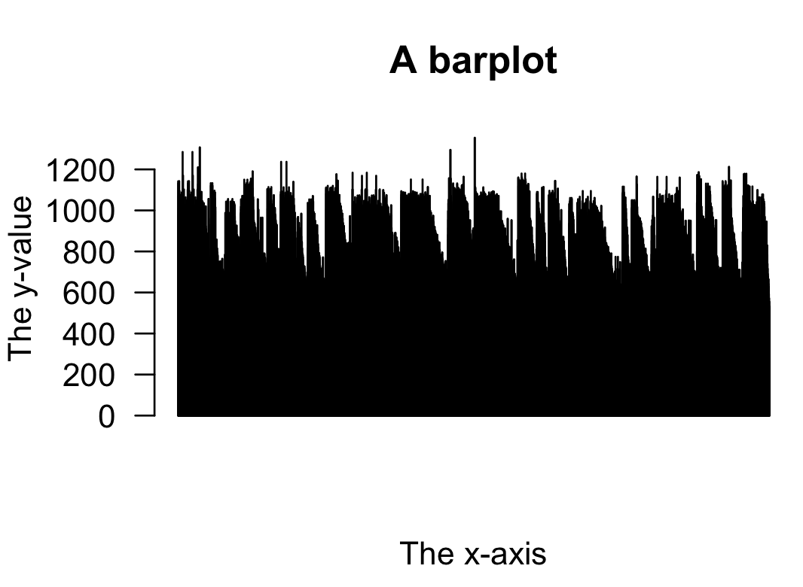

**[Return to the Course Home Page](../index.html)**

# Portfolio Assistance Week 4
**A/Prof Olin Silander**

[Purpose](#purpose)<br>

## Purpose

1. Understand possible ways to progress through a portfolio assessment.
2. Find basic ways to visualise data from the Week 4 portfolio assessment.
3. Understand resources for visualising different types of data. 

## Introduction

**This will take you around an hour to read through. We would expect an average of three hours *beyond* completion of the lab for each Portfolio Assessment component.** For the first few portfolio asssignments this is likely to take much longer; as you improve with `R` and the terminal, this time shoudl decrease.

The Portfolio Assessment from Week 4 is the first part of the Portfolio Assessment. For many of you it will be the first time you have tried to visualise data, or certainly to visualise data outside of Excel. The purpose here is to show possible ways to move step-by-step through the Assessment.

## Background

The Portfolio Assessment is written as follows:

1. The GC (guanine and cytosine) content of a genome (and read) is known to affect how easy it is to sequence. For example, regions of genomes that are GC-rich are often under-represented in sequencing data. One question that arises from this is whether GC content is correlated with quality scores for either Illumina or Oxford Nanopore sequencing reads. **Please address this question.**<br>

    You will have to generate new data on GC content and quality using the `seqkit fx2tab` subcommand (make sure you use the help command, so: `seqkit fx2tab --help`), and combine it with `R` plotting methods to answer this question. Please do this, and state whether you think there is, or is not, a link between GC content and read quality in this data, and provide your graphical analysis as evidence (you are free to present additional evidence).

    You *may* need to access specific columns of your matrix to do this analysis. If you want to do this, there are different methods. Return to the *R Bootcamp* lab to remind yourself.

    If you decide to tell `seqkit` to add a header line to your file (see option `-H`) then you will **have** to go into the file itself and edit the top line, which will probably contain a `#`. Remove this hash, re-save the file, and then `R` should read it properly.

Let's take this step by step

### Please address this question
This is the first and most important part of the assessment. *How will you test "whether GC content is correlated with quality scores for either Illumina or Oxford Nanopore sequencing reads"*?

You need to understand how to break this question down to its most important parts:
1. GC content
2. Correlated
3. Quality Scores
4. Illumina
5. Oxford Nanopore

These are the components of your answer. We need to interpret each a bit further.

### Quality Scores
Quality scores of *what*?
There are two hints in the assessment. First, it ask: *[is] GC content correlated with quality scores for either Illumina or Oxford Nanopore sequencing READS.*
With some careful reading it becomes clear we are talking about sequencing reads.

There is also a second clue: we should use `seqkit fx2tab`. What is the output of `seqkit fx2tab`?

As noted when you did this in the lab, it is "lengths and quality per sequence," or in the comments of commands, "a file with three columns: the NAME, the LENGTH, and the QUALITY".

With some careful reading we should be able to see that we need to get the **quality scores of individual reads**. Furthermore, we know how to do this: using `seqkit fx2tab`, and we know that this will give us column formatted data.

We should remind ourselves **how** to get this type of data. We can look back at the lab, where we see `seqkit fx2tab -qln myseqs.fastq.gz > mydata.txt` gives a file with that information. However, arguably a better way is through using seqkit itself. Two ways to do this - command line help:

```bash
# what is the output of seqkit help
seqkit --help

SeqKit -- a cross-platform and ultrafast toolkit for FASTA/Q file manipulation

Version: 0.13.2

Author: Wei Shen <shenwei356@gmail.com>

Documents  : http://bioinf.shenwei.me/seqkit
Source code: https://github.com/shenwei356/seqkit
Please cite: https://doi.org/10.1371/journal.pone.0163962

Usage:
  seqkit [command]

Available Commands:
  amplicon        retrieve amplicon (or specific region around it) via primer(s)
  bam             monitoring and online histograms of BAM record features
  common          find common sequences of multiple files by id/name/sequence
  concat          concatenate sequences with same ID from multiple files
  convert         convert FASTQ quality encoding between Sanger, Solexa and Illumina
  duplicate       duplicate sequences N times
  faidx           create FASTA index file and extract subsequence
  fish            look for short sequences in larger sequences using local alignment
  fq2fa           convert FASTQ to FASTA
  fx2tab          convert FASTA/Q to tabular format (with length/GC content/GC skew)
  ```

  OR [Google seqkit help] (https://bioinf.shenwei.me/seqkit/usage/ "Google: seqkit help")

Unfortunataely Googling [seqkit help fx2tab](https://bioinf.shenwei.me/seqkit/usage/) does not give us more useful information. Nevertheless we can use command-f (control-f on Windows) to find the relevant section. Finding `fx2tab` or `GC` brings us to the [fx2tab page](https://bioinf.shenwei.me/seqkit/usage/#fx2tab-tab2fx).

We can either command-f quality, which brings us to the *flag* we need to use to get quality, or we can scan the page to see that the second flag listed gives quality. But we don't actually need to any of that, as this was all noted in the previous lab.

### GC content
We next need to find **per read** GC content. We have not encountered this before. There are two solutions here. First, we have only used a single method to get pre-read characteristics, `fx2tab`. We can make an educated guess that we should use this. Alternatively, reading the Portfolio Assessment carefully, we see that we can get data on GC with `seqkit`: "new data on GC content and quality using the `seqkit fx2tab`" using the help function.

### Illumina and Nanopore
This should be apparent - we simply need to make sure that we do this for Illumina and Nanopore.

### Correlation
We need to know what we are correlating. This is apparent in the question: "whether GC content is correlated with quality scores". We can only test this if we have the data. You should now have the data *in column format* by using the correct `seqkit f2tab` command. The only way that we have used to visualise so far is `R`, so we will stick with that.


### Correlation in R
The Portfolio Assessment does not require any statistics (although it does not note this explicitly.)

### A resource for virualisation techniques
This is a [great resource](https://clauswilke.com/dataviz/ "no, really it's good"). Please take a look.

#### Getting the data into R

This is the first hurdle. However, in the Section "Plotting the data more deliberately in R" we noted that:
"you will need to use the read.table function." For the Portfolio Assessment, this is *probably* what you need to do: plot the data more deliberately. Alternatively, we could google [how do I read data into R](https://www.datacamp.com/tutorial/r-data-import-tutorial?utm_source=google&utm_medium=paid_search&utm_campaignid=19589720821&utm_adgroupid=143216588577&utm_device=c&utm_keyword=&utm_matchtype=&utm_network=g&utm_adpostion=&utm_creative=657040116618&utm_targetid=dsa-1947282172981&utm_loc_interest_ms=&utm_loc_physical_ms=9121921&utm_content=dsa~page~community-tuto&utm_campaign=230119_1-sea~dsa~tutorials_2-b2c_3-row-p1_4-prc_5-na_6-na_7-le_8-pdsh-go_9-na_10-na_11-na-mayftyc23&gclid=Cj0KCQjwsIejBhDOARIsANYqkD0Anfvh-vOnPOSbS1ipLBTqHgi_4mefXipOic8ra8dy_oe4uhDJsSEaAgomEALw_wcB). The first hit I find is the datacamp page, where I see you can use `read_csv()`, `read.table()`, `read.delim`, `read.csv`, `read.csv2`, and others.

I will read in some data in column format on my own using `read.table`, and called it `mydata`. For the purpose here I will note that this data is in the form of four columns, with the columns (in order) being:
1. sequence name
2. sequence length
3. GC-content
4. quality

Now I need to look for correlations. It is possible to Google this [How do I test for correlations in R easy](http://www.sthda.com/english/wiki/correlation-test-between-two-variables-in-r#:~:text=correlation%20in%20R-,R%20functions,%2Dvalue%20of%20the%20correlation%20.) The first hit I get is from the STHDA page, but above that I see the Google summary:


<br>
**Here is help on how to do a correlation.**<br><br>

If I return to `R` I can try this:

```bash
cor.test(mydata)
```

This gives an error.

```bash
Error in cor.test.default(mydata) : 'x' must be a numeric vector
```

I can Google this [Error in cor.test.default(mydata) : 'x' must be a numeric vector](https://stackoverflow.com/questions/43497128/r-error-in-correlation-test-x-must-be-a-numeric-vector) and get Stack Overflow as the first hit, where it says *year is not a numeric value - it will be either a character string or a factor. Check with str(mydata).*

This is not that helpful as we don't even have years. Maybe I can look more carefully at `cor.test`: 

```bash
?cor.test()
```

And find:
```bash
Test for association between paired samples, using one of Pearson's product moment correlation coefficient, Kendall's tau or Spearman's rho.

Usage

cor.test(x, ...)

## Default S3 method:
cor.test(x, y,
         alternative = c("two.sided", "less", "greater"),
         method = c("pearson", "kendall", "spearman"),
         exact = NULL, conf.level = 0.95, continuity = FALSE, ...)
``` 

Which is slightly difficult to interpret. I can try a slightly different strategy. For example, a second Google of "cor.test Tutorial" gives a [YouTube video](https://youtu.be/XaNKst8ODEQ) as nearly the top hit. A quick view shows that the author shows `cor.test` help (1m 12s). Interestingly, in this video we see that the author does a plot almost immediately (1m 21s). At 4m 42s, an "all-vs-all" plot is shown. I cn decide whether this would be useful in the case of this Portfolio Assessment.

Another possibility is to Google [correlation between variables](https://www.google.com/search?q=correlation+between+variables&sxsrf=APwXEdeIgokF1OppvGQmGnki5YlUVGiP_w:1684217085845&source=lnms&tbm=isch&sa=X&ved=2ahUKEwjRkYHJlfn-AhVQG4gKHdAkB_QQ_AUoAXoECAEQAw&biw=1178&bih=692&dpr=2).

Here, we see a nice result from Google:<br><br>

<br>
**Here is the definition of a correlation, which comes with some visuals (off-screen to the right).**<br><br>

## The visualisation

There is **no one way to visualise this.**

Once we have the data in `R` we can try different methods. Note that my data is called `mydata`

```bash
hist(mydata[,2], xlab="The Data")
```

<br>
**Here is a very simple viz, the histogram.**<br><br>

---

Some adjustments (go ahead and copy this code if you want; you will have to change the variable name).

### Improved hist

```bash
par(las=1)
hist(mydata[,2], xlab="The Data", main="The Data Title", col="light green")
```

<br>
**An adjusted histogram.**<br><br>

---

### Barplot

```bash
barplot(mydata[,2], main="A barplot", xlab="The x-axis", ylab="The y-value")
```

<br>
**A simple barplot.**<br><br>

---

### Connected line plot

```bash

plot(mydata[,3],mydata[,2],ty="l",xlab="The x data",ylab="The y data",main="Connected line plot")
```

<br>
**Here is a connected line plot, which looks quite messy.**<br><br>

---

### One variable sorted

```bash
plot(mydata[,3],mydata[,2],ty="p",xlab="The crowded x data",ylab="The y data",main="")
```

<br>
**Here is a plot in which one variable is sorted. This is sometimes useful.**<br><br>


---

### Both sorted

```bash
pplot(sort(mydata[,3]), sort(mydata[,2]), ty="l", xlab="Sorted", ylab="Sorted", col="purple", lwd=2, main="Both sorted")
```

<br>
**Here is a plot in which both variables are sorted. This is sometimes useful.**<br><br>

---
### A scatter plot

```bash
plot(mydata[,3],mydata[,2],ty="p",xlab="The crowded x data",ylab="The y data",main="")
```
<br>
**A very simple scatter plot.**<br><br>

---
### Subsampled

```bash
# sample the data
sub.data <- mydata[sample(nrow(mydata),500),]
plot(sub.data[,3],sub.data[,2])
```

<br>
**Here is a smaller part of the data.**<br><br>

---

### Boxplot with help

Last, we can move to very complicated plots which become easier with external help (this approach is allowed).

<br>
**Exteranl assistance.**<br><br>

<br>
**A complicated plot.**<br><br>

---

### Complicated plot with help
I realise that some of you are exploiting this last resource more than others. The fact is that most programmers are now exploiting this resource. For example, take this ChatGPT prompt:

_I have a matrix with two columns quantifying characteristics of an Illumina run. In the first column are %GC values and in the second column is quality. There are 2000 rows. I want a faceted plot in which one panel shows %GC vs quality with a linear regression, and second panel with a histogram of quality, a third panel with a histogram of %GC, and a fourth panel with a ridge plot of quality for which the data have been divided into quartiles based on %GC. The colour theme of the plots should be green to purple, and the output should be in pdf format. Can I have the R code for this?_

Here is the output after running the code and fixing the error messages (also with ChatGPT).

<br>
**A faceted plot.**<br><br>


---

This is all the same data (or part of the same data) plotted in different ways. One of these (or many or none) may be a gret way to illusttrate "whether GC content is correlated with quality scores".