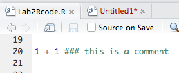
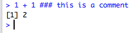
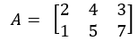
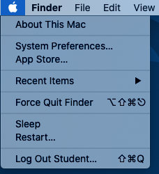

**[Return to the Course Home Page](../index.html)**

# Introduction to R

**Professor Patrick Biggs**

[Purpose](#purpose)<br>
[Introduction](#introduction)<br>
[Lecture Overview](#lecture-overview)<br>
[Conventions used for this RStudio practical](#conventions-used-for-this-rstudio-practical)<br>
[Accessing the resources needed](#accessing-the-resources-needed)<br>
[Basic operations](#basic-operations)<br>
[R data types](#r-data-types)<br>
[R data formats](#r-data-formats)<br>
[Functions within R](#functions-within-r)<br>
[Libraries, also known as Packages](#libraries,-also-known-as-packages)<br>
[Bioconductor](#bioconductor)<br>
[A small complete example](#a-small-complete-example)<br>
[Conclusion of the Practical](#conclusion-of-the-practical)<br>
[Assessment](#assessment)<br>
[Contact](#contact)<br>


## Purpose

To learn how to use a new software environment with the aim of understanding some principles of different data types and their analysis.


## Introduction

The biological world has got much more quantitative and analytical as the way biology is now performed has changed.  Data volumes have increased markedly, and so has our requirement and ability to analyse such data.  The first part of “Bootcamp” will introduce you to two tools that will be used throughout the course:  the statistical software package R and the UNIX command line.  This will be followed up with a look into data visualisation in the third week.

Week 1 focusses on the statistical software package, R. It will also introduce you to the main software environment for the course – RStudio.  We will look at accessing this environment, using it and learning some basic concepts about data handling through the use of R, focussing on data tables.  

<!---In this lab session, you will experience use of R within the RStudio environment as an introduction to the main analyses we will perform for Modules 2 and 3 in the next part of the course.--->


## Lecture Overview

As a brief summary of the lecture, we learnt that the statistical language R, its history, and that it has to be installed on a computer, but it is available for all the major platforms (Windows, OS X and Linux). We talked about its use in this course as an environment in which to explore two aspects of bioinformatics -- transcriptomics and metagenomics -- in Modules 2 and 3 respectively.

We discussed the extensive help and support that these around R and its use, all the packages that can be downloaded to help you. We then talked about the interface to R through the terminal and then with a GUI version, and finally with full-blown environments such as RStudio, through which we also had a quick overview. It is through the use of RStudio, that we will learn how to use R, and that is the focus of today's practical.


<table><tr><td>
<strong>Note for 2022:</strong> Due to Covid-19 and the uncertainties this can still cause us, the practicals for 203328 this year are being performed inside a new cloud-based RStudio environment called "RStudio Cloud". We will discuss the use of this shortly.
</td></tr></table>


We looked at getting data in and out of R, its question and answer model of operation, and then at the five data types within R. After looking at those, we went on to data formats, again a major focus of today's lab practical. We also touched on the installation of packages either through R itself for general package installation, as well as with Bioconductor for more specific bioinformatics applications.

So, now on to the practical...

First thing, you have an electronic copy of this practical -- which you will see via the Stream and this site -- please don't copy and paste in the practical today! Why? Typing these commands is part of the hard wiring required to make them stick! By typing commands it gives you another opportunity to think about the command before you execute it and typing is more likely to trigger a big red flag in dangerous situations! So, think twice, type once, we will discuss this more next week.


**This module is an introduction to the worlds of Linux and R, with a mastery test as an assessment. Please use this practical lab as a learning experience for a new set of tools, which in this case might go beyond this course, and into future study.**


## Conventions used for this RStudio practical

In what follows, we shall use the following typographical conventions for working with R:
-   Characters written in `this programming style` are commands to be typed into the computer as they stand. In a difference to practical 1, this will be for both functions and filenames, *[and all these commands should be typed in for this afternoon's practical]*.
-   Characters written after something like `###` indicate comments within the code that will help you.  They do not run code. 
-   Characters written in without `>` at the start of the line **(e.g. lines starting with "\[1\]")** indicate responses back from the R console inside RStudio that will help you too. 
-   Words inserted within square brackets **\[Enter\]** indicate keys to be pressed.

So, for example,

```R
 > x <- c(1, 5, 7, 14) [Enter]
```
means \"at the R console prompt `>`, type the code as written to make a vector `x` made up of the values 1, 5, 7 and 14, then press the key marked Enter\".

Don\'t forget to press the **\[Enter\]** key: commands are not sent to the R console until this is done. There will not be **\[Enter\]** at the end of any of the lines of code in this practical, it is taken that this is to be typed at the end of the line _unless otherwise stated_. It is also assumed that the first `>` is the R console prompt.


## Accessing the resources needed

### Computing

#### Manawatu (iMacs)

The machines we are using for the course -- Apple iMacs -- have been updated for 2022, and there is a new login method for them. Usernames and passwords will be supplied to you in the lab, but please remember to ignore (i.e. cancel) the dialogue box about the network when you log in. We will be working within web browsers, and Firefox and Chrome are installed on the machines, or Safari if you are an Apple user. We will then login to RStudio Cloud using your personalised account.

#### Albany (PCs)

check with Olin tomorrow


### Opening up RStudio Cloud

#### Setting up an account on RStudio Cloud

We have organised a student account for you at <https://rstudio.cloud/> to be valid until the start of June 2022 (i.e. for the nearly all of the Semester). The information for the working area for this module has been sent to you separately via a Stream announcement.

#### Important Note

**Please see the separate document -- "Access_to_RStudio_Cloud2022" -- that has been provided both as a Stream announcement and in the "Taiwhanga|Labs" section on the Stream site for setting up your RStudio Cloud environment. You must do this before you can do any work in this course, so being familiar with working with these projects when links and projects get sent to you by lecturers is extremely important.**

### Our work today

We are going to be using RStudio today as a convenient introduction in using R, so we are going to focus mostly on the console today (bottom left pane from the lecture). However, we will be using -- or rather you will need to be aware of -- the whole environment for this morning, and also for both next week, and therest of the course.


## Basic operations[^1]

### Assigning variables

Let's start off by making the assigning the variable `x` with a value of 1:

```R
> x = 1
> x
[1] 1
```

We can also use the \<- operator to do the same thing:

```R
> x <- 1
> x
[1] 1
```

I prefer the`<-` as to me it is more demonstrative of what is going on i.e. we are making assigning `x` the value of `1`. Using `=` suggests equivalence, which is not strictly true.


### Functions

We have seen this in the code conventions above. Let's repeat that, but this time call it **vec**:

```R
> vec <- c(1, 5, 7, 14)
> vec
[1] 1 5 7 14
```

### Comments

We have also seen this in the code conventions above. Say we want to make a comment on some addition:

```R
> 1 + 1 ### this is a comment
[1] 2
```

This is our first example of using the 3 colours for this practical, and for all subsequent work within R. In the console the comments will be the same colour, but if you wrote this in the script box within RStudio, you would see the below, which are screenshots from my session. This is due to something called syntax highlighting, which is not relevant for today (but useful nonetheless). Of course, the script does not give you an answer, that is what the console is for.

| R script  | R console returns |
| ------------- | ------------- |
|   |    |


An alternative way to help you with these practicals would be to rewrite the code like this, and this is the convention I may also use:

```R
### this is a comment and it can be at the top of a code block
> 1 + 1 
[1] 2
```

Which one gets used depends on what we are trying to find out, or the principle we are currently exploring.


### Introduction to packages

As a quick introduction to installing packages, we will go into this is more detail later, this is as easy as:

```R
> install.packages("XXXXXX")
```
where `"XXXXXX"` is the package name you want to install. This requires an active internet connection to retrieve the package.

>**Exercise A:**
>
>Install the package called `alluvial` into your current R session. Write the version column from your package window (lower right quadrant: window #4 for the lectures) in the box below (or in a notebook, text file etc.)
>
> <table><tr><td>
> ____________________
> </td></tr></table>

If we then want to use or load the package we type the following into the console:

```R
> library("XXXXXX")
```


### Getting help

As stated in the lecture, there are many ways to get help within R. Looking for answers on Google can also help -- your question is most likely to have been searched for before! R provides extensive documentation. For example, entering `?c` or `help(c)` at the prompt gives documentation of the function `c()` in R.

```R
> help(c)
```

Nothing returns to the console, but you get help in your help window (lower right quadrant: window #4 for the lectures). This is the difference that is found by using RStudio, but it is nothing to worry about.

If you are not sure about the name of the function you are looking for, you can perform a fuzzy search with the `apropos()` function.

```R
> ### your response might be different depending on the packages installed on your system
> apropos("nova")
> [1] "anova" "manova" "power.anova.test" "stat.anova" "summary.manova"
```

We can also use the `example` command to find out what the package can do.

>**Exercise B:**
>
> Load the package called `alluvial` into your current R session (there is a hint below the Exercise A answer box). Write the code in the box below to run as example from the `alluvial` package:
> <table><tr><td>
> ____________________
> </td></tr></table>

What it returns to the console and to your \#4 window as a plot is not relevant for now, and we can move on (looks pretty cool though!). Keep on pressing [Enter] (around 9 times) until you get an R command prompt (`>`) back on your console.


### Some basic mathematical operations

We can do basic mathematics on variables and numbers.

```R
> x + x ### examples -- make up your own here
> x * pi
> vec + 46
> 16 + 4567
> vec * vec
```

Try some ideas out for yourself, and place some code examples in the box below. Go back to the lecture notes (pages 10 and 11) to try some things out like addition, multiplication, subtraction etc. If it does not work, can you think why?

> <table><tr><td>
> ____________________
>
> </td></tr></table>
>
> What does `vec * vec` do to the values of `vec`? 


## R data types[^2]

There are 5 data types, and we can find out about them using the `class()` function. As is the lectures that is what we shall do here.


### Numeric

This is the default computational data type. If we assign a decimal value to a variable `a` as follows, `a` will be of the numeric type.

```R
> a <- 10.5   ### assign a decimal value* **
> a            ### print the value of a* **
[1] 10.5
> class(a)     ### print the class name of a
[1] "numeric"
```
Furthermore, even if we assign an integer to a variable `k`, it is still being saved as a numeric value.

```R
> k <- 1
> k           ### print the value of k* **
[1] 1
> class(k)    ### print the class name of k* **
[1] "numeric"
```

>**Exercise C:**
>
> You have variables `k` and `x` from the above. Check that both are of the numeric type and then write down what the numeric answer for `x + k - 1` is?
> <table><tr><td>
> ____________________
> </td></tr></table>


### Integer

To make integers in R, we need to specific them as such. We can be assured that y is indeed an integer by applying the **is.integer()** function.

```R
> y <- as.integer(3)
> y               ### print the value of y
[1] 3 
> class(y)        ### print the class name of y
[1] "integer" 
> is.integer(y)   ### is y an integer?
> [1] TRUE
```

We can also coerce both numeric value and decimal values into an integer with the same **as.integer()** function.

```R
> as.integer(3.14)    ### coerce a numeric value
[1]
> as.integer("5.27")  ### coerce a decimal string
[1] 5
```

On the other hand, it is erroneous trying to parse a non-decimal string.

```R
> as.integer("Joe")   ### coerce a non-decimal string
[1] NA
Warning message:
NAs introduced by coercion
```

### Complex

A complex value in R is defined via the pure imaginary value i.

```R
> z <- 1 + 2i     ### create a complex number
> z               ### print the value of z
[1] 1+2i
> class(z)        ### print the class name of z
[1] "complex"
```

The following gives an error as -1 is not a complex value.

```R
> sqrt(-1)   ### square root of -1
[1] NaN
Warning message:
In sqrt(-1) : NaNs produced
```

Instead, we have to use the complex value -1 + 0i, which we can do by coercing it.

```R
> sqrt(as.complex(-1))  #### square root of -1+0i
[1] 0+1i
```

### Logical

A logical value is often created via comparison between variables.

```R
> x <- 1; y <- 2    ### sample values, two on one line
> z <- x > y        ### is x larger than y?
> z                 ### print the logical value
[1] FALSE
> class(z)          ### print the class name of z
[1] "logical"
```

### Character

One of the more important data types, which we can start to manipulate using various functions. A character object is used to represent string values in R. We convert objects into character values with the `as.character()` function:

```R
> x <- as.character(3.14)
> x                        ### print the character string
[1] "3.14"
> class(x)                 ### print the class name of x
> [1] "character"
```

Two character values can be concatenated with the paste function.

```R
> fname = "Joe"; lname = "Bloggs"
> paste(fname, lname)
[1] "Joe Bloggs"
```

However, it is often more convenient to create a readable string with the `sprint()` function, which has a C language syntax (hopefully you can see what is going on in this line of code).

```R
> sprintf("%s has %d dollars", "Dave", 1000)
[1] "Dave has 1000 dollars"
```

To extract a substring, we apply the **substr()** function. Here is an example showing how to extract the substring between the third and twelfth characters in a string.

```R
> substr("Mary has a little lamb.", start = 3, stop = 12)
[1] "ry has a l"
```

And to replace the first occurrence of the word "little" by another word "big" in the string, we apply the sub function.

```R
> sub("little", "big", "Mary has a little lamb.")
[1] "Mary has a big lamb."
```

More functions for string manipulation can be found in the R documentation.

```R
> help("sub")
```

>**Exercise D:**
>
> Using what you have learned in the section above, write the code to extract the first to seventh characters in the `Mary has a big lamb` string.
> <table><tr><td>
> ____________________
> </td></tr></table>


## R data formats[^3]

We will consider 4 data formats, and then focus on the one of most importance to use – the data frame – for the rest of the practical.

### Vector

A vector is a sequence of data elements of the same basic type. Members in a vector are officially called components. Nevertheless, we will just call them members.  Here is a vector containing three numeric values 7, 8, and 9.

```R
> c(7,8,9)
[1] 7 8 9
```

Type this vector of logical values:

```R
> c(TRUE, FALSE, TRUE, FALSE, FALSE)
[1]  TRUE FALSE  TRUE FALSE FALSE
```

A vector can also contain character strings.

```R
> c("jj", "kk", "ll", "mm", "nn")
[1] "jj" "kk" "ll" "mm" "nn"
```

Incidentally, the number of members in a vector is given by the length function.

```R
> length(c("jj", "kk", "ll", "mm", "nn"))
[1] 5
```

We can combine vectors, even of different types:

```R
### we have to coerce the numerics to strings in doing this.
> n <- c(7, 8, 9)
> s <- c("jj", "kk", "ll", "mm", "nn")
> c(n, s)
[1] "7"  "8"  "9"  "jj" "kk" "ll" "mm" "nn"
```

Following on from the initial concepts of maths mentioned above, we can perform arithmetic operations of vectors are member-by-member, i.e., member-wise.  For example, suppose we have two vectors `a` and `b`.

```R
a <- c(5, 8, 12, 15) 
b <- c(1, 2, 3, 8)
```

Then, if we multiply a by 5, we would get a vector with each of its members multiplied by 5.

```R
5 * a 
[1] 25 40 60 75
```

And if we add `a` and `b` together, the sum would be a vector whose members are the sum of the corresponding members from `a` and `b`.

```R
> a + b 
[1]  6 10 15 23
```

Similarly for subtraction, multiplication and division, we get new vectors via the same member-wise operations.

```R
> a - b
[1] 4 6 9 7
> a * b
[1]   5  16  36 120
> a / b
[1] 5.000 4.000 4.000 1.875
```

If we have two vectors of unequal length, the shorter one will be recycled in order to match the longer vector. For example, the following vectors u and v have different lengths, and their sum is computed by recycling values of the shorter vector u.

```R
> u <- c(100, 200, 300)
> v <- c(1, 2, 3, 4, 5, 6, 7, 8, 9)
> u + v
[1] 101 202 303 104 205 306 107 208 309
```

> **Exercise E:**
> 
> Rerun the above but with a new vector `u` with only 2 members (it doesn’t matter what they are).  Write the result of `u + v` in the box below.  What has happened?
> <table><tr><td>
> ____________________
> </td></tr></table>
 
In subsequent practicals we will be using indexed positions in vectors, matrices and data frames.  Consider vector `s` above, which should still be in your session.  To find the third member, we simply type:

```R
> s
[1] "jj" "kk" "ll" "mm" "nn"
> s[3]
[1] "ll"
```

### Matrix
 This is a collection of data elements in a 2D format, also known as a table.  Consider a matrix A with 2 rows and 3 columns, such as:	
 

 
As long as the elements are of the same type, we can use our first multi-line R code to make a matrix:

```R
> A <- matrix(
+   c(2, 1, 4, 5, 3, 7),      ### data elements
+   nrow = 2,		      ### number of rows
+   ncol = 3,		      ### number of columns
+   byrow = TRUE)             ### fill by rows
> A
     [,1] [,2] [,3]
[1,]    2    1    4
[2,]    5    3    7
```

We can find the element in the mth row and nth column as `A[m, n]`.

> **Exercise F:**
> 
> What is the number in the second column and second row in matrix A?  Write your code and the answer below:
> <table><tr><td>
> ____________________
> </td></tr></table>

In the next 6 lines of entered code (those with a `>`), we will look at extracting a row of `A`, a column of `A`, and then making a new matrix `B` as a subset of `A`:

```R
> A[2, ]                         ### the 2nd row
[1] 5 3 7
> A[ ,3]                         ### the 3rd column
[1] 4 7
> dimnames(A) = list( 
+    c("row1", "row2"),          ### row names 
+    c("col1", "col2", "col3"))  ### column names 
> A
     col1 col2 col3
row1    2    1    4
row2    5    3    7
```

Finally, and importantly, we can assign names to the rows and columns of the matrix, then we can access the elements by names.

```R
> A["row2", "col3"]       ### element at 2nd row, 3rd column
[1] 7
```

Other ways exist to make matrices.  Let’s make another matrix called B of a different shape, and then we can transpose it:

```R
> B <- matrix(
+   c(8, 4, 7, 1, 3, 5),
+   nrow = 3,
+   ncol = 2)
> B
     [,1] [,2]
[1,]    8    1
[2,]    4    3
[3,]    7    5
> t(B)                   ### transpose of B
     [,1] [,2] [,3]
[1,]    8    4    7
[2,]    1    3    5
```

> **Exercise G:**
> 
> If you multiply matrix A by the transposed matrix B to make a new matrix AB what is the value in the first column and second row?  Write your code and numeric answer below.
> <table><tr><td>
> ____________________
> </td></tr></table>

The columns of two matrices having the same number of rows can be combined into a larger matrix. For example, suppose we have another matrix `C` also with 3 rows.

```R
> C <- matrix( 
+   c(7, 4, 2), 
+   nrow = 3, 
+   ncol = 1)
> C                ### C has 3 rows
     [,1]
[1,]    7
[2,]    4
[3,]    2
```

We can now use the column bind (cbind) function to join C and B together:

```R
> cbind(C,B)
     [,1] [,2] [,3]
[1,]    7    8    1
[2,]    4    4    3
[3,]    2    7    5
```

The same principle works with the row bind (rbind) function.  Enter the following code and see what happens with a new matrix D.

```R
### we can also write the matrix function on one line to save space.
> D <- matrix(c(7, 23), nrow = 1)
> D                                ### D has 2 columns and 1 row
     [,1] [,2]
[1,]    7   23
> rbind(B, D)
```

### List
Let’s make 3 vectors together, and combine them into a list:

```R
> n <- c(5, 6, 1) 
> s <- c("xx", "yy", "zz", "aa", "bb") 
> b <- c(FALSE, FALSE, TRUE, FALSE)
> x <- list(n, s, b, 4)
> x
[[1]]
[1] 5 6 1

[[2]]
[1] "xx" "yy" "zz" "aa" "bb"

[[3]]
[1] FALSE FALSE  TRUE FALSE

[[4]]
[1] 4
```

We can slice data from this list, either by one or more members using the `[ ]` square brackets.

```R
> x[2]               ### only the 2nd member
[[1]]
[1] "xx" "yy" "zz" "aa" "bb"

> x[c(2, 3)]         ### 2nd and 3rd members
[[1]]
[1] "xx" "yy" "zz" "aa" "bb"

[[2]]
[1] FALSE FALSE  TRUE FALSE

> x[[2]]             ### can access directly with [[]]
[1] "xx" "yy" "zz" "aa" "bb"
```

We can also modify members of the list, but not their source.

```R
> x[[2]][1] = "gg"
> x[[2]]
[1] "gg" "yy" "zz" "aa" "bb"
> s                   ### the original s is unaffected
[1] "xx" "yy" "zz" "aa" "bb"
```

### Data frame

We have left our most important data type to last – the data frame. This is used for storing data tables. It is a list of vectors of equal length. For example, the following variable `df` is a data frame containing three vectors `n`, `s` and `b`.

```R
> n <- c(2, 3, 5)
> s <- c("aa", "bb", "cc")
> b <- c(TRUE, FALSE, TRUE)
> df = data.frame(n, s, b)
> df
  n  s     b
1 2 aa  TRUE
2 3 bb FALSE
3 5 cc  TRUE
```

It is now time to start using some real data that can be found in R, in the base package (i.e., it’s just there).    The dataset `mtcars` gets used a great deal in R introductions etc.  So why not do the same here today?  It is much bigger than anything we have looked at so far.

Let’s use the `head()` function – similar to head in Linux that we will also look at next week – to look at the top of this dataframe:

```R
> head(mtcars)
                   mpg cyl disp  hp drat    wt  qsec vs am gear carb
Mazda RX4         21.0   6  160 110 3.90 2.620 16.46  0  1    4    4
Mazda RX4 Wag     21.0   6  160 110 3.90 2.875 17.02  0  1    4    4
Datsun 710        22.8   4  108  93 3.85 2.320 18.61  1  1    4    1
Hornet 4 Drive    21.4   6  258 110 3.08 3.215 19.44  1  0    3    1
Hornet Sportabout 18.7   8  360 175 3.15 3.440 17.02  0  0    3    2
Valiant           18.1   6  225 105 2.76 3.460 20.22  1  0    3    1
```

What do we have here?  Just like Excel -- that you should be familar with -- the top line of the table, called the header, contains the column names. Each horizontal line afterward denotes a data row, which begins with the name of the row, and then followed by the actual data. Each data member of a row is called a cell.

To retrieve data in a cell, we would enter its row and column coordinates in the single square bracket `[]` operator. The two coordinates are separated by a comma. In other words, the coordinates begins with row position, then followed by a comma, and ends with the column position. The order is important.  We can retrieve data either via the column, or via the column names thus:

```R
> mtcars[1, 2]                   ### by column and row
[1] 6
> mtcars["Mazda RX4", "cyl"]     ### by names
[1] 6
```

We can also see the extent of the data with the `nrow()` and `ncol()` functions:

```R
> nrow(mtcars)      ### number of data rows 
[1] 32
> ncol(mtcars)      ### number of data columns
[1] 11
```

We can retrieve a column of data 4 ways, say the tenth column of data.  I show the single result, but please check it gives the same result for you:

```R
> mtcars[[10]]      ### the 10th column
 [1] 4 4 4 3 3 3 3 4 4 4 4 3 3 3 3 3 3 4 4 4 3 3 3 3 3 4 5 5 5 5 5 4
> mtcars[["gear"]]  ### the name of the 10th column
> mtcars$gear       ### use the '$' operator instead of [[]]
> mtcars[,"gear"]   ### use a single [], but prepend with a column for wildcards
```

In a similar way, we can slice out a row from the data frame.  Again, please check that the following gives the same result:

```R
> mtcars[1]                 ### the 1st column as a slice
> mtcars["mpg"]             ### the name of the 1st column as a slice
```

And then something slightly different by looking at two columns:

```R
> mtcars[c("mpg", "hp")]    ### the mpg and hp columns
```

For rows, the principle is the same, though the code is slightly different:
```R
> mtcars[24,]              ### one row of data
            mpg cyl disp  hp drat   wt  qsec vs am gear carb
Camaro Z28 13.3   8  350 245 3.73 3.84 15.41  0  0    3    4
> mtcars[c(4, 24),]        ### two rows of data
                mpg cyl disp  hp drat    wt  qsec vs am gear carb
Hornet 4 Drive 21.4   6  258 110 3.08 3.215 19.44  1  0    3    1
Camaro Z28     13.3   8  350 245 3.73 3.840 15.41  0  0    3    4
> mtcars["Camaro Z28",]    ### row 24 by name
            mpg cyl disp  hp drat   wt  qsec vs am gear carb
Camaro Z28 13.3   8  350 245 3.73 3.84 15.41  0  0    3    4
```

> **Exercise H:**
> 
> How many cylinders does the Hornet Sportabout (row 5) have?  Write your code, and then your answer in the box below:
> <table><tr><td>
> ____________________
> </td></tr></table>


## Functions within R

As you will remember from the lecture, we have come across lots of functions already for example, `head()`, `tail()`, `class()`, `c()`, `help()`, `matrix()`, `t()`, `paste()` etc.  There are thousands of them out there, and they are the “things” to make “stuff” happen.  Packaged recipe that converts one or more inputs (called arguments) into a single output.  

Let’s investigate some arguments of some simple packages.  We will combine this with a little more work with help functions.  Most of your work in R will require knowledge of the functions, and what arguments they take.  Go to window #4 and go to the “Help” tab.  Type `dist` in the search bar, and choose the first one – plain `dist`.

> **Exercise I:**
> 
> How can you open up the help for dist() using the console?
> <table><tr><td>
> ____________________
> </td></tr></table>

The first line of the “usage” section gives you an example of what the function can do. Let’s make a random matrix – everyone’s will be different here, but I will show mine:

```R
> x <- matrix(rnorm(100), nrow = 5)
> head(x, 1)
        [,1]        [,2]      [,3]    [,4]      [,5]      [,6]       [,7]      [,8]      [,9]     [,10]      [,11]     [,12]     [,13]
[1,] -1.2085 -0.08345304 0.3075154 1.83755 0.7306627 -2.442615 -0.2109518 0.4420218 0.6656922 -1.259545 -0.3913284 -2.182033 0.1681088
        [,14]       [,15]      [,16]     [,17]     [,18]      [,19]      [,20]
[1,] 1.146558 -0.09117126 -0.4027668 0.5628789 0.4312849 -0.2714223 -0.3194058

> dist(x)
         1        2        3        4
2 5.359471                           
3 6.317562 5.586858                  
4 6.728759 5.704929 8.591916         
5 7.198402 5.677087 7.236120 5.921220
> dist(x, diag = TRUE)
         1        2        3        4        5
1 0.000000                                    
2 5.359471 0.000000                           
3 6.317562 5.586858 0.000000                  
4 6.728759 5.704929 8.591916 0.000000         
5 7.198402 5.677087 7.236120 5.921220 0.000000
> dist(x, upper = TRUE)
         1        2        3        4        5
1          5.359471 6.317562 6.728759 7.198402
2 5.359471          5.586858 5.704929 5.677087
3 6.317562 5.586858          8.591916 7.236120
4 6.728759 5.704929 8.591916          5.921220
5 7.198402 5.677087 7.236120 5.921220
```

> **Exercise J:**
> 
> Taking the last line of code you entered, how would you modify this to generate a distance matrix on `x` using the “manhattan” method?
> <table><tr><td>
> ____________________
> </td></tr></table>


## Libraries, also known as Packages

There are many basic packages R comes with:
* Base: ~1100 functions such as `which()`, `which.max()`, `table()`, `apply()`, `summary()`, `sum()`, `min()`, `max()`, `sample()`, all the basic object constructors such as `matrix()`, the all-important `c()` function to combine objects into a vector.
* Stats: over 400 including `t.test()`, `hclust()`, `cutree()`, `dist()`, `runif()` and `rnorm()`.
* Utils: another 200 including such essentials as `head()`, `tail()` and `write()`.
* Graphics:  `plot()`, `boxplot()`, `barplot()` and `hist()`.

Let’s now theoretically install a couple of new packages – `survey` and `hexbin` – and then try using them to see the effect of one package on another.  As I said in the lecture, some packages have data within them that we can use such a dataset as an example. 

```R
> install.packages("survey")   ### this has been done for you and there is no need to do it, but this is the code
> library("survey")
### let’s use the ‘api’ dataset
> data(api, package = "survey")
### let’s plot the entire data for the years 1999 and 2000
> plot(api00~api99,data = apipop)
```

You might have to hit [Enter] in the console to see the plot.

```R
### let’s make a vector of 3 colours based on the variable ‘stype’
> colors<-c("tomato","forestgreen","purple")[apipop$stype]
### plot again
> plot(api00~api99,data = apipop,col = colors)
```

You might have to hit [Enter] in the console to see the plot.

How we got here, and what the underlying data is does not matter *per se*. What does the plot look like?  Kind of colourful, right?  It also has 6,194 data points on it!  Do you believe that?  You cannot be sure really.  Well, let’s load another package to see.

The package “hexbin” has functions including one – `hexbin()` – that is a way to aggregate the points in a scatterplot. It computes the number of points in a defined hexagonal bin within the plot area.  So let’s install it and see the effect.

```R
> install.packages("hexbin")  ### this has been done for you and there is no need to do it, but this is the code
> library("hexbin")
### plot the data exactly as before only using centroids
> with(apipop, plot(hexbin(api99,api00), style = "centroids"))
```

You might have to hit [Enter] in the console to see the plot.  The `style = "centroids"` option plots filled hexagons, at the centroid of each bin. The sizes of the plotted hexagons are proportional to the number of points in each bin, so now we can see how much data there is there.  Rather impressive, right?


## Bioconductor

Our last compulsory activity for today is to install a Bioconductor package and then briefly use it.  It will install as another package, but has that underlying structure and support behind it.  Even though this has been done for you already, it’s probably not a bad idea to load up an active connection into your current session.

```R
> install.packages("BiocManager")  
> BiocManager::install()
Update all/some/none? [a/s/n]:
```

Do not update any packages at this time, so type "n" to answer the question above (this is very important).

Let’s go to https://www.bioconductor.org and find a new package to load.  

> **Exercise K:**
> 
> How many Bioconductor packages are there at the current version, according to the website:
> <table><tr><td>
> ____________________
> </td></tr></table>
   
We shall choose `ggtree`, so let’s go back to our R console and load it:

```R
> BiocManager::install("ggtree")  
Update all/some/none? [a/s/n]:
```

Do not update any packages at this time, so type "n" to answer the question above (this is very important).  If you have time, explore the help to see what this package can do.

> **Exercise L:**
> 
> Load the package “ggtree” first.  What is the package version for ggtree? Hint: use the help commands such as `apropos()` to find it.  Hint 2: start typing `package` into the console, and what happens? 
> <table><tr><td>
> ____________________
> </td></tr></table>


## Note:

*If you have got up to here, and are running out of time in the practical, I am happy for you to complete the next section on “A small complete exercise” in your own time.  You should have a basic knowledge now having completed this for the Mastery test in two weeks’ time.  If you would like to do the next exercise later that’s fine, otherwise, please go to the next section for the conclusion and the “pop” quiz across today’s work.*


## A small complete exercise

We shall return to the `mtcars` dataset for some data exploration, including making a few plots, and we shall use the `alluvial` package.

So what’s an alluvial diagram?  From the help pages:

<table><tr><td>
“An alluvial diagram is a variant of a Parallel Coordinates Plot (PCP) but for categorical variables. Variables are assigned to vertical axes that are parallel. Values are represented with blocks on each axis. Observations are represented with alluvia (sing. “alluvium”) spanning across all the axes.”
</td></tr></table>

Again, to some degree what it does exactly for today does not matter.  Let’s load the package and check out our data.

```R
> require("alluvial")
Loading required package: alluvial
> head(mtcars)
                   mpg cyl disp  hp drat    wt  qsec vs am gear carb
Mazda RX4         21.0   6  160 110 3.90 2.620 16.46  0  1    4    4
Mazda RX4 Wag     21.0   6  160 110 3.90 2.875 17.02  0  1    4    4
Datsun 710        22.8   4  108  93 3.85 2.320 18.61  1  1    4    1
Hornet 4 Drive    21.4   6  258 110 3.08 3.215 19.44  1  0    3    1
Hornet Sportabout 18.7   8  360 175 3.15 3.440 17.02  0  0    3    2
Valiant           18.1   6  225 105 2.76 3.460 20.22  1  0    3    1
```

We can regard the last 4 columns as categorical data – that is data with discrete values.  With this data we can plot the relationships between the cars that have engines in the “V” format (“vs”), have automatic gearboxes (“am”), the number of gears (“gear”) and carburettors (“carb”).  Let’s do a basic plot[^4] of our data:
```R
> alluvial(mtcars[8:11], freq = mtcars$cyl)
```

From the help pages:

<table><tr><td>
“Minimal use requires supplying [a] data frame(s) as [the] first argument, and a vector of frequencies as the freq argument. By default all alluvia are drawn using gray, mildly transparent colors.”
</td></tr></table>

Now, let’s add some colour to the plot.  Say we wanted to plot all the values for the results for the automatic cars (`“am” = 1`), and show them as red bars, with black borders we would type:

```R
### perform a test to colour the ‘am’ dataset 
> alluvial(mtcars[8:11], freq = mtcars$cyl, 
    col = ifelse(mtcars$am == "1", "red", "grey"), 
    border = ifelse(mtcars$am == "1", "black", "grey"))
```

Let’s now do something new – don’t worry we will do this in detail again if you do not get to this today – save this plot as an image.  The plot will go to your home directory.  However, please try plotting the data with your name as the filename, the non-automatic cars in orange with blue borders, so you will have to change the code below, but I am not going to show you how:

```R
### set up a file for an image, but make it for orange colours on non-automatic cars – so this code is wrong…..
> png('/cloud/project/testAlluvial.png')
> alluvial(mtcars[8:11], freq = mtcars$cyl, 
+          col = ifelse(mtcars$am == "1", "red", "grey"), 
+          border = ifelse(mtcars$am == "1", "black", "grey"))
> dev.off()
RDStudioGD
          1
```

If this has worked, you have changed code on your own, and exported your first data out of R. Great. Go to your home directory to see your plot. There’s much more of this to come later in the course.


## Conclusion of the practical

As a little final exercise, we will look at the answers we have generated today, to do a numbers-based question.  This is a purely numbers-based answer so hopefully this one will work (all being well), as it has in previous years.  

One last question: if you take the following numbers from your answers returned to the console from the short exercises, and place a comma between each answer what famous series of numbers do you get?  Count only numeric characters from the first to the last, ignore spaces and the `[1]` line count from the R console.  Write your answer in the box below:

> Exercise A:	character 1
> Exercise C:	character 1
> Exercise D:	character 1
> Exercise E: character 4
> Exercise F:	character 1 of your returned numeric answer
> Exercise G:	character 1 of your returned numeric answer
> Exercise H:	your numeric answer
> Exercise K:	character 1, character 4
> Exercise E: character 4, character 1

This is the series called:
<table><tr><td>
____________________
</td></tr></table>

Use the internet or your own understanding to find out what the 17th number in the series is:
<table><tr><td>
____________________
</td></tr></table>
 
That is today’s practical completed.

For those of you on the iMacs, please remember to go to the Apple Menu on your iMac and click on “Log Out Student” to log out of the system.




## Assessment

To reiterate, for this, the first lab of this course, there is no direct assessment today.  What is required however, is an understanding of the principles we have learnt today, as these will be required for two things:

1. For the mastery test which accounts for 15% of the course.  This will take place on Friday 18-Mar-2022.
2. For a very large part of this course in which you will use RStudio to explore examples of genomic data.

The mastery test will test both Linux and R, so half of the marks will come from each part.  We have not done much biology today, but as a hint have a think about how we can work with biological data that can come in a variety of formats and what we can potentially do with those given what we have learnt today.  There will be a worksheet with test questions for you to work through as preparation for the test.


## Contact

I have two offices on the Manawatu campus (as I work for both SFS and SoVS), so I am not always in my Science Tower office D5-30. If you want to discuss anything, it's best to email me beforehand.

Prof Patrick Biggs,

Molecular Biosciences Group,

School of Natural Sciences

```
-. .-.   .-. .-.   .-. .-.   .
||\|||\ /|||\|||\ /|||\|||\ /|
|/ \|||\|||/ \|||\|||/ \|||\||
~   `-~ `-`   `-~ `-`   `-~ `-
```

<p.biggs@massey.ac.nz>

[^1]: Concepts for this part of the practical came from a tutorial found at: <http://www.r-tutor.com/r-introduction>
[^2]: Concepts for this part of the practical came from a tutorial found at: <http://www.r-tutor.com/r-introduction/basic-data-types>
[^3]: Concepts for this part of the practical came from a tutorial found at: <http://www.r-tutor.com/r-introduction/>
[^4]: You might have to hit **\[Enter\]** in the console to see the plot -- this is a new change for 2022, due to the version of R.

<!---## Practical sections start here

```R
x = 34 ###comment
x

### comment
```

New material goes here...

<br><br><br>

[GitHub Markdown cheat sheet](https://github.com/adam-p/markdown-here/wiki/Markdown-Cheatsheet)

This is how you put in an image file:
```

```
 --->
      
    

    
