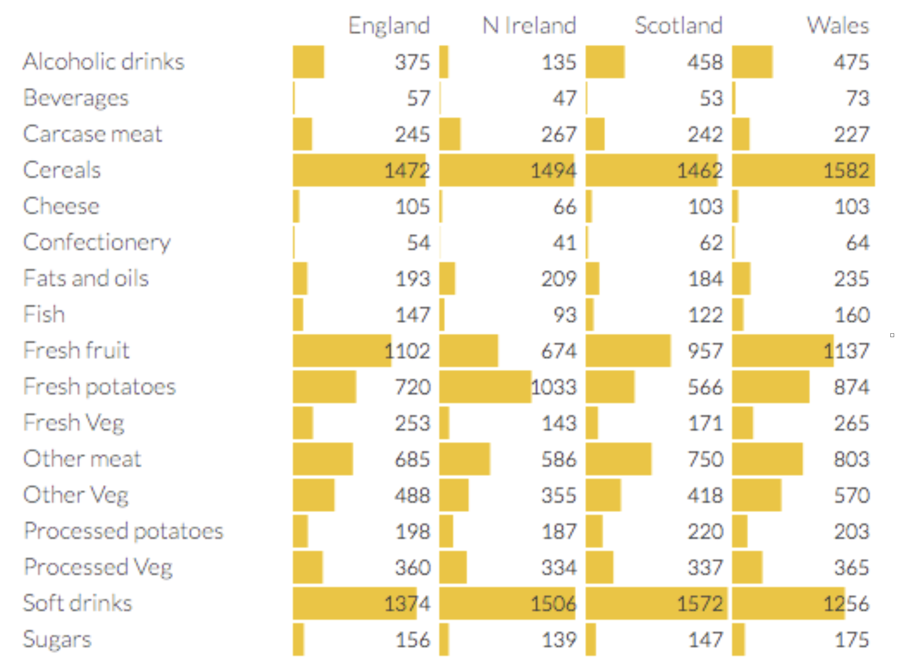
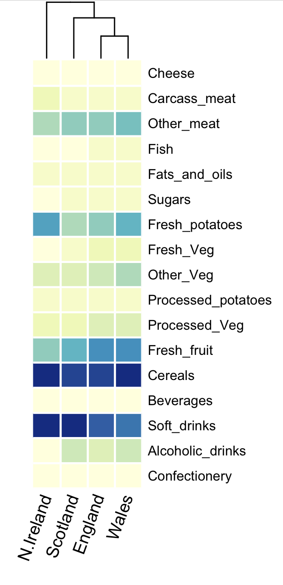
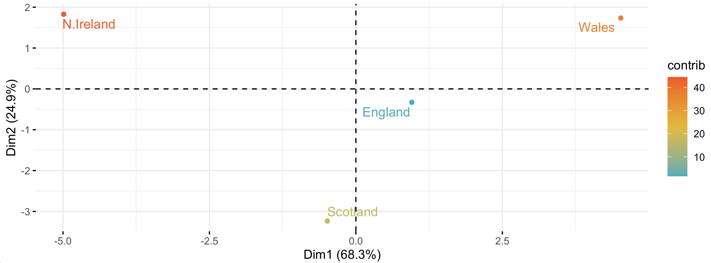
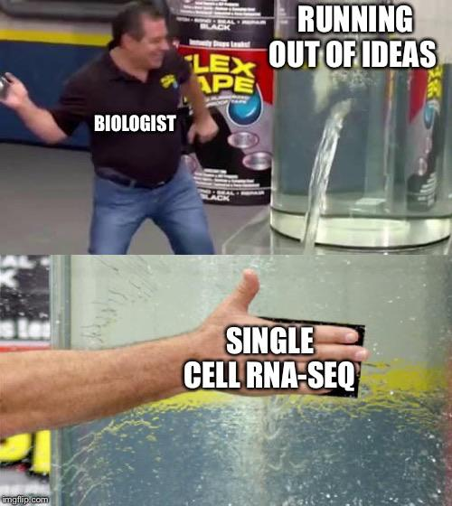

**[Return to the Course Home Page](../index.html)**

# Transcriptomics
**Dr Olin Silander**

## Learning Objectives

1. Understand the purpose of dimensional reduction techniques
2. Understand why dimensional reduction is useful for analysing large datasets
3. List three common methods for visualising RNA-seq data (volcano plot, heatmap, and dimensional reduction - PCA/UMAP/tSNE)
4. Explain the differences between each of the above visulaisation methods
5. Explain the insights that dimensional reduction can give for RNA-seq data
6. Perform the steps necessary to implement dimensional reduction on a dataset
7. Interpret dimensional reduction plots
8. Discuss the advantages and disadvantages of two common dimensional reduction techniques, PCA and UMAP.
9. Explain the requirements for read mapping in RNA-seq and interpret the results.

## Introduction

### Dimensional Reduction

As we have learned throughout the Semester, a key aspect of data analysis is data visualisation. However, working in genomics, we often have extremely complicated data, and coming up with ways to visualise it in an intuitive yet objective manner is hard.

For example, last week you visualised differences in microbiome content based on hundreds of bacteria across tens of microbiome communites. How should we do this if we have tens of thousands of genes (i.e. variables) and tens of thousands of samples? We need to have an effective manner of *reducing* the number of variables so that we can visualise only one or two. How should we reduce the number of variables?

We will use **dimensional reduction** techniques. In this way we can objectively reduce tens of thousands of variables into *combinations of variables* so we can focus only on the one or two (or three) *most important (combinations) of variables* and determine which of our samples are most similar or different on the basis of these combinations.

Dimensional reduction is an important technique. In fact when you have any biological samples that have a large number of variables, e.g.
- microbiome samples with hundreds of different bacteria
- genotype data for individuals with hundreds of different SNPs
- gene expression data from cancer samples for hundreds of different genes
- phenotypic data from hundreds of dogs with information on tens of different phenotypes (e.g. height, weight, disposition, leg length, tail length, hair length, coat colour, and eye colour)

**I would argue that after dimensional reduction is the single most important technique you can apply for visulaisation of the data.** Here, we will focus on two main methods: Principal Component Analysis (PCA) and UMAP.

Before reading further, please take five minutes and read [this quick intro to PCA](https://stats.stackexchange.com/questions/2691/making-sense-of-principal-component-analysis-eigenvectors-eigenvalues "eigen-who?") before continuing.

Becuase this is such an important concept, we are going to spend some time on this.
First some examples that have *nothing* to do with RNA or cells or sequencing. 
But hopefully they give us some insight into how dimensional reduction works and why it's important.

**Important Note**: I have put some extremely informative (imho) youtube videos up on Stream that explain PCA, UMAP, RNA-seq normalisation, and from there you can find explanations on other RNA-seq related topics. Also here:
[Explain PCA](https://www.youtube.com/watch?v=HMOI_lkzW08 "6 minutes")<br>
[Explain PCoA and MDS](https://www.youtube.com/watch?v=GEn-_dAyYME "8 minutes")<br>
[Explain UMAP](https://www.youtube.com/watch?v=eN0wFzBA4Sc "18 minutes")<br>
[Explain RNA-seq](https://www.youtube.com/watch?v=tlf6wYJrwKY&list=PLblh5JKOoLUJo2Q6xK4tZElbIvAACEykp "18 minutes")<br>
[FPKM and TPM](https://www.youtube.com/watch?v=TTUrtCY2k-w&list=PLblh5JKOoLUJo2Q6xK4tZElbIvAACEykp&index=6 "10 minutes")<br>

### The Meat and Potatoes

To gain some initial insight we will consider a food dataset from the UK. This is shown below. The dataset shows the consumption (in grams) per person per week of each of the foodstuffs.

<br>
**Yummy**<br><br>

Our aim here is to find out which of these countries :grimacing: differ the most in their diets. But of course diets are not one food or two foods, they are combinations of all foods. So which of these countries differ the most in the combination of all these foods?

We can already see that consumption of some types of foods differs more than others. For example, cereal consumption varies by about 5% between all countries. However, Welsh people drink more than 3.5 times as much alcohol than Irish people (*Northern Irish*).

We can also visualise this as a heatmap, which plots the same information, but more compactly. At the top of the heatmap is a dendrogram, which indicates how similar the countries are using [Ward's method](https://python-data-science.readthedocs.io/en/latest/unsupervised.html#agglomerative-clustering "it's a bit complicated"). N. Ireland appears the most different, while England and Wales appear the most similar. Note, importantly, that it does not say much about *how* similar.

<br>
**It's getting hot in here**<br><br>

But we can also figure out which countries are the most similar or different in their combined diet. For this, we can perform a PCA. This finds the combinations of diet items (components) that vary the most between countries. We can then take these components and plot them. Below, I show the first two components (Dim1 and Dim2) - these are the two most important components. Clearly, Wales and N. Ireland differ the most in the combinations of items in their diets. I have made the x-axis (pc1) approximately three times longer than the y-axis (Dim2), as Dim1 accounts for approximately three times more variance (68%) than Dim2 (25%). 

<br>
**England is central to it all**<br><br>

Not only that, we can visualise which diet items *contribute* to those components. This is shown below.

<br>
**What are "other veg", Wales?**<br><br>

Now we can see that Dimension (Component) 1 consists primarily of sugars and other_veg, all of which the Welsh consume more of, especially compared to N. Ireland. Dimension 2 consists primarily of the Irish tendency to eat a lot of potatoes (with some avoidance of alcohol). But most importantly, we have shrunk our 17-dimensional dataset to two dimensions that account for 68.3 + 24.9 = 93.2% (!) of the variance in the original 17 dimensions.

Okay, let's repeat this ourselves, with a new dataset.

### Hold my beer - Increasing Sample Size and Dimensions
We will move on to a cocktail dataset and a tutorial derived from [here](https://juliasilge.com/blog/cocktail-recipes-umap/ "Cocktails how are they different") and [here](https://github.com/rfordatascience/tidytuesday/blob/master/data/2020/2020-05-26/readme.md "Cocktails lots of data").


**At this point, open your `terminal`**.

Next, download the data from [here](data/all_cocktails.tab). If you have forgotten how to do that, ask your neighbour.

Navigate to your `RStudio` tab and read this file into `R`. Use the `read.table()` function to do this. Ensure that you use the `header=T` argument and assign it to a reasonably named variable (you can choose, but note that this is a dataset on cocktails. Or, for simplicity you can name it `cocktails_df` as that will match the code below).

We now have a dataset of cocktails and their ingredients. Take a look at the dataset, for example with `head` or `summary`.

Next we need to load a few libraries before we do our first analysis

```R
# it's the tidyverse!
install.packages("tidymodels")
library(tidymodels)

# it's for cats!
install.packages("forcats")
library(forcats)

# it's an obscure stats package!
install.packages("embed")
library(embed)

# it's a famous plotting package!
install.packages("ggplot2")
library(ggplot2)
```

Now we start on the path toward PCA.

```R
# This is a recipe
# We don't really sweat the details
# We just paste the code (*all* of it)
# But I put comments in if you're curious

# Tell the recipe what's happening but have no model ( ~. )
pca_rec <- recipe(~., data = cocktails_df) %>%
  # Note that the name and category of cocktail 
  # are just labels not predictors
  update_role(name, category, new_role = "id") %>%
  # Normalise means so all the 
  # variables have mean 0 and stdev 1
  step_normalize(all_predictors()) %>%
  step_pca(all_predictors())
```

```R
# Actually do the PCA by "preparing"
# the "recipe"
pca_prep <- prep(pca_rec)
# and a smidge of tidying
tidied_pca <- tidy(pca_prep, 2)
```
Phew.

Now we can visualise the results. First, let's take a look at
the first two principal components. Remember, these are the
*combinations* of ingredients that contain the most variance
(in other words, what combinations of ingredients differ
the most between cocktail drinks).

Below we use the [ggplot](https://ggplot2.tidyverse.org/index.html "Thanks, Hadley!") plotting package.
This uses the idea of a *grammar* of graphics
and is among the most popular plotting methods in R

```R
# juice gets the results of the recipe
# and feeds it using %>% to the plotting function
juice(pca_prep) %>%
# the plotting, include the cocktail name
  ggplot(aes(PC1, PC2, label = name)) +
  # make the points colored by category
  geom_point(aes(color = category), alpha = 0.7, size = 2) +
  # add text 
  geom_text(check_overlap = TRUE, hjust = "inward", size = 2) +
  # and don't add more colour anywhere
  labs(color = NULL)
```

Wow, a few cocktails are quite different from others. What's in an Applejack punch?

```R
# we have a cocktail of interest
my.cocktail <- "Applejack Punch"
# Let's find the ingredients and assign it to a variable, "ingredients"
# You should be able to see what the code below is doing

ingredients <- cocktails_df[cocktails_df$name==my.cocktail,]
# Now we can see the ingredients
# What is this code doing? It has a new method, which()
# that we use to only report the ingredients that are 
# greater than 0 (i.e. they're in the cocktail)
cocktails_df[cocktails_df$name==my.cocktail,which(ingredients>0)]

# repeat the above steps but with a 
# cocktail of your choice, or, for example, this one:
my.cocktail <- "Sphinx Cocktail"
```

Not only can we say which cocktails are most different, we can see which are most similar.
This would help us suggest new but similar drinks to customers, for example
if you were bartending.

```R
# Here, we choose a couple of cocktails to look at
# You can choose these or different ontes
my.cocktails <- c("Silver Fizz", "Peach Blow Fizz")
# Another new method, the for loop
# we repeat the same as above, but
# "loop" over all values of the my.cocktails vector above
# of course here, coi means "cocktail of interest"
for(coi in my.cocktails) {
  ingredients <- cocktails_df[cocktails_df$name==coi,]
  print(cocktails_df[cocktails_df$name==coi,which(ingredients>0)])
}
```
So similar yet so different.

So what have we discovered? We have found that dimensional reduction is a powerful method to let us determine what variables (or, *combinations* of variables, e.g. diet items or cocktail ingredients) differentiate samples (e.g. countries or cocktails). We can use this to objectively determine which samples are the most similar, and which are the most different. We can also determine which (combinations of) variables are most responsible for *making* these samples different.

But enough of that, onwards and upwards (hopefully). <br><br>

<br>
**Even so, we will go upwards.**<br><br>

### Who map? UMAP
A second commonly used method for dimensional reduction is UMAP (Uniform Manifold Approximation). UMAP is not as easy as PCA to understand from an algorithmic point of view. It is, however, an extremely powerful method for reducing dimensions while preserving the original structure of the data (i.e. the relative relationships and distances between samples). Please take a couple of minutes to browse [this site](https://pair-code.github.io/understanding-umap/ "Wooly Mammoth!!"). Scroll down to the Woolly Mammoth and adjust the parameters. Specifically, try n_neighbors = 100 and min_dist = 0.25.

Okay, let's go through this quickly just so we can compare to our previous results. We make almost exact the same recipe as before:

```R
umap_rec <- recipe(~., data = cocktails_df) %>%
  update_role(name, category, new_role = "id") %>%
  step_normalize(all_predictors()) %>%
  # this is the different step, where we use the step_umap function
  step_umap(all_predictors())

umap_prep <- prep(umap_rec)

umap_prep
```

And juice our results to plot it.

```R
juice(umap_prep) %>%
  ggplot(aes(UMAP1, UMAP2, label = name)) +
  geom_point(aes(color = category), alpha = 0.7, size = 2) +
  geom_text(check_overlap = TRUE, hjust = "inward", size = 2) +
  labs(color = NULL)
```

Woah. Compare this to the previous PCA result. What is different? Although *both of these methods have the same goal - dimensional reduction - you can see that there are very different results.* Here we can see that UMAP does not aim to find what variables differentiate samples the most (thereby *stretching* some dimensions considerably and *shrinking* others, especially if there are only a few outliers in some dimensions). Rather, UMAP aims to find ways to reduce dimensions while maintaining groupings. If we consider the Woolly Mammoth example from the link above, PCA would find that the variable with the most variation is (largely speaking) length and width. It would then project onto these, leaving differences between the left and right side nearly non-existent. You canimagine, for example, that the two tusks would thus become indistinguishable. However, this is not at all true for UMAP. It groups the tusks (as they are near) but keeps them separate. Similar for the left and right legs.

A second difference between the two methods is that PCA is better suited for datasets in which there are a small number of variable-combinations that differentiate samples (e.g. when the first three principal components accounts for 90% of the variation of the data). In contrast, UMAP is better suited for datasets in which there are many many variable combinations that differentiate samples 

## RNA-seq

### The Data

Now we can begin our RNA-seq journey. To do this, we will begin at the beginning, with some RNA-seq reads from human samples. These are from [here](data/fastq.data.tar "THE TAR FILE"). Let's make a fresh directory for this analysis, perhaps `rnaseq`. Do that, change into that directory, and please download the RNA-seq reads now (`wget`). Note that much this is a subset of the data from the tutorial [here](https://github.com/griffithlab/rnaseq_tutorial/wiki/RNAseq-Data "Awesome tutorial").

 Let's first untar the [tarball](https://en.wikipedia.org/wiki/Tar_(computing "Sticky!") so that we see the files inside.

 ```bash
# -x extracts -v is verbose -f is the file
tar -xvf fastq.data.tar

# upon successful untarring, remove the tarball!
rm fastq.data.tar
```

<br>
**You're lucky I told you the command.**<br><br>


If you look at the names of the `.fastq` files, you will see that some are called "HBR" and some "UHR". The HBR reads are from RNA isolated from the brains of 23 Caucasians, male and female, of varying age but mostly 60-80 years old. The UHR are from RNA isolated from a diverse set of 10 cancer cell lines.

Let's next, check the that `.fastq` files look as we expect. Use your trusty friend, `seqkit`.

Finally, let's do a quick QC step. Before, we used the comprehensive QC tool `fastp`. This is an excellent tool as an all-in-one QC and trimmer. Now we will use `fastqc` and look at a report generated by `multiqc` for rapid QC assessment

We can do a quick install:

```bash
# both at once
# might briefly redline your RAM
mamba install -c bioconda fastqc multiqc
``` 
Now we run the QC steps

```bash
fastqc *fastq

# it can't be this easy, can it?
# you wouldn't cut and paste this, would you?
mu1tiqc .

```

Go ahead and click on the multiqc report file (`.html`). (Open in your browser.) For each of the `.fastq` files we can see a summary of its statistics. Note that there is a clickable menu on the left, and a toolbox available on the right (click the "toolbox" tab). The toolbox allows you to do things like colour samples by group or hide specific samples. We will not worry about that. However, one important statistic we can see is that there a lot of sequence duplicates.

We are not going to worry about the adaptor trimming step of QC, as *I have already done this for you*. However, under normal circumstances this could be fatal for your pipeline.

### Alignment
The human genome is three billion base pairs long (the haploid version). Clearly we cannot take the reads from above and map them to this genome as you will not be able to handle this genome in the memory of your `RStudio` instance. Instead, then, I have extracted 500 Kbp from chromosome 22 (so, only 1 Mb in total), and we will deal only with this region. You can see this region [here - yes, clickme](https://genome.ucsc.edu/cgi-bin/hgTracks?db=hg38&lastVirtModeType=default&lastVirtModeExtraState=&virtModeType=default&virtMode=0&nonVirtPosition=&position=chr22%3A22500000%2D23000000&hgsid=1357628733_TbqBbiOKKUkY821r3FT7Pi0FieRA "It's the Santa Cruz genome browser!"). The webpage you are on is the Santa Cruz Genome Browser, one of the primary repositories for reference genomes, with many of the genome features hand-annotated. Here, you can see a region from human chromosome 22 (visible at the top of the screen, with the focal region in a red rectangle). In an extreme stroke of luck, this region also has genes in it. (Kidding, I made sure it did). These genes are visible as dark blue / purplish annotated elements, and are clickable if you'd like to see more details.

The `.fasta` file of the extracted region from Chromosome 22 is [here](data/human-GRCh38-22sub.fasta). Go ahead and download it now (yes, `wget`).

We now need to map our reads. What should we use? Well, you have mapped reads before in the lab in which we reconstructed SARS-CoV-2 genomes. We can repeat that here.

```bash
# it's our trusty friend bwa mem
# let's index first
bwa index human-GRCh38-22sub.fasta

# now map the first UHR read set
# the first argument is the reference to map against
# the second two arguments anre the read files
# and output is to a .sam
bwa mem human-GRCh38-22sub.fasta UHR_Rep1.R1.fastq UHR_Rep1.R2.fastq > UHR_Rep1.bwa.sam

```

Great. Let's take a quick look at our results.

```bash
# samtools is so versatile
samtools flagstats UHR_Rep1.bwa.sam
```

Look specifically at the "Supplementary reads." What are these? [Click here to find out](https://www.biostars.org/p/181901/ "Hint: they're not good").

Why do we have these Supplementary reads? Did you forget something? We are looking at RNA-seq data. RNA-seq data is from mRNA, which is often *spliced*. So we need a splice-aware aligner!


<br>
**Yes, you do.**<br><br>


```bash
# here's a splice-aware aligner?
mamba install -c bioconda hisat2
```

```bash

# first we make the index. The second argument here is the base-name of our index
hisat2-build human-GRCh38-22sub.fasta human-GRCh38-22sub

# then we map. These arguments should be relatively self-explanatory
hisat2 -x human-GRCh38-22sub -1 UHR_Rep1.R1.fastq -2 UHR_Rep1.R2.fastq -S UHR_Rep1.hisat2.sam
```

```bash
# samtools is so versatile
samtools flagstats UHR_Rep1.bwa.sam
# then to compare
samtools flagstats UHR_Rep1.hisat2.sam
# let's remove this pesky bwa alignment
rm *bwa.sam
# and the hisat2 alignment (trust me)
rm *hisat2.sam
```

We have just seen that there are no Supplementary reads in the `hisat2` `.sam` file, and thus we have successfully mapped across the exon junctions. However, we have six different read sets here and would like to map them all. We could go and map each one of them by hand. But we are operating on the command line and would like to do things a little more quickly. In this case we will use a `bash` loop, a slightly complicated format but one which can help tremendously when you have hundreds of files. I have written it out below. If you *have not* used the same file names as the ones listed above, then the loop won't work. Let someone know if this is the case.

```bash
# the F here is a variable that we loop over
# We'll also sort
for F in *R1.fastq; do
    hisat2 -x human-GRCh38-22sub -1 $F -2 ${F/R1/R2} -S ${F/R1\.fastq/sam};
    samtools sort ${F/R1\.fastq/sam} > ${F/R1\.fastq/sort\.sam};
done
```

You should now be able to see six new `.sam` files in your directory. You can easily check this using a wildcard: `ls -lh *sam`. You can immediately see that the Human Brain datasets have fewer mapped reads. Finally, we can take a look at the depths.

```bash
samtools coverage -m sam.file.of.your.choice.sam
```

Take a look at all the replicates for each sample. Do they look the same? You can return to the UCSC browser page to see how the plots here relate to the gene locations on the chromosome. Remember that the region you have mappoed to is a small part of chromosome 22. Specifically, it's from 22.5 Mbp to 23 Mbp. Thus, on your `samtools coverage` plot, position 150 Kbp will be 22.5 Mbp + 150 Kbp = 22,650,000 bp.

There are clearly specific genes that are almost completely turned off in the brain. Whic are those?

Look also at *UHR_Rep2.sort.sam*. There is something slightly funny going on with this sample. What is different about this sample? More importantly: **How could this happen?**

<br>
<br>

## Next Time

Next time: Why do bulk RNA-seq when we can do single-cell RNA-seq? What is single-cell RNA-seq? And more.

<br>
**Problem solved.**<br><br>


<br><br><br>


