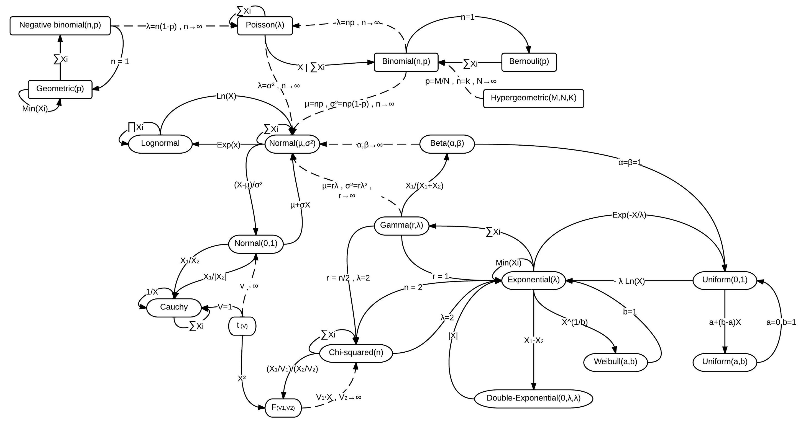

**[Return to the Course Home Page](../index.html)**

# Transcriptomic Visualization
**Dr Olin Silander**

## Learning Objectives

1. Understand the steps involved in analysing RNA-seq data
2. Understand how small read count numbers can lead to uncertainty
3. Calculate differences in gene expression between samples (DGE)
4. Use four methods to visualise differences in gene expression: volcano plots, heatmaps, PCA, and UMAP 


## Introduction

Up to this point, we have covered Methods for visualising RNA-seq results via dimensional reduction - specifically, Principal Component Analysis (PCA) and Uniform Manifold Approximation and Projection (UMAP). You have seen that in using these methods that certain "characteristics" (e.g. cocktail ingredients) of certain "things" (e.g. cocktails) can be reduced  


### Why are small numbers unreliable?

I have discussed in class that when only a small number of RNA-seq reads map to a gene, we cannot be as certain of its expression level than when large numbers of reads map to a gene. Let's first investigate why this is so.

Many of you have probably heard of different probability distributions, for example the [Normal distribution](https://en.wikipedia.org/wiki/Normal_distribution "Pi, why are you in this formula?") (or Gaussian distribution), the [exponential distribution](https://en.wikipedia.org/wiki/Exponential_distribution "It's got no memory!"), the [binomial distribution](https://en.wikipedia.org/wiki/Binomial_distribution "Will I succeed or not??"). Each of these is associated with different types of processes or samples, for example, [human height](https://tasks.illustrativemathematics.org/content-standards/HSS/ID/A/4/tasks/1020#:~:text=The%20heights%20of%20adult%20men,standard%20deviation%20of%202.5%20inches. "how tall are you?"), the [lifetime of a car battery](https://opentextbc.ca/introstatopenstax/chapter/the-exponential-distribution/ "I'm not talking about Tesla here"), or the [number of heads you'll get in ten coin flips](https://onlinestatbook.com/2/probability/binomial.html "Heads I win, tails you lose!"), respectively.

Closely related to the binomial distribution is The Poisson Distribution, which is the distribution one would expect in almost any case we are sampling a countable number of things. For example, after a very light rain, we could count the number of raindrops on different sidewalk squares. [These would be Poisson distributed](https://en.wikipedia.org/wiki/Poisson_scatter_theorem#:~:text=The%20expected%20number%20of%20raindrops,with%20intensity%20parameter%202%2F5. "But they would be hard to count"). Maybe we are interested in [how many Prussian cavalry](http://rstudio-pubs-static.s3.amazonaws.com/567089_c15d14f3d35b4edcbf13f33bbe775d4c.html "Not interested, thanks") are likely to be [killed by horse kicks in any given year](https://www.randomservices.org/random/data/HorseKicks.html "Where is Prussia anyway?"). Or maybe we're interested in the [number of calls we can expect at a call centre](https://www.statology.org/poisson-distribution-real-life-examples/ "Not answering my phone"). All of these are Poisson distributed.<br>

<br>
**There are lots of distributions and they're all related**<br><br>


The number of RNA-seq reads that map to a gene [is also Poisson distributed](https://www.biostars.org/p/84445/ "I knew it!") (largely speaking). As expected, then, most packages for analysing RNA-seq data *model* the data as being Poisson distributed. Let us see what this means for genes with high and low number of reads mapped to them.

<br>
**I literally do not understand this at all**. Credit: [xkcd](https://www.explainxkcd.com/wiki/index.php/12:_Poisson "But here's an explanation")<br><br>


Okay, let's make some pretend RNA-seq data. First, we will make a toy dataset with a very small number of read counts per gene. Maybe it was from a bad library prep. Or maybe from an under-represented barcode in what was otherwise a good sequencing run. To do this, we will sample our read counts as if they were Poisson. Navigate to your `R` console.

```R
# Let's keep this simple
# we'll use R's built-in Poisson random number generator rpois()
# In this case, the first argument is the number of random numbers
# and the second is the *mean* of the Poisson distribution
# We don't need to specify the variance, as the variance of 
# a Poisson distribution is EQUAL to the mean!
# And we'll get results for four "samples"

# Doing this at the top let's us easily adjust the number of genes
# and number of samples without adjusting the rest of the code
# (if for some reason you wanted to do that)
n.genes <- 4000
n.samples <- 6
avg.reads <- 4
# Make our data, the total amount is just the number 
# of samples times the number of genes and we'll have
# a mean of 3. We'll pretend our data come from two
# samples, "normal" and "cancer" tissue

normal.counts <- rpois(n.samples*n.genes/2, avg.reads)
cancer.counts <- rpois(n.samples*n.genes/2, avg.reads)

low.read.counts <- matrix(c(normal.counts, cancer.counts), ncol=n.samples, nrow=n.genes)

# Add some labels
rownames(low.read.counts) <- paste0("gene_",1:n.genes)
colnames(low.read.counts) <- c(paste0("normal_",1:(n.samples/2)), paste0("cancer_",1:(n.samples/2)))
# Did it work?
head(low.read.counts)
``` 

Let's check that these are Poisson distributed. We'll use the `hist()` function.

```R
# I always change this as I don't like sideways numbers
par(las=1)

# We'll use a very large number of breaks for consistency with the next section
hist(low.read.counts[,1], breaks=0:200-0.5, xlim=c(0,12), xlab="Number of mapped reads", ylab="Number of genes", main="Poisson or not?")
```

You'll note that even though we specified that the mean of our distributions should be four, there are **many** genes that have more than twice as many mapped reads, some with three times as manmy mapped reads, some with 1/4 as many mapped reads, and a number with zero mapped reads. Should we conclude that the genes with zero mapped reads are actually not expressed? **No!** It is simply sampling noise that has prevented us from observeing reads that map to these genes. We should have sequencing data that is *deeper* - i.e. has more reads per sample. Also note that this distribution has a relatively long tail - there are probably even some genes with read counts of ten or eleven (in fact we can calculate the exact fraction we would expect). Let's go ahead and do that. We can use `R`'s built-in exact calculator of Poisson probabilities, `dpois()`

```R
# Make sure your histogram window is still active
points(0:12, dpois(0:12,avg.reads)*n.genes, ty="o", bg="pink", lwd=2, pch=21)
```

This line should follow the distribution fairly closely, with some sampling noise. Let's next look at our dataset more holistically. Here, we will use a heatmap, which most of you will have already encountered.

```R
# We don't care if it's pretty
# But let's output to a pdf so we can look at it later
pdf(file="low.read.count.pdf", width=2,height=8)
heatmap(low.read.counts)
dev.off()
```

Go ahead and open the pdf. Great! We've got some clearly differentially expressed genes, some only in sample 1, some only in sample 2, etc. Now we can go through our differential gene expression analysis using [edgeR](https://scholar.google.co.nz/citations?view_op=view_citation&hl=en&user=XPfrRQEAAAAJ&citation_for_view=XPfrRQEAAAAJ:SGW5VrABaM0C "it's popular"). This is one of the primary RNA-seq analysis packages, the other being [DESeq2](https://scholar.google.co.nz/citations?view_op=view_citation&hl=en&user=vzXv764AAAAJ&citation_for_view=vzXv764AAAAJ:IjCSPb-OGe4C "Wow Mike").


<br>
**There are really only two commonly used RNA-seq analysis packages**<br><br>

```R
# Get edgeR from the bioconductor website
library(BiocManager)
BiocManager::install("edgeR")
```

We also have to set up our sample data so that `edgeR` can handle it. This is relatively simple, and just involves constructing a matrix that will tell `edgeR` which samples are which. Let's do that quickly:

```R
# for this to work you must have named your
# sample number variable "n.samples" 
sample.data <- sample.data <- c(rep("normal",n.samples/2),rep("cancer",n.samples/2))

# What does it look  like?
sample.data
```

Then we can have `edgeR` do the analysis for us (thanks!). Various parts of the tutorial below are from [here](https://www.nathalievialaneix.eu/doc/html/solution-edgeR-rnaseq.html) and [here](https://web.stanford.edu/class/bios221/labs/rnaseq/lab_4_rnaseq.html).

```R
# Here we make our edgeR object
dge.low.counts <- DGEList(counts=low.read.counts,group=factor(sample.data))
# check what it looks like
summary(dge.low.counts)

# We make a cheeky backup copy because we're prone
# to deleting important things
dge.low.counts.backup <- dge.low.counts

```

We can then filter our results so that we only include genes that have mapped read counts per million mapped reads of at least 100 in at least two samples.

```R
# remind ourselves what the read counts look like
head(dge.low.counts)

# What do the counts per million look like?
head(cpm(dge.low.counts))

# find out which rows to keep
# here cpm(dge.low.counts)>100 gives a TRUE or FALSE
# which can also be summed as they can be 
# interpreted as ones (TRUE) or zeroes (FALSE)
keep <- rowSums(cpm(dge.low.counts)>100) >= 2

# keep only those rows
dge.low.counts <- dge.low.counts[keep,]

# check what was lost
dim(dge.low.counts)
```

We've kept all our genes (rows)! Even though they have low counts! That's because our total library has (on average) only about 16,000 reads per sample. If we normalise by millions, that means the sum of each row (on average) gets multiplied by 1,000,000/16,000 = 62.5. *And* all rows have at least two samples each with two or more reads. 2\*62.5 is greater than 100, so that's all we need. Of course we can also calculate the probability that five of our samples in one row have fewer than two eads, and that is just the probability that at least five have one or zero reads, which is about one in six million. We could change our cutoff to three samples having at least 100 mapped reads, and then we see that we (probably) lose a few genes. This is unsurprising, as the probablility of this happening is close to 1 in 1,000. Let's do that.

```R
keep <- rowSums(cpm(dge.low.counts)>100) >= 3

# keep only those rows
dge.low.counts <- dge.low.counts[keep,]

# check what was lost
dim(dge.low.counts)
```

Next we need to normalise our data for library size.

```R
# normalise
dge.low.counts <- calcNormFactors(dge.low.counts)

# check what we did
dge.low.counts
```

Looks good.

I claimed that this data is Poisson distributed (in fact, it is). However, `edgeR` is loathe to admit it is (and in fact, most RNA-seq data is *not*). Therefore, we are going to calculate the dispersion and fit a *negative binomial* to model the data (rather than a Poisson). This is simply because RNA-seq data almost always has *more* variance than a Poisson, and the negative binomial let's us fit our data to match that extra variance.

```R
# we do this across genes and across samples
dge.low.counts <- estimateCommonDisp(dge.low.counts)
dge.low.counts <- estimateTagwiseDisp(dge.low.counts)
```

Finally, we can begin to *look* at our data. First, a multidimensional scaling (MDS) plot..

```R
plotMDS(dge.low.counts, method="bcv", col=as.numeric(dge.low.counts$samples$group))
```

Your plot - for the most part - should indicate that none of the samples cluster by type (although you might find, by chance, that they do).

We can also sort our data to find the most differentially expressed genes using the `exactTest` and `topTags` functions:

```R
dge.test <- exactTest(dge.low.counts)
# here, n is the number of genes to return, we just make it all genes
sort.dge <- topTags(dge.test, n=nrow(dge.test$table))
head(sort.dge)
```

But we can also make a [volcano](https://www.space.com/sharkcano-undersea-volcano-satellite-image "Sharkcano") plot. First we have to extract the relevant fields from our `edgeR` object, then plot.

```R
# as everyone knows, a volcano plot requires the log2 fold-change and the -log10 p-values
volcanoData <- cbind(sort.dge$table$logFC, -log10(sort.dge$table$PValue))
colnames(volcanoData) <- c("logFC", "-log10(p-value)")

# Everyone loves pch 19
plot(volcanoData, pch=19)

# okay but what if we *correct for multiple tests, and instead use the 
# corrected p-value (here, called FDR)
volcanoData <- cbind(sort.dge$table$logFC, -log10(sort.dge$table$FDR))
plot(volcanoData, pch=19)
```

Nothing! This is unsurprising, as we are using a completely random data set. However, you can see the characteristic volcano plot shape, where genes that have high or low log2-fold-changes also have low p-values (or high -log10 p-values).

We can now make our toy data set a bit more interesting. For example, we could change the read counts for a few random genes. Let's do that.


```R
# Randomly increase read counts of 20 genes
# in the cancer samples by 3-fold
# to do that we first find random genes (rows)
rand.genes <- sample(1:n.genes,20)
# Then we increase the counts, but *only* in the cancer samples (the 
# 2nd half of the samples)
low.read.counts[rand.genes,4:6] <- 3*low.read.counts[rand.genes,(n.samples/2+1):n.samples]
dge.low.counts <- DGEList(counts=low.read.counts,group=factor(sample.data))
dge.low.counts <- calcNormFactors(dge.low.counts)
dge.low.counts <- estimateCommonDisp(dge.low.counts)
dge.low.counts <- estimateTagwiseDisp(dge.low.counts)

# Does this change anything? Let's check.
plotMDS(dge.low.counts, method="bcv", col=as.numeric(dge.low.counts$samples$group))

```
With any luck, you might now see some samples grouping. And we've only changed the expression of 20 genes!

What about our differentially expressed genes?
```R
dge.test <- exactTest(dge.low.counts)
# here, n is the number of genes to return, we just make it all genes
sort.dge <- topTags(dge.test, n=nrow(dge.test$table))
# We'll look at a few extra lines
head(sort.dge, n=22L)
```

Now you should see some differentially expressed genes (but maybe not many). Let's repeat this process but pretend we have a better sample with more reads.

Okay, to get a better handkle on this whole process, let's change some more parameters. This time, we'll get more reads. We can just run through the code quite quickly.

```R
n.genes <- 4000

# change one or both of these to whatever values you like
# before they were 6 and 4
n.samples <- 8
avg.reads <- 50
normal.counts <- rpois(n.samples*n.genes/2, avg.reads)
cancer.counts <- rpois(n.samples*n.genes/2, avg.reads)
read.counts <- matrix(c(normal.counts, cancer.counts), ncol=n.samples, nrow=n.genes)
# Add some labels
rownames(read.counts) <- paste0("gene_",1:n.genes)
colnames(read.counts) <- c(paste0("normal_",1:(n.samples/2)), paste0("cancer_",1:(n.samples/2)))
# Did it work?
head(read.counts)
```

The `edgeR` bit.

```R
dge.counts <- estimateCommonDisp(dge.counts)
dge.counts <- estimateTagwiseDisp(dge.counts)
# look at this plot, don't ignore it
plotMDS(dge.counts, method="bcv", col=as.numeric(dge.counts$samples$group))
dge.test <- exactTest(dge.counts)
sort.dge <- topTags(dge.test, n=nrow(dge.test$table))
head(sort.dge)

volcanoData <- cbind(sort.dge$table$logFC, -log10(sort.dge$table$PValue))
colnames(volcanoData) <- c("logFC", "-log10(p-value)")
plot(volcanoData, pch=19)
```


### Differential Gene Expression Analysis (Real Data)

As we will be using the DESeq2 package we will first need to install it. Navigate to your `R` console.

We will use the `DESeq2` plotting tools, which require `ggplot2`. Apparently many of you are becoming quite familiar with this package for your portfolio assessments (well done!).

```R
# Install ggplot2 if necessary
# load the libraries for ggplot2 and DESeq2
# you know how to do this
```

The input data 
