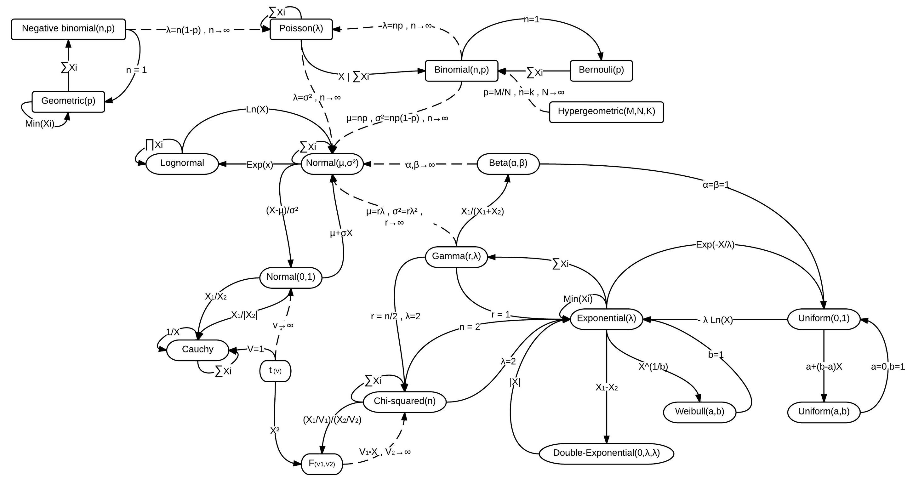
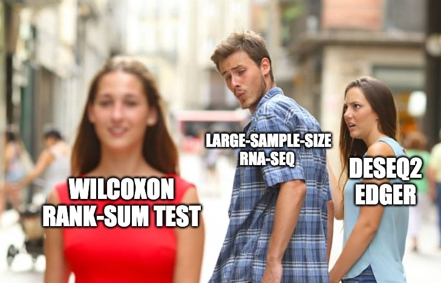

**[Return to the Course Home Page](../index.html)**

# Transcriptomic Analysis and Visualization
**Dr Olin Silander**

## Learning Objectives

1. Understand the steps involved in analysing RNA-seq data
2. Understand how small read count numbers can lead to uncertainty
3. Calculate differences in gene expression between samples (DGE)
4. Use two methods to visualise differences in gene expression: volcano plots and MDS 


## Introduction

Up to this point, we have covered Methods for visualising RNA-seq results via dimensional reduction - specifically, Principal Component Analysis (PCA) and Uniform Manifold Approximation and Projection (UMAP). You have seen that in using these methods that certain "characteristics" (e.g. cocktail ingredients) of certain "things" (e.g. cocktails) can be reduced. We have also visualised how RNA-seq data maps to genomic regions.

Today, we are going to just make some "toy" datasets so that we can get some insight into how RNA-seq packages are operating to find and plot differentially expressed genes (genes that are expressed at different levels in different samples).

First, we will see how our data can affect our conclusions by dealing with datasets of different size. The aim is to compare the results from two analyses - one with small numbers of reads, and one with large numbers. After we look at each dataset, which we generate randomly, we will change the dataset so that there *are* differentially expressed genes (DGEs), and see how that affects our inferences.


### Why are small numbers unreliable?

I have discussed in class that when only a small number of RNA-seq reads map to a gene, we cannot be as certain of its expression level than when large numbers of reads map to a gene. Let's first investigate this to gain some insight.

Many of you have probably heard of different probability distributions, for example the [Normal distribution](https://en.wikipedia.org/wiki/Normal_distribution "Pi, why are you in this formula?") (or Gaussian distribution), the [exponential distribution](https://en.wikipedia.org/wiki/Exponential_distribution "It's got no memory!"), the [binomial distribution](https://en.wikipedia.org/wiki/Binomial_distribution "Will I succeed or not??"). Each of these is associated with different types of processes or samples, for example, [human height](https://tasks.illustrativemathematics.org/content-standards/HSS/ID/A/4/tasks/1020#:~:text=The%20heights%20of%20adult%20men,standard%20deviation%20of%202.5%20inches. "how tall are you?"), the [lifetime of a car battery](https://opentextbc.ca/introstatopenstax/chapter/the-exponential-distribution/ "I'm not talking about Tesla here"), or the [number of heads you'll get in ten coin flips](https://onlinestatbook.com/2/probability/binomial.html "Heads I win, tails you lose!"), respectively.

Closely related to the binomial distribution is The Poisson Distribution, which is the distribution one would expect in almost any case we are sampling a countable number of things. For example, after a very light rain, we could count the number of raindrops on different sidewalk squares. [These would be Poisson distributed](https://en.wikipedia.org/wiki/Poisson_scatter_theorem#:~:text=The%20expected%20number%20of%20raindrops,with%20intensity%20parameter%202%2F5. "But they would be hard to count"). Maybe we are interested in [how many Prussian cavalry](http://rstudio-pubs-static.s3.amazonaws.com/567089_c15d14f3d35b4edcbf13f33bbe775d4c.html "Not interested, thanks") are likely to be [killed by horse kicks in any given year](https://www.randomservices.org/random/data/HorseKicks.html "Where is Prussia anyway?"). Or maybe we're interested in the [number of calls we can expect at a call centre per hour](https://www.statology.org/poisson-distribution-real-life-examples/ "Not answering my phone"). All of these are Poisson distributed.<br>

<br>
**There are lots of distributions and they're all related**<br><br>

### RNA-seq reads are Poisson distributed

The number of RNA-seq reads that map to a gene [is also Poisson distributed](https://www.biostars.org/p/84445/ "I knew it!") (largely speaking). As expected, then, most packages for analysing RNA-seq data *model* the data as being Poisson distributed (well...more on that later). Let us see what this means for genes with high and low number of reads mapped to them.

<br>
**I literally do not understand this at all**. Credit: [xkcd](https://www.explainxkcd.com/wiki/index.php/12:_Poisson "But here's an explanation")<br><br>


### Constructing a toy RNA-seq dataset

We'll make some pretend RNA-seq data. First, we will make a toy dataset with a very small number of read counts per gene. Maybe it was from a bad library prep. Or maybe from an under-represented set of barcodes in what was otherwise a good sequencing run. To make this toy dataset, we will sample our read counts as if they were Poisson. Navigate to your `R` console.

```R
# To make a toy dataset
# we'll use R's built-in Poisson random number generator rpois()
# This will give us a set of random numbers that 
# are Poisson-distributed.
#
# In the rpois function, the first argument is the number of random numbers
# and the second is the *mean* of the Poisson distribution
# We'll make up fake data for six "samples"

# First, by declaring some "master" variables here,
# we can easily adjust the number of genes
# and number of samples without adjusting the rest of the code
# total nmber of "genes" in our organism
    n.genes <- 4000
# total number of samples
n.samples <- 6
# average number of reads per gene
avg.reads <- 4

# We will make our data all at once. The total number 
# of Poisson distributed "reads per gene" is the total number
# of samples multiplied by the number of genes.
# However, we'll divide our six "samples" into two
# sets of three (n.samples*n.genes/2): one set of three is
# "normal" tissue and one set of three is "cancer" tissue

normal.counts <- rpois(n.samples*n.genes/2, avg.reads)
cancer.counts <- rpois(n.samples*n.genes/2, avg.reads)

# here we make a single matrix of all this data
# the total columns will be our number of samples
# and we will have one row for each gene
low.read.counts <- matrix(c(normal.counts, cancer.counts), ncol=n.samples, nrow=n.genes)

# We need to label the rows of our matrix with "gene_1", "gene_2", etc.
rownames(low.read.counts) <- paste0("gene_",1:n.genes)
# we label the columnes as "normal_1", "normal_2" etc. using paste()
colnames(low.read.counts) <- c(paste0("normal_",1:(n.samples/2)), paste0("cancer_",1:(n.samples/2)))
# Did it work?
head(low.read.counts)
``` 

Using `head` you should see a matrix with columns labeled "cancer_1 etc. and rows labeled "gene_1" etc.

### Testing for a match to the Poisson distribution

Next we can check that the read counts are Poisson distributed - they *should be* as we made the numbers using `rpois`, the Poisson random number generator. We'll use the `hist()` function to visualise the number of reads per gene. In this case, the plurality of genes should have a read count of the mean we assigned (4).

```R
# I always change this as I don't like sideways numbers
par(las=1)

# We'll use a very large number of breaks for consistency with the next section
# We'll also break on increments of 0.5 so that the counts are centred
hist(low.read.counts[,1], breaks=0:200-0.5, xlim=c(0,12), xlab="Number of mapped reads", ylab="Number of genes", main="Poisson or not?")
```

You'll note that even though we specified that the mean of our distributions should be four, there are **many** genes that have more than twice as many mapped reads, some with three times as many mapped reads, some with 1/4 as many mapped reads, and a number of genes with zero mapped reads. Should we conclude that the genes with zero mapped reads are actually not expressed? **No!** It is simply sampling noise that has prevented us from observing reads that map to these genes.

In fact we should have made sure that our sequencing data that is *deeper* - i.e. has more reads per sample and thus on average, more reads per gene. Regardless, let's test how well our gene and read counts match the Poisson. We can use `R`'s built-in **exact** calculator of Poisson probabilities, `dpois()`

```R
# Make sure your histogram window is still active
# We use the same "avg.reads" from above as the argument to dpois
# and we only get the exact Poisson numbers for 1:12 as those are the only ones
# on our plot.
points(0:12, dpois(0:12,avg.reads)*n.genes, ty="o", bg="pink", lwd=3, pch=21)
```

This line should follow the distribution fairly closely, with some sampling noise, and it should be a beatiful shade of pink.

### Visualising the toy data with a heatmap

Let's next look at our dataset more holistically. Here, we will use a heatmap, which most of you will have already encountered.

```R
# We don't care if it's pretty
# But let's output to a pdf so we can look at it later
pdf(file="low.read.count.pdf", width=2,height=8)
heatmap(low.read.counts)
dev.off()
```

Go ahead and open the pdf. Great! We've got some clearly differentially expressed genes, some only in sample 1, some only in sample 2, etc. But let's be careful not to squint at the data too hard...

### Differential expression analysis using edgeR

Now we can go through a differential gene expression analysis using [edgeR](https://scholar.google.co.nz/citations?view_op=view_citation&hl=en&user=XPfrRQEAAAAJ&citation_for_view=XPfrRQEAAAAJ:SGW5VrABaM0C "it's popular"). This is one of the primary RNA-seq analysis packages, the other being [DESeq2](https://scholar.google.co.nz/citations?view_op=view_citation&hl=en&user=vzXv764AAAAJ&citation_for_view=vzXv764AAAAJ:IjCSPb-OGe4C "Wow Mike").


<br>
**There are really only two commonly used RNA-seq analysis packages**<br><br>

```R
# Get edgeR from the bioconductor website
library(BiocManager)
BiocManager::install("edgeR")
library(edgeR)
```

We also have to set up our sample data so that `edgeR` can handle it. This is relatively simple, and just involves constructing a vector that will tell `edgeR` which samples are which (here we are pretending they are "normal" and "cancer"). Let's do that quickly:

```R
# for this to work you must have named your
# sample number variable "n.samples" 
# this gives us a 6-element vector of names 
# for our samples
sample.data <- c(rep("normal",n.samples/2),rep("cancer",n.samples/2))

# What does it look  like?
sample.data
```

Next we can have `edgeR` do the analysis for us. Various parts of the tutorial below are from [here](https://www.nathalievialaneix.eu/doc/html/solution-edgeR-rnaseq.html) and [here](https://web.stanford.edu/class/bios221/labs/rnaseq/lab_4_rnaseq.html).

```R
# Here we make our edgeR object using the DGEList function
# grouping the samples on the basis of the sample.data we made above
dge.low.counts <- DGEList(counts=low.read.counts,group=factor(sample.data))
# check what it looks like
summary(dge.low.counts)

# We make a cheeky backup copy because we're prone
# to deleting important things
dge.low.counts.backup <- dge.low.counts

```

### Stepping through counts-per-million Normalisation and filtering with edgeR


```R
# remind ourselves what the read counts look like
head(dge.low.counts)
```

Note that these are the small read numbers we started with.

```R
# What do the counts per million (cpm) look like?
head(cpm(dge.low.counts))
```

Note that these numbers are much much larger. This is becuase `edgeR` has *normalised* our numbers so that they are per million. However, because our total "read numbers" were much much less than one million, it ended up *multiplying* them for the normalisation.

We can filter our results so that we only include genes that have mapped read **counts per million mapped reads** of *at least 100* in *at least two* samples.


```R
# find out which rows to keep
# here cpm(dge.low.counts)>100 gives a TRUE or FALSE - 
# TRUE when the counts are above 100 and FALSE when not.
# TRUE is also interpreted as "1" by R, and FALSE as "0".
# Thus the sum function below "sums" up the TRUE rows
# to test if the sum is greater than 2
# In this way we get genes with counts > 100 in at least two samples.
keep <- rowSums(cpm(dge.low.counts)>100) >= 2

# keep only those rows
dge.low.counts <- dge.low.counts[keep,]

# check what was lost
dim(dge.low.counts)
```

We've kept all (or almost all) our genes (rows)! Even though they have low counts! That's because our total library has (on average) only about 16,000 reads per sample. If we normalise by millions, that means the sum of each row (on average) gets multiplied by 1,000,000/16,000 = 62.5. And *apparently*, all rows have at least two samples each with two or more reads. 2 reads\*62.5 normalisation factor is greater than 100, so if each row satisifes this, then it is kept.

We can think whether this is a good thing or not (in fact, it's likely to not be a problem).

Interestingly, we can also calculate the exact probability that five of our samples in one row have fewer than two reads, such that we would get rid of that row. That is just the probability that at least five samples in a row have one or zero reads. The probability that any one gene in one sample has 0 or 1 read is 0.091. The chance that five do is 0.091^5*0.909, or about one in six million. Thus, one in six million rows should have fewer than two reads in at least five samples.

We could change our cutoff to **three** samples having at least 100 mapped reads. Then we see that we (probably) lose a few genes. This is unsurprising, as the probablility of this happening is close to 1 in 1,000.

```R
keep <- rowSums(cpm(dge.low.counts)>100) >= 3

# keep only those rows
dge.low.counts <- dge.low.counts[keep,]

# check what was lost
dim(dge.low.counts)
```

### Stepping through Normalisation for library size

Next we need to normalise our data for library size.

```R
# normalise using the edgeR calcNormFactors
dge.low.counts <- calcNormFactors(dge.low.counts)

# check what we did
dge.low.counts
```

Looks good.


### Letting edgeR use a negative binomial

I claimed that this data is Poisson distributed (in fact, it is). However, `edgeR` is loathe to admit it is (because in fact, most RNA-seq data is *not*). Therefore, we are going to calculate the [dispersion](https://en.wikipedia.org/wiki/Statistical_dispersion "more stats") (how squished or flattened a distribution is) and fit a [negative binomial](https://en.wikipedia.org/wiki/Negative_binomial_distribution "let's not be negative") to model the data (rather than a Poisson). This is simply because RNA-seq data almost always has *more* variance than a Poisson (i.e. it's flattened relative to our expectations), and the negative binomial let's us fit our data to match that extra variance.

```R
# we estimate "dispersion" across genes and across samples
dge.low.counts <- estimateCommonDisp(dge.low.counts)
dge.low.counts <- estimateTagwiseDisp(dge.low.counts)
```

### MDS and Volcano plots

Finally, we can begin to *look* at our data. First, a multidimensional scaling (MDS) plot. An MDS plot is very very similar to a PCA plot. Here we have many genes that differ in "expression" between samples. This is analogous to the Food-Country relationships we saw last week, except the samples here (normal and cancer) are the countries, and the *genes*, which are expressed at different levels in different samples, are the foods.


```R
# in this case we won't worry about the specific method
plotMDS(dge.low.counts, method="bcv", col=as.numeric(dge.low.counts$samples$group))
```

Your plot - for the most part - should indicate that none of the samples cluster by type. This is not surprising, as we made these samples with random data.

We can sort our data to find the **most differentially** expressed genes using the `exactTest` and `topTags` functions:

```R
dge.test <- exactTest(dge.low.counts)
# here, n is the number of genes to return, we just tell it to return it all genes
sort.dge <- topTags(dge.test, n=nrow(dge.test$table))
# this gives us the most differentially expressed (remember, this is not really true)
head(sort.dge)
```

We can also make a [volcano](https://www.space.com/sharkcano-undersea-volcano-satellite-image "Sharkcano") plot. First we have to extract the relevant fields from our `edgeR` object, then plot.

```R
# as everyone knows, a volcano plot requires the log2 fold-change and the -log10 p-values
# here, logFC is the fold-change. We use cbind ("column bind") to put
# the fold-change and p-values together
volcanoData <- cbind(sort.dge$table$logFC, -log10(sort.dge$table$PValue))
colnames(volcanoData) <- c("logFC", "-log10(p-value)")

# Everyone loves pch 19
plot(volcanoData, pch=19)
```

It looks like there are some "significantly" differentially expressed genes with low p-values (high -log10). Are these real? Let's correct for "multiple tests" (when we do the same statistical test again and again and again).

```R
# What if we *correct for multiple tests*, and instead use a statistic similar to 
# a corrected p-value (here, called False Discovery Rate, or FDR). Instead
# of the p-value, we cbind the FDR
volcanoData <- cbind(sort.dge$table$logFC, -log10(sort.dge$table$FDR))
plot(volcanoData, pch=19)
```

Nothing to see here! Phew. This is unsurprising, as we are using a completely random data set. However, you can see the characteristic volcano plot shape, where genes that have high or low log2-fold-changes also have low p-values (or high -log10 p-values).

### A more interesting dataset

We can now make our toy data set a bit more interesting. For example, we can change the read counts for a few random genes. Let's do that.

```R
# Randomly increase read counts of 20 genes
# in the cancer samples by 3-fold
# to do that we first find random genes (rows) using "sample"
rand.genes <- sample(1:n.genes,20)
#
# Then we increase the counts for those genes, but *only* in 
# the cancer samples (the 2nd half of the samples)
# Here I am multiplying the expression levels by 3.
# You should be able to understand the basic syntax here
# where we are accessing matrix elements using the matrix[n,m]
# notation, and changing *only* the cancer genes which are
# in columns 4:6, i.e. (n.samples/2+1):n.samples)
low.read.counts[rand.genes,(n.samples/2+1):n.samples] <- 3*low.read.counts[rand.genes,(n.samples/2+1):n.samples]
# now we redo the edgeR analysis
dge.low.counts <- DGEList(counts=low.read.counts,group=factor(sample.data))
dge.low.counts <- calcNormFactors(dge.low.counts)
dge.low.counts <- estimateCommonDisp(dge.low.counts)
dge.low.counts <- estimateTagwiseDisp(dge.low.counts)
```

Now we have a new dataset. Here, a number of genes have higher expression in cancer. Specifically, we changed the expression 3-fold. We need to check whether this had the expected effect - are these genes actually inferred as being "differentially" expressed?

```R
# Does this change anything? Let's check. First, we will plot an MDS
# plot again. This time, some of the genes ("foods") *do* differ between the 
# samples ("countries"). The MDS analysis can use those genes to separate the samples
plotMDS(dge.low.counts, method="bcv", col=as.numeric(dge.low.counts$samples$group))
```

With any luck, you might now see some samples grouping. And we've only changed the expression of 20 genes! However, you might not - changing the expression level of 20 genes by three-fold with such small read numbers does not guarantee we find anything at all.

We can also do a volcano plot.

```R
volcanoData <- cbind(dge.test$table$logFC, -log10(dge.test$table$PValue))
colnames(volcanoData) <- c("logFC", "-log10(p-value)")
plot(volcanoData, pch=19)
# let's highlight which points we made differentially expressed in orange
# We know which these are because we made our list of "rand.genes" above
points(volcanoData[rand.genes,], pch=19,col="orange")
```


What about our differentially expressed genes?
```R
dge.test <- exactTest(dge.low.counts)
# here, n is the number of genes to return, we just make it all genes
sort.dge <- topTags(dge.test, n=nrow(dge.test$table))
# We'll look at a few extra lines
head(sort.dge, n=22L)
```

Now you should see some differentially expressed genes (but maybe not many, especially depending on how much you changed the genes' expression (e,g. by two-fold or four-fold or 1.5-fold)).


### A dataset with more reads per gene

Finally, to get a better handle on this whole process, let's change some more parameters. This time, we'll get more reads (i.e. increase our Poisson average from 4 to 50). We can just run through the code quite quickly.

```R
n.genes <- 4000

# change one or both of these to whatever values you like
# before they were 6 and 4. Make sure your avg reads per gene is quite high
n.samples <- 8
avg.reads <- 50

# this is where we get the random numbers
normal.counts <- rpois(n.samples*n.genes/2, avg.reads)
cancer.counts <- rpois(n.samples*n.genes/2, avg.reads)
read.counts <- matrix(c(normal.counts, cancer.counts), ncol=n.samples, nrow=n.genes)
# Add some labels
rownames(read.counts) <- paste0("gene_",1:n.genes)
colnames(read.counts) <- c(paste0("normal_",1:(n.samples/2)), paste0("cancer_",1:(n.samples/2)))
# Did it work?
head(read.counts)
sample.data <- c(rep("normal",n.samples/2),rep("cancer",n.samples/2))
# check what it looks like
summary(read.counts)
dge.counts <- DGEList(counts=read.counts,group=factor(sample.data))
dge.counts <- calcNormFactors(dge.counts)
```

We first take a quick peak at how Poisson this is.

```R
# Again, we use a histogram
hist(read.counts[,1], breaks=0:200-0.5, xlim=c(0,100), xlab="Number of mapped reads", ylab="Number of genes", main="Poisson or not?")
points(0:100, dpois(0:100,avg.reads)*n.genes, ty="o", bg="pink", lwd=2, pch=21)

```

Poisson? It looks Normal! *The Poisson converges to the normal for large numbers*. Note that **none** of the read counts vary by more than 50% (presuming youu set your read count per gene high enough). This contrasts with our low read count sample, in which many gene read counts varied by 2- or 3-fold.


<br>
**There are lots of distributions and they're all related**<br><br>


### An edgeR analysis when we have more reads

Now, the `edgeR` bit.

```R
dge.counts <- estimateCommonDisp(dge.counts)
dge.counts <- estimateTagwiseDisp(dge.counts)
# look at this plot, don't ignore it
# do any of the samples differ now?
plotMDS(dge.counts, method="bcv", col=as.numeric(dge.counts$samples$group))

# do the stats
dge.test <- exactTest(dge.counts)

# Finally, lets do the volcano plot
volcanoData <- cbind(dge.test$table$logFC, -log10(dge.test$table$PValue))
colnames(volcanoData) <- c("logFC", "-log10(p-value)")
plot(volcanoData, pch=19)

# let's find the differentially expressed genes (DGE)
sort.dge <- topTags(dge.test, n=nrow(dge.test$table))
head(sort.dge, n=22L)
```
As before, you should find that there are few differences becuase this data is just random. But as before, we can change the expression of a few genes.

```R
# we change this in the same way. If you would like, you can change many more of
# the genes instead of just 10
rand.genes <- sample(1:n.genes,10)
# Then we increase the counts for the randomly selected genes, but *only* in the
# cancer samples (the 2nd half of the samples)
# and do the analysis all the way to the MDS in one fell swoop
read.counts[rand.genes,(n.samples/2+1):n.samples] <- 2*read.counts[rand.genes,(n.samples/2+1):n.samples]
dge.counts <- DGEList(counts=read.counts,group=factor(sample.data))
dge.counts <- calcNormFactors(dge.counts)
dge.counts <- estimateCommonDisp(dge.counts)
dge.counts <- estimateTagwiseDisp(dge.counts)
dge.test <- exactTest(dge.counts)

sort.dge <- topTags(dge.test, n=nrow(dge.test$table))
head(sort.dge)
plotMDS(dge.counts, method="bcv", col=as.numeric(dge.counts$samples$group))
```
And then as usual, we follow that with the volcano plot.

```R
volcanoData <- cbind(dge.test$table$logFC, -log10(dge.test$table$PValue))
colnames(volcanoData) <- c("logFC", "-log10(p-value)")
plot(volcanoData, pch=19)
# let's highlight which points we made differentially expressed
points(volcanoData[rand.genes,], pch=19,col="orange")
```

Or plot the volcano plot but with the False Discovery Rate, FDR, rather than the p-value.

```R
volcanoData <- cbind(sort.dge$table$logFC, -log10(sort.dge$table$FDR))
colnames(volcanoData) <- c("logFC", "-log10(FDR)")
plot(volcanoData, pch=19)
```

What is different here versus the dataset with few reads? We can easily see that we have found more differentially expressed genes, even though they are not (necessarily) *more* differentially expressed - we just have more reads. This shows the power of having deeper sequencing datasets.<br>


<br>
**Well, on Sunday it is.**<br><br>
