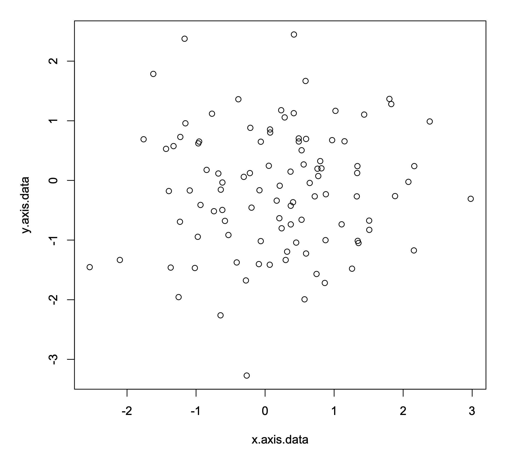
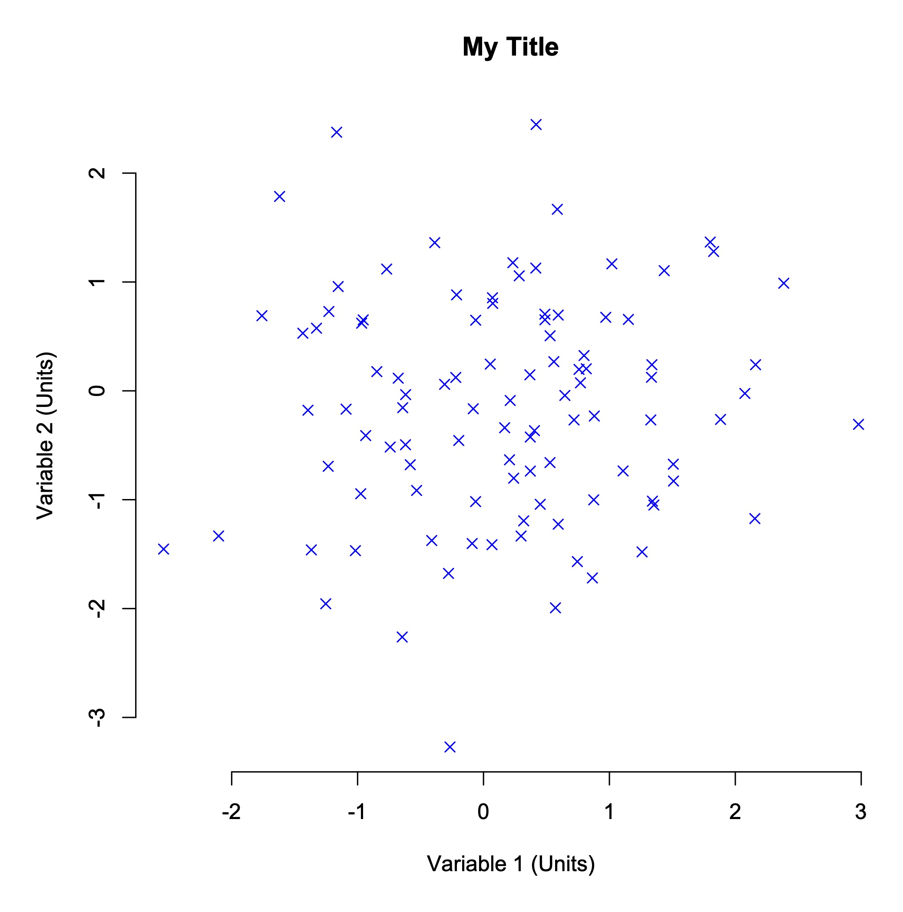

**[Return to the Course Home Page](../index.html)**

# Introduction to Visualization
**Professor Murray Cox**

[Purpose](#purpose)<br>
[Introduction](#introduction)<br>
[A Basic Scatter Plot](#a-basic-scatter-plot)<br>
[Different Types of Graphs](#different-types-of-graphs)<br>
[Making Good Use of Summary Statistics](#making-good-use-of-summary-statistics)<br>
[Choosing A Plot Type](#choosing-a-plot-type)<br>
[Critically Evaluating Your Data](#critically-evaluating-your-data)<br>
[Checking Your Data Source](#checking-your-data-source)<br>
[P Hacking](#p-hacking)<br>
[Take Home Messages](#take-home-messages)<br>

## Purpose

To learn how to critically explore data, with the aim of designing and making clear, simple and informative graphs.


## Introduction

Conveying quantitative information in graphical form sounds easy.  Perhaps surprisingly, it isn't.  A large number of studies dating from the 1960s onward show that what data you use and how you present it really matters.  People can interpret graphs of the same data in very different ways solely because of superficial choices like axis ranges, plot types, color schemes and other seemingly unimportant features.  Interpretation can also be influenced by more fundamental issues with the data.  In this practical, we will explore some basics of thinking critically about data and good graph design.  We will make graphs for a number of different datasets, and in the process, we explore some examples of good and poor pratice.


## A Basic Scatter Plot

Let's start by building a simple scatter plot for a set of 100 random data points drawn from a normal distribution.  In R, you can do this with the following commands.

```R
x.axis.data <- rnorm(100)
y.axis.data <- rnorm(100)
```

Making a basic scatter plot is also straightforward in R.  You use the command *plot* and then put the *x* axis data first, followed by the *y* axis data.

```R
plot(x.axis.data, y.axis.data)
```

In this example, the data generated by R is random, so everyone will get a different graph.  However, running this command in R should produce a graph that looks something like this.



This is a good start, but there is a lot more we can do.  For instance, what data is plotted on those axes, and what units are they in?  We can add axis labels to give this information to the reader.

```R
plot(x.axis.data, y.axis.data, xlab="Variable 1 (Units)", ylab="Variable 2 (Units)")
```

You can also add a title if you want to.  Graphs in papers and reports don't usually have titles (they often use a written caption instead), but titles can be helpful when you are exploring a new dataset and need to keep track of lots of plots.

```R
plot(x.axis.data, y.axis.data, main="My Title", xlab="Variable 1 (Units)", ylab="Variable 2 (Units)")
```

You can do lots of other fancy things as well, such as changing the point character using the *pch* flag (some options are shown [here](https://www.r-bloggers.com/2021/06/r-plot-pch-symbols-different-point-shapes-in-r/))...

```R
plot(x.axis.data, y.axis.data, main="My Title", xlab="Variable 1 (Units)", ylab="Variable 2 (Units)", pch=4)
```

...or changing the color of the points...

```R
plot(x.axis.data, y.axis.data, main="My Title", xlab="Variable 1 (Units)", ylab="Variable 2 (Units)", pch=4, col="blue")
```

... or removing the box around the plot.

```R
plot(x.axis.data, y.axis.data, main="My Title", xlab="Variable 1 (Units)", ylab="Variable 2 (Units)", pch=4, col="blue", bty="n")
```



As you can see, by making relatively small changes, you can alter how the graph looks in some fairly striking ways.

R lets you modify essentially every feature of a graph.  Although often a simple graph will suit your purposes, searching for example plots online is a good way to get a feel for what alternative designs might be possible and how to make them.  The [R Graph Gallery](https://www.r-graph-gallery.com) is a particularly nice site with lots of worked examples.

> **EXERCISE 1**
> Here is code to generate another dataset.
>
> ```x <- runif(100)```
> ```y <- 2 + 3 \* x^2 + rnorm(100, 0, 0.25)```
> 
> Let's assume this dataset shows the production of a metabolite in mg/L (*x* axis data) relative to the cellular expression of a gene in read counts per million (*y* axis data).
> Can you make a scatter plot that clearly and simply shows the trend between metabolite levels and gene expression?


## Different Types of Graphs

Alright, so that's all well and good if you want to make a scatter plot.  But what if you want some other type of plot, perhaps a bar chart?

Well, the R command for a bar chart is also fairly straightforward.  

```R
items <- c("A", "B", "C", "D", "E")
values <- sample(seq(0,100), 5)
barplot(values, names=items)
```

> **EXERCISE 2**
> Can you add *x* and *y* axis labels and a title to the bar chart?

And what if you want a pie chart?  That's also easy.

```R
items <- c("A", "B", "C", "D", "E")
values <- sample(seq(0,100), 5)
pie(values, labels=items)
```

There are a huge number of ways to plot data, including many plot types you have probably never heard of before.  Regardless of what sort of data you have, there will be multiple ways to plot it.  Often, the plot commands in R are very simple – at least for basic styles.

> **EXERCISE 3**
> Take another look through the [R Graph Gallery](https://www.r-graph-gallery.com).
> Choose a plot style that interests you and use the commands given online to replicate the plot.  For this exercise, stick to plots described as 'base R' rather than 'ggplot2'.


## Making Good Use of Summary Statistics

Plotting data is time consuming, so before we do that, it is best practice to calculate summary statistics, such means (averages) and standard deviations.

Let's consider a dataset showing the gene expression of 142 genes together with their associated protein levels as determined by mass spectrometry.  There are four sets of data generated under four different environmental conditions.  

The first thing we need to do is load this dataset.

```R
load(url("https://github.com/mpcox/203.311/raw/main/Week3/files/expression.Rdata"))
```

Gene expression data should be plotted on the *x* axis and is therefore stored in variables called 'set1.x', 'set2.x', etc.  Protein level data should be plotted on the *y* axis and is stored in variables called 'set1.y', 'set2.y', etc.

Means (averages) are easy to calculate in R.

```R
mean(set1.x)
mean(set2.x)
mean(set3.x)
mean(set4.x)
```

> **EXERCISE 4**
> Calculate the mean (average) values of both the gene expression (*x*) and protein (*y*) levels for the four datasets.  Do they appear to differ under the four environmental conditions?

Standard deviations are also easy to calculate in R.

```R
sd(set1.x)
```

> **EXERCISE 5**
> Calculate the standard deviations of both the gene expression (*x*) and protein (*y*) levels for the four datasets.  Do they appear to differ under the four environmental conditions?

Finally, it can be helpful to calculate correlations between different variables.  A correlation analysis will tell you whether genes with high expression also have high levels of the corresponding protein.

```R
cor.test(set1.x, set1.y)
```

> **EXERCISE 6**
> Calculate correlations of gene expression (*x*) against protein (*y*) levels for the four datasets.  Do they appear to differ under the four environmental conditions?

At this point, you have probably identified that the four datasets are very similar, both in terms of their average expression and protein levels, regardless of which environmental conditions they were generated under. Interestingly, the correlation values are also small – there is little evidence that genes with high expression also produce high levels of the corresponding protein.

Just to confirm this, it's always a good idea to plot your data, just to confirm that there are no real differences between the datasets.

> **EXERCISE 7**
> Make scatter plots for the four datasets.


## Choosing A Plot Type

It's often a good idea to look at your data visually.  The challenge is: what plot type should you use?  After a while you begin to learn what sorts of plots are particularly good at representing certain types of data. Nevertheless, often you just have to try different plot types and see what works.

Let's consider genes grouped into functional categories, such as 'immune genes', 'enzymes', 'cell wall genes' and the like.  Classifying genes in this way is very common, and can be highly effective for distinguishing how certain types of genes change under different conditions (say, in cancer cells vs normal tissue).

Here is a dataset of five immune cell types and their percentage frequency under three conditions: normal tissue, the primary tumor, and a secondary tumor ('metastasis').

```R
cell.type <- c("eosinophils", "mast cells", "lymphocytes", "basophils", "neutrophils")
normal <- c(17.5, 21.5, 20.0, 17.0, 24.0)
primary <- c(20.0, 21.0, 19.0, 20.0, 20.0)
secondary <- c(21.0, 18.5, 20.0, 23.5, 17.0)
```  

> **EXERCISE 8**
> We learned earlier how to make pie charts.  Make pie charts for the normal tissue, primary tumor and secondary tumor.  Are there any clear differences in the proportions of the five immune cell types?

Because it's hard to know what plot type produces the clearest visualation of your data, it is often helpful to try other options and see if you like them better.  For group data, like that given here, bar charts are often used.

It can also sometimes be convenient to re-order your dataset – this can make it easier for your readers to understand the results.  Here, let's move the immune cell types around so they're in alphabetical order.

```R
cell.type <- c("basophils", "eosinophils", "lymphocytes", "mast cells", "neutrophils")
normal <- c(17.0, 17.5, 20.0, 21.5, 24.0)
primary <- c(20.0, 20.0, 19.0, 21.0, 20.0)
secondary <- c(23.5, 21.0, 20.0, 18.5, 17.0)
```

> **EXERCISE 9**
> We learned earlier how to make bar charts.  Make bar charts for the normal tissue, primary tumor and secondary tumor.  Do you prefer them to the pie charts?


## Critically Evaluating Your Data

In 1980, Robert Jackman wrote an influential [paper](https://www.jstor.org/stable/2095134) looking at the link between social factors and income for a global range of countries.  Although this study is over 40 years old and is not based on genetic data, the analysis is widely known as a case study of how to look critically at data.  It is worth considering for that reason alone.

Let's start by loading the dataset.

```R
load(url("https://github.com/mpcox/203.311/raw/main/Week3/files/income.Rdata"))
```

This dataset contains two variables for 18 countries: the percentage turnout at national elections ('turnout') and the average level of inequality in the incomes of people ('income.inequality').

> **EXERCISE 10**
> We learned earlier how to calculate correlations.  Take this dataset and calculate the correlation between voter turnout and income inequality.

Hopefully you found, as did many many researchers before Jackman, that there is a strong negative correlation between voter turnout and income inequality (r = –0.78, p = 0.00013).  Because the P value is low, we would say that this is a statistically significant result.  Specifically, countries with a high voter turnout have less income inequality between people.

> **EXERCISE 11**
> Now do what Jackman did: make a scatter plot of voter turnout (*x* axis) vs income inequality (*y* axis).  What do you see?

In this instance, one country – South Africa – stands out as being very different to all the other countries.  In statistics, this process of looking for unusual data points is called [anomaly detection](https://en.wikipedia.org/wiki/Anomaly_detection) and South Africa would be said to be an *outlier*.  Although it is important to think critically before removing data from any analysis, this is a good example of where it would be reasonable to do that and then see if the analysis changes.

So what does the correlation between voter turnout and income inequality look like if we exclude South Africa?

First, we have to take out the South Africa data point.  Conveniently, it is the first entry in each variable.  Because each variable is just a vector of numbers, we can simply ask R to ignore the first country in the list and only consider countries 2 to 18.

```R
cor.test(turnout[2:18], income.inequality[2:18])
```

> **EXERCISE 12**
> Calculate the correlation between voter turnout and income inequality.  How has the correlation value changed?  What is the statistical significance – that is, what is the probability value now?


## Checking Your Data Source

It's always important to check your data, including its source.

Consider the following time series dataset.

```R
year <- c(1999, 2000, 2001, 2002, 2003, 2004, 2005, 2006, 2007, 2008, 2009)
gene.gains <- c(6, 5, 5, 10, 8, 14, 10, 4, 8, 5, 6)
gene.losses <- c(9, 8, 11, 12, 11, 13, 12, 9, 9, 7, 9)
```

This shows the number of genes gained and lost from the genome of a New Zealand alpine buttercup as a population on the Ruapehu plateau was surveyed over the course of a decade.

> **EXERCISE 13**
> Calculate the correlation between gene gain and gene loss.  Are these two values associated?

For time series data, it can be helpful to add lines to plots.  This can be done in two ways: using the *type* flag or the *lines* command.  In the *type* flag, the options are *p* for **points**, *l* for **lines** and *b* for **both**.  Run the commands below and see if you can figure out how they work.

```R
plot(year, gene.gains, type="b", col="blue")
lines(year, gene.losses, type="b", col="red")
```

> **EXERCISE 14**
> This dataset was obtained from an [online repository](http://www.tylervigen.com/spurious-correlations). Quickly look through the website and just confirm that the dataset was downloaded correctly.


## P Hacking

By now, you should have a growing understanding of how important it is to check your data, question your assumptions, and think critically about your decisions, including how you set out to explore and visualize your data.

In this final exercise, we will explore the issue of *p hacking*, which is when you keep looking through your data until you find a significant result.  When datasets were small, researchers could only really ask one or two questions of any given dataset.  Now that many studies collect huge amounts of data, it is tempting to look through the data to find interesting results.

> **EXERCISE 15**
> Take a look at [this website](https://projects.fivethirtyeight.com/p-hacking/). Quickly look through the website and just confirm that the dataset was downloaded correctly.  Try selecting various parameters to test.  Can you find a statistically significant result?  How much do you believe it?


## Take Home Messages

During this practical, you have hopefully encountered some points that are new to you.  From my perspective, I think the main take home messages are:

+ You can make all sorts of plots in R, often easily, but you need to think very carefully about how your readers will interpret the plots you give to them.  Some types of plots are just always worse than others.

+ You need to be confident about where your data comes from.  Is it accurate?  Is it complete?  Have any errors crept into the dataset before it came to me?

+ You should look at your data carefully.  Does it make sense, given what you expect?  Are there any features of the data that look suspicious?  Are there any outliers?  Even if summary statistics are normal, plot your data to check for unexpected features.

+ You need to think about what analyses you want to run before you run them.  The human brain is very good at finding patterns in random data.  Are you using your data to answer a specific question, or are you just looking through your data until you 'find something'?

If you put all these together, the key point is that you need to think critically as you analyze your data.  Just throwing together a plot can get you into trouble quickly.  Spending the time to think through what you're doing and why will save you a lot of problems down the track.

