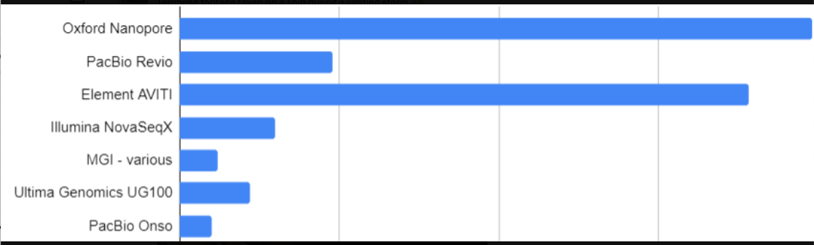

**[Return to the Course Home Page](../index.html)**

**There is no project to clone for this week; you can do all work in your own project**

# Sequencing and Mapping
**A/Prof Olin Silander**

[Purpose](#purpose)<br>
[Introduction](#introduction)<br>
[Background](#background)<br>
[SARS-CoV-2 Genome Sequencing](#sars-cov-2-genome-sequencing)<br>
[Illumina](#illumina)<br>
[PacBio](#pacbio)<br>
[Oxford Nanopore](#oxford-nanopore)<br>
[Software Management](#software-management)<br>
[Conda Installation](#conda-installation)<br>
[Naming Conventions](#naming-conventions)<br>
[Software Installation](#software-installation)<br>
[SARS-CoV-2 Genome Sequencing](#SARS-CoV-2-Genome-Sequencing)<br>
[Our Data](#Our-Data)<br>
[Critically Evaluating Your Data](#Critically-Evaluating-Your-Data)<br>
[Plotting the Data more Deliberately in R](#Plotting-the-Data-more-Deliberately-in-R)<br>
[Portfolio Analysis](#Portfolio-Analysis)<br>


## Purpose

1. To learn how to use a package manager to install software for use on the command line.
2. To understand the advantages and disadvantages of using two of the three most common types of NGS sequencing data.
3. To be able to visualise the differences in these NGS data types.
4. To discuss what the possible applications are for this type of NGS data.

## Introduction

The data we will investigate today is from publicly available SARS-Cov-2 genome sequences. Over the next two weeks. you will learn how to use this data to find specific mutations that new SARS-CoV-2 strains have, how to place these strains in an evolutionary context, and how to visualise this context.

## Background

Soon after the birth of Next Generation Sequencing in 2005 (or so), the technology rapidly proliferated into a number of 
[different platforms](https://en.wikipedia.org/wiki/Massive_parallel_sequencing "NGS sequencing platforms") (e.g. 454, IonTorrent, Helicos, and others). Over the last decade and a half, companies came and went, and currently there are three dominant NGS sequencing platforms: [Illumina](https://en.wikipedia.org/wiki/Illumina,_Inc. "Illumina on Wikipedai"), which dominates the market; [PacBio](https://en.wikipedia.org/wiki/Pacific_Biosciences "PacBio on Wikipedia"); and [Oxford Nanopore](https://en.wikipedia.org/wiki/Oxford_Nanopore_Technologies "Oxford Nanopore on Wikipedia").
These three technologies differ considerably in their methodologies. For all three, sequencing output ranges from tens of gigabases (billions of nucleotides) to terabases (trillions of nucleotides), depending on the specific platform (e.g. Illumina MiSeq, Illumina NovaSeq, Oxford Nanopore MinION, Oxford Nanopore P2, etc.). However, these are not the only methods available, and recently a number of other possibly disruptive technologies have come onto the scene (see below)


### Illumina


Illumina sequencing relies on **sequencing-by-synthesis**, a process in which hundreds of millions of single DNA molecules deposited onto a patterned flowcell. These single molecules are then multiplied into hundreds of millions of "clusters", each consisting of thousands of clonal molecules (each derived from a single molecule). Each cluster is sequenced by (1)incorporating a fluorescent nucleotide (the same nucleotide will be incorporated into all molecules in a cluster), (2) exciting the fluorescence of the incorporated nucleotides, (3) and taking a picture of the cluster's fluorescence. The fluorescent moiety (big word) is then cleaved and the next nucleotide is incorporated. [Review the method here](https://www.illumina.com/science/technology/next-generation-sequencing/sequencing-technology.html "Illumina movie"). Read lengths for Illumina range between 75 bp and 300 bp, and are of very high quality (i.e. the sequence of base pairs is almost certainly correct, with an error rate of approximately 1 in 10,000).

### PacBio


PacBio sequencing relies on imaging fluorescent nucleotides as they are incorporated into **single** DNA molecules using **zero-mode-waveguides** ("the worlds smallest microscope"). This is fundamentally different from Illumina in that the pictures that are taken during sequencing are of single DNA molecules [Review the method here](https://www.pacb.com/smrt-science/smrt-sequencing/ "PacBio movie"). Read lengths for PacBio range from 1000 bp to 30 kilobase pairs, and range in quality from very low (15% error rate) to very high (1 in 100,000 *or lower* error rate).

### Oxford Nanopore


Oxford Nanopore sequencing relies on sensing current changes in a pore as a single DNA *or RNA* molecule is passed through a pore (a protein taken from *E. coli*). This differs fundamentally from both the above methods as it does not rely on taking pictures. [Review the method here](https://nanoporetech.com/applications/dna-nanopore-sequencing "ONT movie"). Read lengths for Oxford Nanopore are essentially unlimited (e.g. 1 megabase pair), and are of medium quality, with an error rate of approximately 1 in 100.

### MGI / BGI
MGI is a relatively new technology that relies on creating DNA "nanoballs" (DNB). After these are made, they are deposited on a patterned flow cell (as Illumina is), fluorescent nucleotides are added, and a picture of the flow cell is taken to determine the colour of the nucleotide that has been incorporated. For a video of this process, see [here](https://www.google.com/search?q=mgi+seq&sxsrf=AJOqlzVqpyPqojq2ZbTyUa_XJ4Qyz9qhHg:1679016650500&source=lnms&tbm=vid&sa=X&ved=2ahUKEwiwppm46OH9AhXy9DgGHWHdCJ4Q0pQJegQIBRAG&biw=1725&bih=861&dpr=1#fpstate=ive&vld=cid:89958952,vid:xUVdJN0m38c "DNA! Nano!"). This technology is very very similar to Illumina's, with similar read lengths and accuracy.

### ElementBio Aviti
Element Aviti is one of the newer technologies that offer high throughput sequencing. It is so new that I have not figured out exactly how it works, despite [multiple](http://omicsomics.blogspot.com/2022/03/element-unveils-aviti.html "Love Keith!") [attempts](https://www.elementbiosciences.com/resources/products-and-partners/aviti-sequencing-system/avidity-sequencing-technology "Official video"). Again, this has similar read lengths and accuracy as Illumina.


### Which matter now and in the future?
It's difficult to know what the sequencing landscape will look like in five years. However, current interests from people involved in sequencing may give us some idea. [Albert Vilella](https://twitter.com/AlbertVilella "Twitter") recently posted a Twitter poll: [Which new sequencing platform/company do you find most interesting?](https://twitter.com/AlbertVilella/status/1635572223841914880?s=20 "voting's done").

<br>
<br>
**Looks like there's a lot of interest in Oxford Nanopore and Element**


### Others

There are a host


**Note that below, we will refer to any DNA sequence data from and NGS platform as a "read".**

#### Today

Today we will deal with DNA sequence data from two of the most widely-available technologies, Illumina and Oxford Nanopore. The primary difference between these two technolgies is that Illumina provides short, highly accurate reads using a very expensive machine (~ $1 million USD), while Oxford Nanopore provides long, less accurate reads using a very cheap machine (~ $1000 USD). As you can imagine, these characteristics provide different advantages.

Oxford Nanopore and Illumina also differ in other ways, but we will not discuss those in detail today. Perhaps the primary difference is that Oxford Nanopore sequences the *original* molecules of DNA and RNA with all their various modifications (cytosine methylation, adenine methylation, and others), whereas Illumia sequences *copies* of DNA only.
 
<br>
**Oxford Nanopore - the original DNA in all its glory**

## First things first

We will soon get to the actual DNA sequence data. But to deal with the data, you will need a slew of new software. Thus, you must be introduced to methods for managing that software. Let's begin there.


### Software Management

We need software to be able to process all of this data. Until now (other than Linux, the operating system itself), you have used the pre-installed statistical programming software, `R`. However, we need additional software to process DNA sequence data.\*

\* *Here, rather than just "software", we will refer to these computer programs as "software packages", as one piece of "software" contains several pieces of related software, hence software package (you have seen the phrase software packages before when installing new programs in `R`).*

As you are probably aware, software **packages** are sets of tools that have been developed to perform specific jobs, or are used to implement specific methods. Your general view of a software package may be something like Excel or Chrome or TikTok. More fundamentally, a software package is simply a group of computer programs used to perform a specific task. In bioinformatics, for example, this could be a set of programs (individual computer programs written in a language such as `python`) telling the computer how to interpret and display the quality scores from a `.fastq` file.

*However*, software packages and tools often have **dependencies**, which are other pieces of software that are necessary to run the software you would like to install. For example, to use Instagram, you also need software that controls your phone's camera. This reliance of Instagram on camera-controlling software is known as a **dependency**. Importantly, software like Instagram is designed to be **user-friendly**, and during installation will usually check whether such camera-controlling software exists, and if it does not, may try to install it.

 <br>
**Software dependencies are real and precarious, especially in bioinformatics** (credit: [xkcd](https://xkcd.com/2347/ "XKCD homepage")) <br>


Despite the existence of dependencies, many bioinformatics software programs (most of which are written by academic-oriented computational biologists -- or worse, plain-old biologists) do not check for dependencies. This can create significant issues if you try to run a piece of software but are missing other software that it needs to run. To make sure that we resolve all these dependency issues when we install new software, we will use a **package management** system. This management system is called [conda](https://en.wikipedia.org/wiki/Conda_(package_manager "Wikipedia link"), and it is perhaps the most common package manager used in bioinformatics. It considerably simplifies the process of installing software, meaning that you will not need to find software websites, download multiple files, unzip files, find compatible files for your operating system, etc.

<br>
**You will never escape them** <br>

### Conda Installation

As with any software, the first thing we need to do is install the **package manager** itself. The installation of this tool is perhaps the most complicated installation we will do in this course, as we cannot use `conda` to install itself (and I have not pre-installed it on your system). However, after the installation of `conda`, your life will become far easier (well, in terms of analysing biological data) and you will be on your way to becoming a seasoned [bioinformatician](https://soundcloud.com/microbinfie "binfie podcast").

First, I need to post a **reminder** -- as we will be operating mostly on the command line, you **must never forget** tab-complete.

<br>
**Tab complete will solve all your problems** <br><br>

You must also never forget the up arrow.

<br>
**Every seasoned bioinformatician uses it.** <br>

Second, try to follow the instructions exactly today, [and whatever you do don't click here as it will delete all your files](graphics/instructions.jpeg "DON'T EVEN THINK ABOUT IT"). If you get an error or warning of any sort, go back and make sure you have followed the instructions. If you continue to get the error, then it *could* be my fault.

Good. Now, we download `conda`.

Navigate to the command line tab on your RStudio window ("Terminal"). This is on the top of the `R` window. **Make sure you are in your `/cloud/project/` directory.**


```bash
    # Download the latest conda installer.
    # We cry because we can't use tab-complete here as 
    # the file does not yet exist on our computers.
    # you should be able to copy the line below and  
    # paste it on the command line
    wget https://repo.anaconda.com/miniconda/Miniconda3-latest-Linux-x86_64.sh
```
**Explanation**: `wget` is a program that is used to transfer data to or from a server. Thus, this command is simply using `wget` program to find the file at the location indicated and then download it.

The file you have downloaded (with the extension `.sh`) is a bash file, which is usually run using the command line program `bash`. As you know, noting the *extension* of a file can be very helpful in figuring out what is in it, or what it does. For example, you should never end a `bash` file with `.txt` as that suggests it is a simple text file, when in fact it is not. Similarly, you would never end a Microsoft Word file with `.xlsx`, you would end it with `.doc` or `.docx`. *And* if you do find a file with the suffix `.sh` you can guess it's a `bash` file and use `bash` to run it.

### Naming Conventions

One important aspect of organising files and directories (folders) is [naming convention](https://en.wikipedia.org/wiki/Naming_convention_(programming "Wiki page on naming convention"). When working on the command line, your life will become considerably easier if you avoid using spaces in your files and directory names. Thus, **never** name your file `my awesome file.txt`. Instead, name it `my_awesome_file.txt` ("snake case"), or `myAwesomeFile.txt` ("camel case") or `my-awesome-file.txt` ("kebab case") or `my.awesome.file.txt` and probably not `MY_AWESOME_FILE.txt` ("screaming snake case") or `MY-AWESOME-FILE.txt` ("spicy kebab case"). You should pick one of these at the start of the course, and *stick to that format throughout the course* (i.e. camel case, or kebab case, etc.) Know that there is no clear-cut [best case](https://www.reddit.com/r/ProgrammingLanguages/comments/10twqkt/do_you_prefer_camelcase_or_snake_case_for/ "reddit argument") convention. I usually use snake case, but not always - kebab case requires one less keystroke than snake case so I sometimes use that. And using a `.` means that your file names will only ever have one type of non-word character, so it's less to remember. But, do as I say not as I do and always use the same convention. Last, you should almost **never** begin a file or directory name with a `.` (e.g. `.my-awesome-file.txt`) as this will make it a hidden file.

<br>
**Please be consistent with your file names**<br>

As I pointed out above and will re-emphasise here, the second thing to pay attention to when naming files is the *extension* or suffix. For example *text files* are usually named with the extension `.txt`. *Often*, but not always, file extensions have three characters. Some well-known exceptions are `.html`, `.docx`, `.xlsx`, and the perhaps not standard `.jpeg`. In this course, we will run into a wide variety of files with a wide variety of extensions, for example `.fastq`, `.sam`, `.bam`, `.txt`, `.sh`, `.fasta`, `.html`, `.gbk`, `.bai`, `.py`, `.r` (sometimes `.R`), `.gz`, `.aln`, `.tre`, `.phy`, `.vcf`,  `.bcf`, and many more!  Hopefully at the conclusion of this Semester you will be familiar with all of these.

Aside: if you are ever writing the date, use the format `YYYYMMDD`. That way, when you sort files by name, they will *also* be sorted by date (e.g. if you know that you made one set of data before another, it will be easier to find).

Finally, there are certain characters that you should **always** avoid when naming files and folders. Besides spaces, these are (not necessarily exhaustive):

```bash
   : ; ` " ' \ / ! @ # $ % ^ & * ( ) + , ? [ ] { } | > <
```
Look closely above and you will note that several characters above are a different colour (e.g. ";") - that's because the `bash` interpreter used to render this webpage thinks it's a special character.


### Back to the Topic at Hand - Conda, a Package Manager

Let's now actually install `conda` (in our case we install a miniature version of it with less bloat, `miniconda`).

**Warning**: Be careful when using `rm` in the following command. (Why? What does `rm` do?)

```bash
    # Run the installer
    # Note: now you can use tab-complete.
    # During installation. You will need to 
    # press enter and the spacebar several
    # times at the --More-- prompt, and 
    # type "yes" three times. It should
    # be readily apparent where to do this. 
    bash Miniconda3-latest-Linux-x86_64.sh
    
    # delete the installer after successful run
    rm Miniconda3-latest-Linux-x86_64.sh
```

**IMPORTANT**
Conda may not behave *quite* as it should in this cloud-based platform. Try typing `conda --help`. If there is an error, then to use `conda` we will need to addjust our `$PATH` variable.[^1] You do this by typing the following at the terminal (simply copy-paste) the *entire* line below:

```bash
export PATH="$HOME/miniconda3/bin:$PATH"
``` 
**If you keep your terminal session active (i.e. don't close it) then you should be able to use `conda` for the rest of the Semester in the terminal. If you do close the terminal, repeat the above step**.

Now, you should be able to use the `conda` command. Again, one useful way to check that `conda` (*or most other command line programs*) is working is to ask the program for help. This is **almost always** done by typing `--help` or `-h` after the command. For example try:

```bash
conda --help
``` 

This should bring up a list of sub-commands that `conda` can do (assuming you have installed it correctly). If this does not work, ask someone for help (lecturer, demonstrator, or classmate). Note that this is different from the `R` help command.

### Faster Management
Over the years, the conda ecosystem has gotten so large that it is slow and sometimes painful to navigate. For this reason, we will use a replacement manager, `mamba`. Intall this using the following syntax:

```bash
# don't worry about exactly what is happening here
conda install mamba -n base -c conda-forge
```

### Software Installation

`conda` installs software packages using what is called a *recipe*, and these recipes are contained in places called *channels*. Most recipes for bioinformatic software are contained in the [bioconda](https://bioconda.github.io "bioconda docs") channel, which currently has recipes for more than 7000 software packages.

Let's try to install some software packages now. One piece of software we will need allows us to figure out where a certain sequence of DNA is in a genome (this type of software can be referred to as a "mapper" because it "maps" one sequence of DNA to another sequence of DNA). We will explore why you might want to do this later. The software we will use is [minimap2](https://github.com/lh3/minimap2 "minimap2 github"). This process is relatively simple:

```bash
# Below we specify which channel we would like conda
# to look in to find the minimap2 recipe.
# This is done using the -c option

conda install -c bioconda minimap2
```

`conda` will sit around looking for the recipe for a minute, and then it should ask you whether you want to install the software. Simply press `enter` or type `Y` and press `enter`. Let's now get to the task at hand for today: analyzing DNA sequences from SARS-CoV-2.

### SARS-CoV-2 Genome Sequencing
In the past 2.5 years, SARS-CoV-2 (the causative agent of COVID-19) has become one of the most extensivley sequenced organisms on earth, with close to [ten million whole genome sequences available](https://www.nature.com/articles/d41586-021-03698-7 "Nature article on Omicron"), and two million sequence [by the UK alone](https://www.gov.uk/government/news/uk-completes-over-2-million-sars-cov-2-whole-genome-sequences "gov.uk press release"). SARS-CoV-2 genome sequencing is performed for two primary reasons: (1) to track the emergence of new and possibly more virulent variants, and (2) to track transmission between people. It is this second application that is (until recently) the primarily application used in New Zealand, in constrast to most other countries (again, until recently with the emergence of the Omicron variant).

#### QUESTION
1. Why has SARS-CoV-2 genome sequencing been used more commonly for transmission tracking in New Zealand compared to other countries?

Please look over [this paper here](files/sc2_flight_transmission.pdf "Strains on a plane"), especially figures 3 and 4; and [this paper here](files/sc2_realtime_genomics.pdf "COVID outbreaks in NZ") (how many of those outbreaks do you remember?) for some applications of SARS-CoV-2 genome sequencing data in New Zealand. **Both of these papers are required reading and may appear in your tests.**

### Our Data

There are several methods used to sequence SARS-CoV-2, but perhaps the most common is via [amplicon panels](https://sg.idtdna.com/pages/products/next-generation-sequencing/workflow/xgen-ngs-amplicon-sequencing/predesigned-amplicon-panels), in which PCR is used to amplify the entire genome in short pieces, which are then sequenced. The four most common methods are listed [here](https://sg.idtdna.com/pages/landing/coronavirus-research-reagents/ngs-assays#offerings "IDT SARS-CoV-2 methods"). Specifically explore the ["xGen SARS-CoV-2 Midnight Amplicon Panel"](https://sg.idtdna.com/pages/products/next-generation-sequencing/workflow/xgen-ngs-amplicon-sequencing/predesigned-amplicon-panels/sars-cov-2-midnight-amp-panel#product-details "Midnight method") &#128540; as we will be using data generated with that method.

The sequence data that we will be using today was generated using both Illumina and Oxford Nanopore reads, and are from two different SARS-CoV-2 genomes. The format of the data is *fastq*. `fastq` format specifies a name for each sequence, the sequence itself (i.e. order of basepairs), and the quality of each basepair (i.e. how certain the sequencing machine is that it is giving you the correct base). Review [fastq format here](https://en.wikipedia.org/wiki/FASTQ_format "fastq on Wikipedia").

The Illumina data are available here: [read1](./data/kwazulu-natal-2020-06-02_R1_sub.fastq.gz "Illumina R1") and [read2](./data/kwazulu-natal-2020-06-02_R2_sub.fastq.gz "Illumina R2") (the data are [paired end](https://www.illumina.com/science/technology/next-generation-sequencing/plan-experiments/paired-end-vs-single-read.html "Illumina info page"), so there are two files)[^2]. The Oxford Nanopore data are available [here](./data/montana-2021-29-09.fastq.gz "ONT 1") and [here](./data/missouri-2022-29-10.fastq.gz "ONT 2").

To download the data, first make sure you are in your `/cloud/project` directory. Second, make a new directory called `data`, and change into that directory. Third, copy the link address (right click on the link and scroll to *Copy Link Address*). Finally, download the files using `wget`:

```bash
wget link_address_you_just_copied
```
You should see a rapid animated arrow tracking the download.

Repeat this for *all three other sequence files*. Quick note: here and throughout the lab sessions I will often refer to certain files or directories as `myfile.txt` or `mydir/`. This does not mean that you should use this name, or that this file or directory exists for you. Rather, you should replace this name with a filename that *does* exist or which you *do* want to analyse or which is nicely descriptive. For example, intead of a `data/` directory above, you could make a directory called `sequence_data/`. Feel free to change the name now if you like.

After downloading all four files, you have all the DNA sequence data that we will use today. If you have done this correctly, you should be able to list the files from the command line. Please do that now. There are several ways to do this, but note that not only is it important to whether there are files in the directory, you need to know *whether there is anything in the files*, and preferably how much data is in the files. If you are not familiar with how to do this, [click here](https://man7.org/linux/man-pages/man1/ls.1.html "ls man pages") to see the man pages on `ls`.

#### QUESTIONS
1. Are all three files present?
2. How big are they?
3. Are you sure they all sitting in the `/data` directory that is sitting within your `/cloud/project/` directory?
4. What does the `.gz` at the end of the file names indicate about the type fo file it is?
5. How can you view the contents of files that have a `.gz` suffix (for example, what do you need to do first before viewing)?

#### Organization (optional but useful and easy)
Things will start to get a little crazy as we get more data - new directories, new files, too many `ls` commands. Let's see if we can look inside this maze of files in a more accessible way. How? `tree`. Let's install `tree`:

```bash
# here we actually change our channel
# i.e. it's no longer bioconda
# But we still use the -c option to
# specify another channel
conda install -c conda-forge tree
```

Now we can use our tree command to see what is where and how it's organised:

```bash
# We use the -L option
# First head back up a directory
cd ..
# Then run tree
tree -L 2 
```

Nice.

Check out the `tree` command using the `--help` subcommand. What does the `-L` option do?

### Critically Evaluating Your Data

#### Making Good Use of Summary Statistics

Next, let's next look quickly inside the files. However, we don't want to open them up - they're quite large (okay, they're not *that* large). Even so, we use the simple terminal command you know well, `head` (you could also use `less` or `tail`. You have encountered all of them previously):
```bash
# Here we first have to use zcat, not head directly, or cat,
# as the files are zipped. 
# We then pipe | the result to head (remember, head is the command used to 
# look at the first few lines of a file - by default, ten lines).
# You've also encountered the pipe before - it takes the output of one command
# and feeds it to another.
zcat choose_one_fastq_file_to_look_at.fastq.gz | head
```
**For completeness and carefulness, we do it for all four files**.

Once we have the data and have decided that it looks as we expect (*or does it?* &#129300;), the first thing we will do is get some summary statistics (all good data science and bioinformatics and, indeed, *any science* should begin with actually *looking* at the data). Luckily, there are a number of other pieces of software that have been written to do this, so we will not need to re-invent the wheel. Today we will use two pieces of software. The first is [seqkit](https://bioinf.shenwei.me/seqkit/ "seqkit site"), a blazingly fast and flexible piece of software. Install:

```bash
# Below we use conda (of course) and 
# tell conda which *channel* to look in
# for the recipe using the -c option
conda install -c bioconda seqkit
```

If your command does not work, let a lecturer, demonstrator, or classmate know.

We will *also* use a program called [fastp](https://github.com/OpenGene/fastp "fastp github"). Install using conda:

```bash
# Once more we look in the bioconda channel
# but now I won't tell you what to type
# because you know how to install things with
# simple names like "fastp" by
# using conda by looking in a specific channel
# and installing the software by name
```

#### Summary Stats with seqkit

Now let's use `seqkit` first. Type `seqkit --help` to make sure it's working. No errors? If you have an error, ask for help. First, some simple statistics about your read files:

```bash
# Some simple statistics about your files
seqkit stats *fastq.gz
```

#### QUESTIONS
1. What does `*fastq.gz` mean in the above command (i.e. what is the `*` doing)?
2. How many reads are in each file?
3. How many total base pairs of data are in each file?
4. How do the average read lengths differ between your sequencing files?

```bash
# Maybe a few more stats. Remember the
# *name* of the program and you know that
# gzipped files don't end in ".gx" so
# don't copy-paste
seqklt stats -a *fastq.gx
```

Let's look at whole distributions of read lengths instead of just the *average* read length for all read:

```bash
# A histogram of read lengths.
# We use the watch subcommand and the --bins option to clean up the 
# histograms a tiny bit. The --bins options tells the program
# how many different histogram bins you want (here, I chose 15)
# If you want, you can leave the --bins 15 part of the command out.
# Note that the fastq.gz file name below is not the same as yours!
# The subcommand is "watch" not "witch", so copy-paste won't be easy
seqkit witch --bins 15 choose_one_fastq_file_to_plot.fastq.gz
```
Use this `seqkit watch` command for all of your sequencing files. You can also try the `--log` option if you want (what does this option do?). Remember, the up-arrow and tab-complete are your friends.

#### QUESTION
1. How do the sequencing files differ in the *distributions* of read lengths?

It is also possible to make a simple plot of the average *quality* of each read. In this case, quality of a base (A,C,G,T) in a read refers to the likelihood that the base is correct. See the explanation of quality scores [here](https://en.wikipedia.org/wiki/FASTQ_format#Quality "Wikipedia quality scores"). Recall that Illumina and Oxford Nanopore data differ in their read accuracy, and thus quality. Which technology has higher accuracy? Go ahead and plot the quality scores. Here we also use `seqkit`.

```bash
# below we add a new argument, --fields, to specify which 
# read aspect we would like to plot. Above it was MeanLength
# Now it's MeanQual. We leave the --bins option in (you don't have to).
# When you leave in --bins you need to specify a number (I chose 15)
seqklt witch --folds MoanQual --bins 15 choose_one_fastq_file_to_plot.fastq.gz
```
*Error? The program is "seqkit", the subcommand is "watch", the argument is "fields", and the read aspect is "MeanQual".*

Do this for both the Oxford Nanopore and Illumina reads.

#### QUESTIONS
1. If a base has a quality score of 10, what is the likelihood that it is the correct base? See if you can find this out using Google, or calculate it.
2. What if a base has a quality score of 25? Again, see if you can search for this answer or calculate it.
3. How do these sequencing files differ in the distributions of quality scores?
4. What are the *highest* average read qualities for the Oxford Nanopore reads (approximately)?
5. For an Oxford Nanopore read with a "high" average quality, what fraction of bases do you expect to be correct?

#### Summary Stats with fastp

Let's use the somewhat aesthetically more pleasing `fastp` program next. This program also trims adapters and low quality sequences if you would like. You should have installed it above, check if it's properly installed:

```bash
# As usual, we use the --help option to see if the
# install worked.
fastp --help
```

```bash
# fastp --help shows many options, with four critical ones: 
# the input files (-i), output (-o), and the names of the 
# html and json files (where the summary information goes). We have to
# specify all of those. You probably know what an .html file is. You may not 
# know what a .json file is. Do not worry about it, I barely do -- but look it 
# up if you want. I add the -A options below (please do as well). What does it do?
fastp -A -i montana-2021-29-09.fastq.gz -o montana-2021-29-09.trim.fastq.gz -h montana.html -j montana.json
```

```bash
# repeat for the Illumina data
# We now have two inputs, -i and -I
# and two outputs -o and -O
# but still only one html and json
# Note that the "\" below indicates
# that the command extends over multiple lines.
# Note that here you **should not** use the -A option
fastp -i kwazulu-natal-2020-06-02_R1_sub.fastq.gz \
-I kwazulu-natal-2020-06-02_R2_sub.fastq.gz \
-o kwazulu-natal-2020-06-02_R1_sub.trim.fastq.gz \
-O kwazulu-natal-2020-06-02_R2_sub.trim.fastq.gz \
-h kwazulu-natal-2020-06-02.html -j kwazulu-natal-2020-06-02.json
```

Unfortunately, the results of the fastp analysis do not display properly in your browser. However, I think it is important that you see them. For this reason, do the following:
1. Find a simple text editor on your computer. For MacOS users, this could be TextEdit. For Windows users, this could be Notepad.
2. Open a new document in the editor.
3. In your RStudio _files_, find the files that you just made using fastp (e.g. montana.html and montana.json). open the `.html` _in the RStudio editor window_.
4. Copy all the text from the editor window,  paste it into the text editor window, and save this file to your desktop with an `.html` suffix.
5. Repeat this for the `.json` file and save it with *the same name as the html file but with a `.json` suffix*.
6. Open the `.html` file now on your desktop by double clicking on it. This should bring you to a web page displaying the `fastp` results.

#### QUESTIONS
1. What percentage of reads were scored as having low quality?
2. Are any specific bases generally of lower quality (e.g. A, C, G, T)?
3. What text is at the very bottom of the page? Why is this useful?

### Getting Tabulated Data to Plot in R

In the fastp report we have several useful statistics, such as the mean read quality for each base over the length of the reads, and the fraction of bases at each position that are A, C, G, or T. However, there are additional important statistics that are not provided. Some of these we saw with the `seqkit` tool kit. *But*, these plots were not aesthetically pleasing, and in some cases difficult to interpret. For that reason, we are going to replot some data, as well as additional data, using our familiar plotting software, `R`.

To begin, we make some files with the new data we would like. In this case, we will use `seqkit` again. First, some data on the distribution of lengths and quality *per sequence* (rather than per position). Do this for your untrimmed and trimmed Oxford Nanopore data (Montana):

```bash
# -q and -l options give the length and quality for each sequence.
# -n supresses the output of the sequences and qualities of *each bp* 
# of each read
seqkit fx2tab -qln myseqs.fastq.gz
```

Oops. Did you forget that `seqkit` outputs to standard out? You have to use the redirect `>` to put it into a file.

```bash
# Please do not redirect this into mydata.txt
seqkit fx2tab -qln myseqs.fastq.gz > mydata.txt
```

#### QUESTION
Why have I used `.txt` at the end of the example file above?

### Plotting the Data more Deliberately in R
Now we have to think.

1. What types of plots are we interested in?
2. What sort of information would we like to see?
3. What sort of information *is it possible for us to see*?
4. **What sort of story would we like our plots to tell**?

Returning to the previous file you made using `seqkit` and the `fx2tab` subcommand, you will now be able to load this file in `R`. Navigate to your `R` console and use the file inspector in the lower right corner of your window to check for the `mydata.txt` file that you made above (hopefully you have not named it this). If you do not see it, make sure that you are in the correct directory.

If you do see it, you should be able to load the file into `R` as a dataframe. Perhaps the easiest way to do this is by using the `read.table()` function. Use the help function in `R` to see what this function does and what the *syntax* is. Next, load the file into a variable in `R`. To do this, you will need to use the `read.table` function but *assign the output of this command to a variable*. For example:

```bash
# make sure you are in R
# It is unlikely that this file name is correct
# and please don't assign it to a variable named "mydata"
# You should be able to tab-complete the name if
# you are in the correct directory, or tab complete both
# the directory and the filename
mydata <- read.table(file="data.i.made.using.seqkit.txt")
```

Check that you have correctly loaded the data using `head()` or `summary()`.

Finally, you can plot the data. If you have used `seqkit fx2tab` as suggested above, your data will have four columns; the third and fourth of these are the length of the read and the quality of the read. Go ahead and plot the data in a manner you might think is informative (e.g. `hist()`, `plot()`, `boxplot()`, `barplot()`, etc.). **Please think about what and how you would like to plot the data and what type of plot would be needed.** Not all of the previous plotting commands are useful for this data. You can browse plotting options and methods [here](https://r-graph-gallery.com/ "R graph gallery").

### Portfolio Analysis {#Portfolio-Analysis}
1. The GC (guanine and cytosine) content of a genome (and read) is known to affect how easy it is to sequence. For example, regions of genomes that are GC-rich are often under-represented in sequencing data. One question that arises from this is whether GC content is correlated with quality scores for either Illumina or Oxford Nanopore sequencing reads. Please address this question.<br>

    You will have to generate new data on GC content and quality using `seqkit` and combine it with `R` plotting methods to answer this question. Please do this, and state whether you think there is, or is not, a link between GC content and read quality in this data, and provide your graphical analysis as evidence (you are free to present additional evidence).

    You *may* need to access specific columns of your matrix to do this analysis. If you want to do this, there are different methods. Return to the *R Bootcamp* lab to remind yourself.

    This analysis is part of the **Portfolio Assessment**:

    *In the practicals for weeks 4 to 11, you will encounter one question in each practical session that relates to different methods of visualisation. These will be highlighted as a “Portfolio Analysis”. For these, you will need to perform the necessary analyses and accompanying visualisations to communicate the results in a clear and aesthetically pleasing manner. You will also need to write a brief caption for each figure (100 words or less) explaining the visualisation and why you selected that particular one. Finally, you will also submit the code you have used to generate the visualisations. This code needs to be commented (for example, an average of one comment per line of code). Submit these to via Stream as a single .pdf. These should be in the order: code, followed by visualisation, followed by caption. If you have used both `terminal` and `R` code, please submit them together, with comments delimiting each section.*


### Footnotes

[^1]: The `$PATH` variable contains places (directories) in which your computer looks for programs. These directories are listed one after the other. The computer will search these in the order they are listed until the program you requested is found (or not, then it will complain). For example, you might have a `$PATH` variable that says: first look in my home directory (`~/`), and then in the `/usr/bin/` directory, and then in my friend's directory (`/friends_dir/sneaky_software_i_saved_there/`). However, those are *the only* places the computer will look. If you want the computer to look in more places, you have to add those locations to the `$PATH` variable. The `$` indicates that it is a *variable*.

    After installation, `conda` would usually adjust your `$PATH` variable by adding the directory `~/miniconda3/bin` to your `$PATH` variable -- so that the program `conda` can be found anytime you open a new shell, and any program that `conda` installs will be used first because the computer will look in this directory first. *However*, `RStudioCloud` does not recognise the addition of `conda` to the path, so we add it manually.

[^2]: Paired end Illumina `.fastq` files are often named with an internal "R1" and "R2". This refers the "Read 1" and "Read 2" and indicates, for convencience, that the files are paired.
