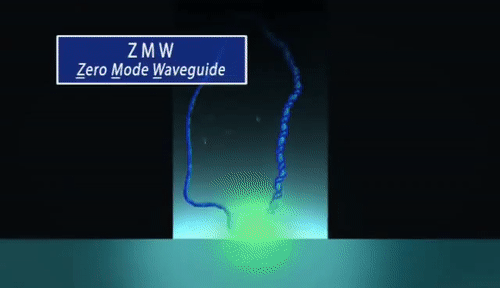

**[Return to the Course Home Page](../index.html)**

# Sequencing and Mapping
**Dr Olin Silander**

[Purpose](#purpose)<br>
[Introduction](#introduction)<br>
[SARS-CoV-2 Genome Sequencing](#sars-cov-2-genome-sequencing)<br>
[Illumina](#illumina)<br>
[PacBio](#pacbio)<br>
[Oxford Nanopore](#oxford-nanopore)<br>
[The Data](#data)<br>
[Making Good Use of Summary Statistics](#making-good-use-of-summary-statistics)<br>
[Choosing A Plot Type](#choosing-a-plot-type)<br>
[Critically Evaluating Your Data](#critically-evaluating-your-data)<br>
[Take Home Messages](#take-home-messages)<br>


## Purpose

To learn about the advantages and disadvantages in two of the three most common types of NGS sequencing data, how to visualise these differences, and what the applications are for this data. The data we will use is from publicly available SARS-Cov-2 genome sequnces. You will learn how to use this data to find specific mutations that new SRAS-CoV-2 strains have, how to place these strains in an evolutionary context, and how to visualise this context.


## Introduction

Soon after the birth of Next Generation Sequencing in 2005 (or so), the technology rapidly proliferated into a number of 
[different platforms](https://en.wikipedia.org/wiki/Massive_parallel_sequencing "NGS sequencing platforms") (e.g. 454, IonTorrent, Helicos, and others). However, this number has been gradually weaned down, and currently there are three dominant NGS sequencing platforms: [Illumina](https://en.wikipedia.org/wiki/Illumina,_Inc. "Illumina on Wikipedai"), which dominates the market; [PacBio](https://en.wikipedia.org/wiki/Pacific_Biosciences "PacBio on Wikipedia"); and [Oxford Nanopore](https://en.wikipedia.org/wiki/Oxford_Nanopore_Technologies "Oxford Nanopore on Wikipedia").
These three technologies differ considerably in their methodologies. For all three, sequencing output ranges from tens of gigabases (billions of nucleotides) to terabases (trillions of nucleotides), depending on the specific platform (e.g. Illumina MiSeq, Illumina NovaSeq, Oxford Nanopore MinION, Oxford Nanopore PromethION, etc.).

Below, we will refer to any DNA sequence data from and NGS platform as a "read".

### SARS-CoV-2 Genome Sequencing
In the past 2.5 years, SARS-CoV-2 (the causative agent of COVID-19) has become one of the most highly sequenced organisms, with more than five million whole genome sequences available. SARS-CoV-2 genome sequencing if performed for two primary reasons: (1) to track the emergence of new and possibly more virulent variants, and (2) to track transmission. It is this second application that is primarily used here in New Zealand.

There are several methods used to sequence SARS-CoV-2, but perhaps the most common are via "amplicon panels", in which PCR is used to amplify the entire genome, which is then sequenced. The four most common methods are listed [here](https://sg.idtdna.com/pages/landing/coronavirus-research-reagents/ngs-assays#offerings "IDT SARS-CoV-2 methods"). Note, specifically, the ["xGen SARS-CoV-2 Midnight Amplicon Panel"](https://sg.idtdna.com/pages/products/next-generation-sequencing/workflow/xgen-ngs-amplicon-sequencing/predesigned-amplicon-panels/sars-cov-2-midnight-amp-panel#product-details "Midnight method")


Today we will deal with DNA sequence data from two of the most widely-available technologies, Illumina and Oxford Nanopore. The primary difference between these two technolgies is that Illumina provides short, highly accurate reads, while Oxford Nanopore provides long, less accurate reads. We will see that these provide different advantages.


### Illumina


Illumina sequencing relies on sequencing-by-synthesis in which millions of single DNA molecules are multiplied into millions "clusters", and each cluster is sequenced by the incorporating fluorescent nucleotides and imaging the cluster. [Review the method here](https://www.illumina.com/science/technology/next-generation-sequencing/sequencing-technology.html "Illumina movie"). Read lengths for Illumina range between 75 bp and 300 bp, and are of very high quality (i.e. the sequence of base pairs is almost certainly correct, with an error rate of approximately 1 in 10,000).

### PacBio


PacBio sequencing relies on imaging the incorporation of fluorescent nucleotides into single DNA molecules using zero-mode-waveguides ("the worlds smallest microscope"). [Review the method here](https://www.pacb.com/smrt-science/smrt-sequencing/ "PacBio movie"). Read lengths for PacBio range up to 30 kilobase pairs, and range in quality from very low (15% error rate) to very high (1 in 100,000 or lower error rate).

### Oxford Nanopore


Oxford Nanopore sequencing relies on sensing current changes in a pore as a DNA *or RNA* molecule is passed through a pore (a protein taken from *E. coli*). [Review the method here](https://nanoporetech.com/applications/dna-nanopore-sequencing "ONT movie"). Read lengths for Oxford Nanopore are essentially unlimited (e.g. 1 megabase pair), and are of medium quality, with an error rate of approximately 1%.


### Today's Data
The format of the data that we will be using today are Illumina and Oxford Nanopore reads from two SARS-CoV-2 genomes. The format of the data is *fastq*, which specifies a name for each sequence, the sequence itself (i.e. order of basepairs), and the quality of each basepair (i.e. how certain the sequencing machine is that it is giving you the correct base). Review [fastq format here](https://en.wikipedia.org/wiki/FASTQ_format "fastq on Wikipedia").

The Illumina data are available here: [R1](./data/kwazulu-natal-2020-06-02_R1_sub.fastq.gz) [R2](./data/kwazulu-natal-2020-06-02_R2_sub.fastq.gz). The Oxford Nanopore data are available [here](./data/montana-2021-29-09.fastq.gz).

To download the data, click on one of the links above to reach a page linking to the data. It shiould look like this:


Right click the "Download" button and scroll to *copy link address*. Then navigate to the RStudio command line, and download the data using *wget*:
```bash
wget https://the_data_file_address_you_just_copied
````

Repeat this process for all three of the files above. Now you have all the DNA sequence data that we will use today. If you have done this correctly, you should be able to list the files from the command line. The following command should give information on which files are present and whether they contain anything. Here, we are looking specifically for *fastq.gz* files, so we use a *wildcard* (the asterisk) to *list* (ls) only those files that match that pattern:

```bash
ls -lh *fastq.gz
```

<br>

### Making Good Use of Summary Statistics
We will follow much of the format from last week's lab, as this is *simply good practice* in bioinformatics and data analysis.

Thus, once we have the data, the first thing we will do is get some summary statistics. First, we need to load the sequencing data into *RStudio*. We will use the *load_sequence* function to do this. Look up this function and the arguments that it takes now.

Note that here and throughout the lab sessions I will refer to certain files or directories as "myfile.txt" or "mydir/". This does not mean that you should use this name, or that this file even exists for you. Rather, you should replace this name with the file that *does* exist and which you *do* want to analyse.
```R
sc2.illumina <- load_fastq("my_fastq.fastq")
```

### Choosing A Plot Type

### Critically Evaluating Your Data

### Take Home Messages

[GitHub Markdown cheat sheet](https://github.com/adam-p/markdown-here/wiki/Markdown-Cheatsheet)


