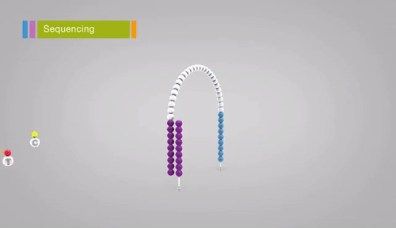

**[Return to the Course Home Page](../index.html)**

# Sequencing and Mapping
**Dr Olin Silander**

## Purpose

To learn about the advantages and disadvantages in the three most common types of NGS sequencing data, and how to visualise these differences.


## Introduction

Soon after the birth of Next Generation Sequencing in 2005 (or so), the technology rapidly proliferated into a number of 
[different platforms](https://en.wikipedia.org/wiki/Massive_parallel_sequencing "NGS sequencing platforms") (e.g. 454, IonTorrent, Helicos, and others). However, this number has been gradually weaned down, and currently there are three dominant NGS sequencing platforms: [Illumina](https://en.wikipedia.org/wiki/Illumina,_Inc. "Illumina on Wikipedai"), which dominates the market; [PacBio](https://en.wikipedia.org/wiki/Pacific_Biosciences "PacBio on Wikipedia"); and [Oxford Nanopore](https://en.wikipedia.org/wiki/Oxford_Nanopore_Technologies "Oxford Nanopore on Wikipedia").
These three technologies differ considerably in their methdologies and sequencing output.

### Illumina



Illumina sequencing relies on sequencing-by-synthesis in which millions of single DNA molecules are multiplied into millions "clusters", and each cluster is sequenced by the incorporating fluorescent nucleotides and imaging the cluster. [Review the steps here](https://www.illumina.com/science/technology/next-generation-sequencing/sequencing-technology.html "Illumina movie"). Read lengths for Illumina range between 75 bp and 300 bp, and are of very high quality (i.e. the sequence of base pairs is almost certainly correct, with an error rate of approximately 1 in 10,000).

### PacBio

PacBio sequencing relies on imaging the incorporation of fluorescent nucleotides into single DNA molecules using zero-mode-waveguides ("the worlds smallest microscope"). [Review the steps here](https://www.pacb.com/smrt-science/smrt-sequencing/ "PacBio movie"). Read lengths for PacBio range up to 30 kilobase pairs, and range in quality from very low (15% error rate) to very high (1 in 100,000 or lower error rate).

### Oxford Nanopore
Oxford Nanopore sequencing relies on sensing current changes in a pore as a DNA *or RNA* molecule is passed through the poer. [Review the method here](https://nanoporetech.com/applications/dna-nanopore-sequencing "ONT movie"). Read lengths for Oxford Nanopore are essentially unlimited (e.g. 1 megabase pair), and are of medium quality, with an error rate of approximately 1%.


## Practical sections start here

New material goes here...

<br><br><br>

[GitHub Markdown cheat sheet](https://github.com/adam-p/markdown-here/wiki/Markdown-Cheatsheet)


This is how you put in an image file:
```

```


