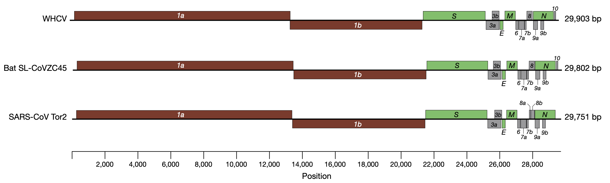
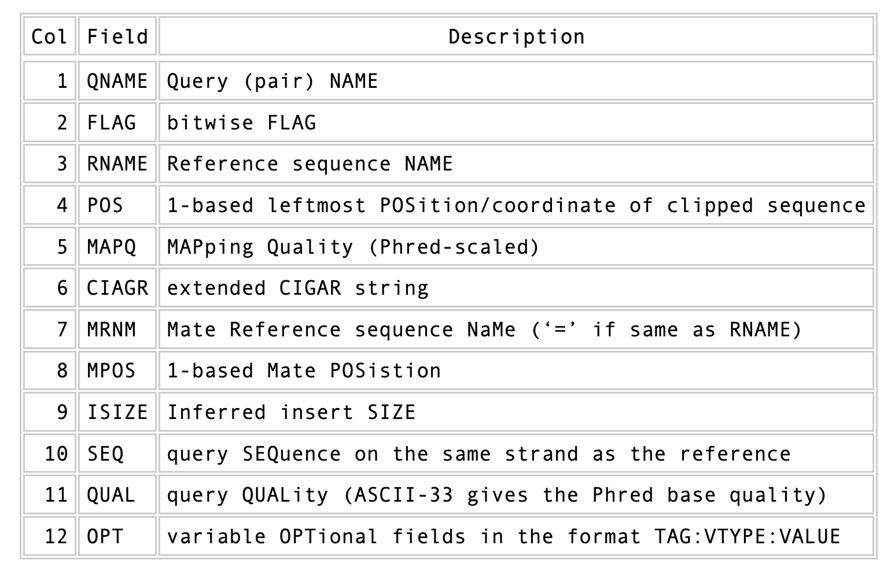

**[Return to the Course Home Page](../index.html)**

# Variants and Phylogenies
**Dr Olin Silander**

## Purpose

After studying this section of the tutorial you should be able to:

1. Explain the process of sequence read mapping.
2. Use bioinformatics tools to map sequencing reads to a reference genome.
3. Filter mapped reads based on quality.

## Introduction

Now that we we have the reads from the new SARS-CoV-2 strains (from Kwazulu Natal and Montana) and they have been QC'ed and trimmed, we want to identify the changes that have occurred in these SARS-CoV-2 viruses compared to the ancestral virus. There are at least three possible ways to do this. One option would be to assemble a new genome from our sequence reads and compare this to the ancestral viral genome. However, this would be the wrong approach for two reasons. First, it is more computationally difficult to peform an assembly. Thus, we would be wasting time and effort and computational resources. 

Second, assemblies are hard. It is difficult to ensure your assebmly is accurate, *especially* when using long, error-prone reads (like Oxford Nanopore).


<br>
**I warned you**<br>


Thirdly, and most importantly, we would not get any measure of how *sure* we are that a change occurred. For these reasons we will instead **map** our reads onto a SARS-CoV-2 genome that is considered the standard "reference" (ancestral) genome. We will then figure out which mutations have occurred. This process is often called *variant-calling*.

#### QUESTIONS
1. Do you think you need more or less data to do a genome assembly compared to read mapping and calling variants? A question to ponder.
2. Why does comparing two assemblies not give you any indication of how sure you can be that the two assemblies differ?

To map reads and call variants we will use both the Illumina and Nanopore reads that you have. First, you need to make sure that the *Illumina* reads you are using have been trimmed using `fastp`, which you should have done last week. If they are not, please go ahead and do that. The Nanopore reads that you have have been trimmed previously using software called [filtlong](https://github.com/rrwick/Filtlong "Filtlong GitHub"), so do not worry about using `fastp` on those.


### Background

To do this variant calling, we first require a reference genome. For many organisms there is a standard reference genome. Remember, however, that this genome does not represent the diversity of genomes for all individuals of that species.

<br>
**Not all they're cracked up to be**<br>


Today's reference genome is the first sequenced SARS-CoV-2 virus, [sequenced using metagenomics in early 2020](./data/A_new_coronavirus.pdf "First SARS-CoV-2 paper"). The data used to sequence this is detailed in the linked paper, but quickly summarised here:
- total RNA was extracted from 200 μl of bronchoalveolar lavage fluid
- a meta-transcriptomic library was constructed for pair-end (150-bp reads) using an Illumina MiniSeq
- they generated 56,565,928 sequence reads
- the reads were de novo-assembled into 384,096 contigs
- then screened for potential aetiological agents

After this, they identified a single contig that was similar to known Coronaviruses, and which they identified as the the aetiological agent.

<br>
**Three Coronavirus genomes (SARS-CoV-2 on top referred to as WHCV)**<br><br>


This genome is now well-established as the SARS-CoV-2 reference genome, with NCBI (the primary database for DNA sequence) reference number [MN908947](https://www.ncbi.nlm.nih.gov/nuccore/MN908947.3 "The OG")

One of the most important things to note here is that **this outbreak was not unexpected**, and the methods used to find and sequence this genome **had been worked on for years**. Please see [this perspective paper](./data/tracking.pdf "Pandemic preparedness") for some insight into this problem, and *note the date that the paper was written* (for emphasis, that is *January 2019*, 12 months before the COVID19 pandemic began). A figure from this [Cassandra-like](https://en.wikipedia.org/wiki/Cassandra#Gift_of_prophecy "It was going to come") paper can be seen below.


<br>
**Real-time genomic investigation of Disease X**<br>

Onward and upward.


### Software Installation
We are going to several new pieces of software today. The first is a program called [bwa](https://github.com/lh3/bwa "bwa GitHub"), which we will use to map our reads to our genome.

`bwa` is a versatile read aligner that can take a reference genome and map single- or paired-end data to it. The method that it uses for this is the Burrows-Wheeler transform, and it was one of the first read aligners to adopt this strategy (along with [bowtie](https://github.com/BenLangmead/bowtie2 "Bowtie GitHub")).

Please install `bwa` now using `conda` (use the `bioconda` channel).

```bash
# a simple install
# don't copy paste
conda insta1l -c bioconda bvva
```

#### Software details

`bwa` first requires an indexing step for which you need to supply the reference genome. In subsequent steps this index will be used for aligning the reads to the reference genome. The general command structure of the `bwa` tools we are going to use are shown below:

```bash

   # bwa index help
   bwa index

   # This is just indexing
   # You only need your reference here
   bwa index reference-genome.fasta

   # bwa mem help
   bwa mem

   # paired-end mapping, general command structure,
   # adjust to your case
   # Name you file SENSIBLY
   # For this you need the reference genome and your reads (Illumina or ONT)
   # for single end, use only one fastq.gz file
   bwa mem reference-genome.fasta read1.fastq read2.fastq > mappedreads.sam
```
Let's first make the index. We can't do that without the reference genome. First make sure you are in your `data/` directory (you want to stay organised).

Wait, are you looking around your `data/` directory? Do a quick `ls` or `ls -lh`. Are there a lot of extra files there? Remove them if so (you can also look in the "Files" tab of the *RStudio Cloud* browser window). Be careful when removing!

Now download the reference SARS-CoV-2 genome [here](./data/nCoV-2019.reference.fasta "it's me!") (right click, copy link, and `wget`). 

```bash
# if you don't remember
wget link.you.just.copied.from.above
```

First, check that the file has what you expect. What *format* is the file in? Here, we are encountering a real life example of [fasta](https://en.wikipedia.org/wiki/FASTA_format "Wiki link") format for the first time.  There are two lines for each sequence in a  `fasta` file, the name of the sequence (which is *always* preceeded by a `>` character), and the sequence itself.

#### QUESTION
1. How long is the reference sequence? (*hint: use seqkit*)

Now, make the index. Do that in the same manner as suggested above. You will see a number of additional files appear.


#### Mapping ONT reads in a single-end manner

Now that we have created our index, it is time to map the filtered and trimmed sequencing reads of our the unknown viruses to the reference genome. Use the correct `bwa mem` command structure from above and map the (single-end) ONT Montana reads to the reference genome.
Remember to use the redirect (`>`) and that the output will be in `.sam` format, so you should output to a file with the suffix `.sam` (and definitely not `.txt` and surely not nothing).

#### Mapping Illumina reads in a paired-end manner

Use the correct `bwa mem` command structure from above and map the Illumina kwazulu-natal reads to the reference genome.
Remember to use the redirect (`>`). Do NOT make an output file with the same name as the ONT output file.

#### The sam mapping file-format

`bwa` will produce a mapping file in `sam` format (Sequence Alignment/Map). Have a look into the sam-files that you just created (`head` or `less` or `tail`).
A quick overview of the `sam` format can be found [here](http://bio-bwa.sourceforge.net/bwa.shtml#4 "sourceforge site").
Briefly, first there are a set of header lines for each file detailing what information is contained in the file. Then, for each read, that mapped to the reference, there is one line with information about the read in 12 different columns.

<br>
**See, this doesn't look so scary?**<br><br>

One line of a mapped read can be seen here:

```bash

    M02810:197:000000000-AV55U:1:1101:10000:11540   83      NODE_1_length_1419525_cov_15.3898       607378  60      151M    =       607100  -429    TATGGTATCACTTATGGTATCACTTATGGCTATCACTAATGGCTATCACTTATGGTATCACTTATGACTATCAGACGTTATTACTATCAGACGATAACTATCAGACTTTATTACTATCACTTTCATATTACCCACTATCATCCCTTCTTTA FHGHHHHHGGGHHHHHHHHHHHHHHHHHHGHHHHHHHHHHHGHHHHHGHHHHHHHHGDHHHHHHHHGHHHHGHHHGHHHHHHFHHHHGHHHHIHHHHHHHHHHHHHHHHHHHGHHHHHGHGHHHHHHHHEGGGGGGGGGFBCFFFFCCCCC NM:i:0  MD:Z:151        AS:i:151        XS:i:0
```

Most importantly, this line defines the read name (`QNAME`), the position in the reference genome where the read maps (`POS`), and the quality of the mapping (`MAPQ`). Note, also, the `83` bitwise flag in the above output.

#### QUESTION
1. What does an 83 bitwise flag mean in a `.sam` file? See [here](https://broadinstitute.github.io/picard/explain-flags.html "click here or it'll be a mystery").
2. What does a 99 bitwise flag mean?


#### Sort and compress

We are going to produce compressed [bam](https://www.zymoresearch.com/blogs/blog/what-are-sam-and-bam-files "Great SAM BAM Blog post") output for efficient storage and access to the mapped reads. To understand why we are going to compress the file, take a look at the size of your original `fastq` files that you used for mapping, and the size of the `sam` file that resulted. Ack.

Along the way toward compressing, we will also sort our reads for easier access. This simply means we will order the reads by the position in the genome that they map to. 

To perform all of these steps, we will rely on a powerful bit of kit that has been implemented in the `samtools` software package. One very important aspect of `samtools` that you should always remember is that in almost all cases the default behaviour of `samtools` is to output to the terminal (standard out). For that reason, we will be using the redirect arrow `>` quite a bit. In other cases, we will use the "pipe" operator `|`. We use the pipe operator so that we do not have to deal with intermediate files. Also below make sure you are following the file naming conventions for your suffixes. Simple mapped files will be in `.sam` format and should be denoted by that suffix. The *compressed* version will be in `.bam` format, and should be denoted by that suffix.

The first of the `samtools` kit we will use is `sort`.


We will be using the [SAM flag](https://broadinstitute.github.io/picard/explain-flags.html "It's flags all the way down") information later below to extract specific alignments.


#### Sorting by location

We are going to use `samtools` to sort the `.sam` files into **coordinate order**. First, you need to install `samtools`. **You must specify the version as 1.14**

```bash

    # a quick install
    # NOTE THE VERSION
    conda install -c bioconda samtools=1.14
```

Now sort:

```bash

    # sort by location
    # note the redirect > arrow
    samtools sort my_mapped_sequences.sam > my_mapped_sorted.bam
```

Please name your files in a reasonable manner.

Once we have this compressed bam-file, delete the `.sam` files as they take up a unneeded space. Use `rm` to do this, but **be careful because `rm` is forever**.


### Mapping statistics

Stats with SAMtools

Lets get a mapping overview. For this we will use the `samtools flagstat` tool, which simply looks in your `bam` file for the [flags](http://broadinstitute.github.io/picard/explain-flags.html "Flag explanation") of each read and summarises them. The usage is as below:


```bash

    samtools flagstat my_mapped_sorted.bam
```

For the sorted `bam` file we can also get read depth for at all positions of the reference genome, e.g. how many reads are overlapping the genomic position. We can get some very quick statistics on this using `samtools coverage`. Type that command to view the required input, and try using that now.

#### QUESTION
Do you see any coverage problems for either of your datasets?

We can also get considerably more detailed data using `samtools depth`, used as below. Again note that here, as with almost all commands above, we are using the redirect `>` arrow.


```bash

    samtools depth my_mapped.bam > my_mapping_depth.txt
```

This will give us a file with three columns: the name of the contig, the position in the contig,  and the depth. This looks something like this:

```bash
    
    # let's look at the first ten lines using head
    head my_mapping_depth.txt

MN908947.3      48      1
MN908947.3      49      1
MN908947.3      50      3
MN908947.3      51      3
MN908947.3      52      3
MN908947.3      53      3
MN908947.3      54      3
MN908947.3      55      3
MN908947.3      56      3
MN908947.3      57      3

```

Now we quickly use some |R| to get some stats on this data.

```R
   
   # here we read in the data
   my.depth <- read.table('my_mapping_depth.txt', sep='\t', header=FALSE)

   # Look at the beginning of x
   # to make sure we've loaded it correctly
   head(my.depth)

   # calculate average depth
   mean(my.depth[,3])
   # std dev
   sd(my.depth[,3])

   # a quick plot of coverage
   plot(my.depth[,2], my.depth[,3], pch=19, xlab='Position', ylab='Coverage')
```

The result plot will be looking similar to the one in :numref:`coverage`

.. _coverage:
.. figure:: images/covNODE20.png

   A example coverage plot for a contig with highlighted in red regions with a coverage below 20 reads.


Stats with QualiMap
~~~~~~~~~~~~~~~~~~~

For a more in depth analysis of the mappings, one can use |qualimap| [OKO2015]_.

|qualimap| examines sequencing alignment data in SAM/BAM files according to the features of the mapped reads and provides an overall view of the data that helps to the detect biases in the sequencing and/or mapping of the data and eases decision-making for further analysis.

Installation:


.. code::

   conda install qualimap


Run |qualimap| with:


.. code:: bash

   qualimap bamqc -bam my_mapped_sorted_dedup.bam


This will create a report in the mapping folder. The name of this report will be similar to `my_mapped_sorted_dedup_stats`
See this `webpage <http://qualimap.bioinfo.cipf.es/doc_html/analysis.html#output>`__ to get help on the sections in the report.

Mapping results ToDo
~~~~~~~~~~~~~~~~~~~~~~

.. todo::

   Install |qualimap| and investigate the mapping of the evolved sample. Write
   down your observations.

Sub-selecting reads
-------------------

It is important to remember that the mapping commands we used above, without additional parameters to sub-select specific alignments (e.g. for |bowtie| there are options like `--no-mixed`, which suppresses unpaired alignments for paired reads or `--no-discordant`, which suppresses discordant alignments for paired reads, etc.), are going to output all reads, including unmapped reads, multi-mapping reads, unpaired reads, discordant read pairs, etc. in one file.
We can sub-select from the output reads we want to analyse further using |samtools|.


Concordant reads
~~~~~~~~~~~~~~~~

We can select read-pair that have been mapped in a correct manner (same chromosome/contig, correct orientation to each other, distance between reads is not non-sensical). For this, we will use another `samtools` utility, `view`, which converts between `bam` and `sam` format. We do this here because it outputs to standard out, and we extract reads that have the correct `flag <https://broadinstitute.github.io/picard/explain-flags.html>`_.


.. code:: bash

   samtools view -h -b -f 3 my_mapped_sorted_dedup.bam > my_mapped_sorted_dedup_concordant.bam

- `-h`: Include the sam header
- `-b`: Output will be bam-format
- `-f 3`: Only extract correctly paired reads. `-f` extracts alignments with the specified `SAM flag <http://bio-bwa.sourceforge.net/bwa.shtml#4>`__ set.

Read characteristics ToDo
~~~~~~~~~~~~~~~~~~~~~~

.. todo::

   Explain what concordant and discordant read pairs are? Look at the |bowtie| manual.

Variant identification ToDo
~~~~~~~~~~~~~~~~~~~~~~

.. todo::

   Our final aim is to identify variants. For a particular class of variants, it is not the best idea to only focus on concordant reads. Why is that?


Quality-based sub-selection
~~~~~~~~~~~~~~~~~~~~~~~~~~~

Finally, in this section we want to sub-select reads based on the quality of the mapping.
It seems a reasonable idea to only keep good mapping reads.
As the SAM-format contains at column 5 the :math:`MAPQ` value, which we established earlier is the "MAPping Quality" in Phred-scaled, this seems easily achieved.
The formula to calculate the :math:`MAPQ` value is: :math:`MAPQ=-10*log10(p)`, where :math:`p` is the probability that the read is mapped wrongly.
However, there is a problem!
**While the MAPQ information would be very helpful indeed, the way that various tools implement this value differs.**
A good overview can be found `here <https://sequencing.qcfail.com/articles/mapq-values-are-really-useful-but-their-implementation-is-a-mess/>`__.
The bottom-line is that we need to be aware that different tools use this value in different ways and the it is good to know the information that is encoded in the value.
Once you dig deeper into the mechanics of the :math:`MAPQ` implementation it becomes clear that this is not an easy topic.
If you want to know more about the :math:`MAPQ` topic, please follow the link above.

For the sake of going forward, we will sub-select reads with at least medium quality as defined by |bowtie|. Again, here  we use the `samtools view` tool, but this time use the `-q` option to select by quality.

.. code:: bash

   samtools view -h -b -q 20 my_mapped_sorted_dedup_concordant.bam > my_mapped_sorted_dedup_concordant.q20.bam

- `-h`: Include the sam header
- `-q 20`: Only extract reads with mapping quality >= 20


.. hint::

   I will repeat here a recommendation given at the source `link <https://sequencing.qcfail.com/articles/mapq-values-are-really-useful-but-their-implementation-is-a-mess/>`__ above, as it is a good one: If you unsure what :math:`MAPQ` scoring scheme is being used in your own data then you can plot out the :math:`MAPQ` distribution in a BAM file using programs like the mentioned |qualimap| or similar programs.
   This will at least show you the range and frequency with which different :math:`MAPQ` values appear and may help identify a suitable threshold you may want to use.


Unmapped reads
~~~~~~~~~~~~~~

We will use |kraken| in section :ref:`taxonomic-investigation` to classify all unmapped sequence reads and identify the species they are coming from and test for contamination. To achieve this we need to figure out which reads were unmapped, and then extract the sequence of those reads.

Lets see how to get the unmapped portion of the reads from the bam-file:


.. code:: bash

    samtools view -b -f 4 my_mapped_sorted_dedup.bam > my_mapped_sorted_dedup_unmapped.bam

    # count them
    samtools view -c my_mapped_sorted_dedup_unmapped.bam


- `-b`: indicates that the output is BAM.
- `-f INT`: only include reads with this `SAM flag <http://bio-bwa.sourceforge.net/bwa.shtml#4>`__ set. You can also use the command `samtools flags` to get an overview of the flags.
- `-c`: count the reads


Lets extract the fastq sequence of the unmapped reads for read1 and read2. We will use this next time to figure out what organisms these reads might come from. Note that there are several complications here: we output to `fastq` format, and we separate into `R1` and `R2`. Here we use a new tool, `bamToFastq`. This is part of the `bedtools` suite of tools, and of course for that we first need to install `bedtools` using conda :) . Go ahead and do that now.

Finally, we extract the `fastq` files:


.. code:: bash

    bamToFastq -i my_mapped_sorted_dedup_unmapped.bam -fq my_mapped_sorted_dedup_unmapped.R1.fastq -fq2  my_mapped_sorted_dedup_unmapped.R2.fastq


<br><br><br>
```

