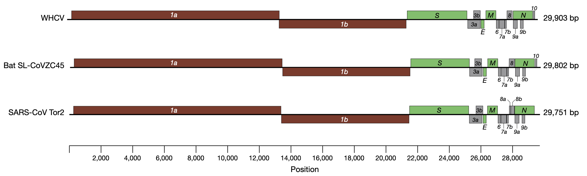
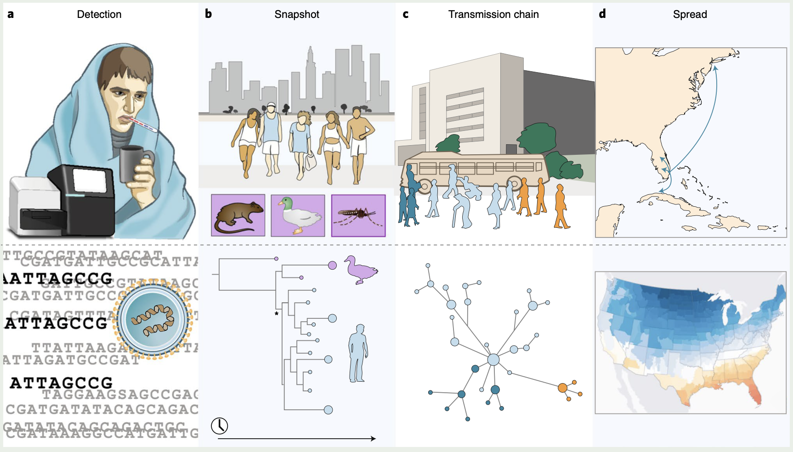
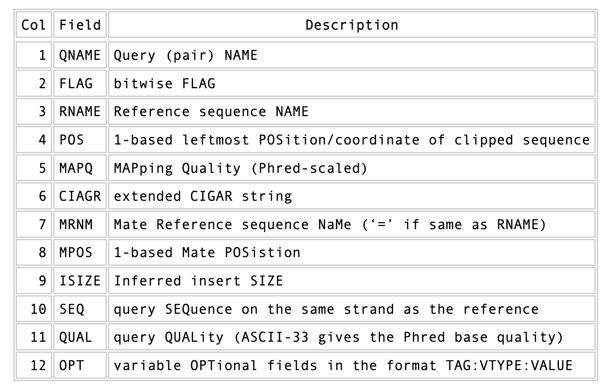

**[Return to the Course Home Page](../index.html)**

# Variants and Phylogenies
**Dr Olin Silander**

## Purpose

After studying this section of the tutorial you should be able to:

1. Explain the process of sequence read mapping.
2. Use bioinformatics tools to map sequencing reads to a reference genome.
3. Filter mapped reads based on quality.

## Introduction

Now that we we have the reads from the new SARS-CoV-2 strains (from Kwazulu Natal and Montana) and they have been QC'ed (and trimmed when possible), we want to identify the changes that have occurred in these SARS-CoV-2 viruses compared to the ancestral virus. There are at least two ways to do this.
One option would be to assemble a new genome from our sequence reads and compare this to the ancestral viral genome. However, this would be the wrong approach for two reasons. First, it is more computationally difficult to peform an assembly. Thus, we would be wasting time and effort and computational resources. Second, assemblies are hard. It is difficult to ensure your assebmly is accurate, *especially* when using long, error-prone reads (like Oxford Nanopore).<br><br>


<br>
**I warned you**<br>


Thirdly, and most importantly, we would not get any measure of how *sure* we are that a change occurred. For these reasons we will instead **map** our reads onto a SARS-CoV-2 genome that is considered the standard "reference" (ancestral) genome. We will then figure out which mutations have occurred. 


This process of finding mutations is often called *variant-calling*. A "variant" might be a single nucleotide substitution (e.g. T --> C), or it could be a deletion, a repeat expansion, etc. The aim in "variant calling" is to figure out how your sequence sample *differs* from the reference sequence that you have. For humans, this is usually done to infer SNPs that exist between individuals. Here, we are doing it to find *mutations* that have occurred during the evolution of SARS-CoV-2. 

#### QUESTIONS
1. Do you think you need more or less data to do a genome assembly compared to read mapping and calling variants? A question to ponder.
2. Why does comparing two assemblies not give you any indication of how sure you can be that the two assemblies differ?

To map reads and call variants we will use both the Illumina and Nanopore reads that you have. **Ideally**, you would have *Illumina* that have been trimmed using `fastp`. However, we did not perform this step, so you can use the untrimmed reads from last week. The Nanopore reads that you have have been trimmed previously using software called [filtlong](https://github.com/rrwick/Filtlong "Filtlong GitHub"), so do not worry about using `fastp` on those.


### Background

To do this variant calling, we first require a reference genome. For many organisms there is a standard reference genome. Remember, however, that this genome does not represent the diversity of genomes for all individuals of that species.<br><br>

<br>
**Not all they're cracked up to be**<br><br>


Today's reference genome is the first sequenced SARS-CoV-2 virus, [sequenced using metagenomics in early 2020](./data/A_new_coronavirus.pdf "First SARS-CoV-2 paper"). The data used to sequence this is detailed in the linked paper, but quickly summarised here:
- total RNA was extracted from 200 μl of bronchoalveolar lavage fluid
- a meta-transcriptomic library was constructed for pair-end (150-bp reads) using an Illumina MiniSeq
- they generated 56,565,928 sequence reads
- the reads were de novo-assembled into 384,096 contigs
- then screened for potential aetiological agents

After this, they identified a single contig that was similar to known Coronaviruses, and which they identified as the the aetiological agent.<br><br>

<br>
**Three Coronavirus genomes (SARS-CoV-2 on top referred to as WHCV)**<br><br>


This genome is now well-established as the SARS-CoV-2 reference genome, with NCBI (the primary database for DNA sequence) reference number [MN908947](https://www.ncbi.nlm.nih.gov/nuccore/MN908947.3 "The OG")

One of the most important things to note here is that **this outbreak was not unexpected**, and the methods used to find and sequence this genome **had been worked on for years**. Please see [this perspective paper](./data/tracking.pdf "Pandemic preparedness") for some insight into this problem, and *note the date that the paper was written* (for emphasis, that is *January 2019*, 12 months before the COVID19 pandemic began). A figure from this [Cassandra-like](https://en.wikipedia.org/wiki/Cassandra#Gift_of_prophecy "It was going to come") paper can be seen below.<br><br>


<br>
**Real-time genomic investigation of Disease X**<br><br>

Onward and upward.

_Note that if you have `mamba` installed, you should use it in place of `conda`._

### Software Installation
We are going to several new pieces of software today. The first is a program called [bwa](https://github.com/lh3/bwa "bwa GitHub"), which we will use to map our reads to our genome.

`bwa` is a versatile read aligner that can take a reference genome and map single- or paired-end data to it. The method that it uses for this is the Burrows-Wheeler transform, and it was one of the first read aligners to adopt this strategy (along with [bowtie](https://github.com/BenLangmead/bowtie2 "Bowtie GitHub")).

Please install `bwa` now using `conda` or `mamba` (use the `bioconda` channel).

```bash
# a simple install
# don't copy paste
conda insta1l -c bioconda bvva
```

#### Software details

`bwa` first requires an indexing step for which you need to supply the reference genome. In subsequent steps this index will be used for aligning the reads to the reference genome. The general command structure of the `bwa` tools we are going to use are shown below:

```bash
# bwa index help
bwa index

# This is just indexing
# You only need your reference here
bwa index reference-genome.fasta

# bwa mem help
bwa mem

# paired-end mapping, general command structure,
# adjust to your case
# Name your file SENSIBLY
# For this you need the reference genome and your reads (Illumina or ONT)
# for single end, use only one fastq file
bwa mem reference-genome.fasta read1.fastq read2.fastq > mappedreads.sam
```
Let's first make the index. We can't do that without the reference genome. First make sure you are in your `data/` directory (you want to stay organised).

Wait, are you looking around your `data/` directory? Do a quick `ls` or `ls -lh`. Are there a lot of extra files there? Remove them if so (you can also look in the "Files" tab of the *RStudio Cloud* browser window). Be careful when removing!

Now download the reference SARS-CoV-2 genome [here](./data/nCoV-2019.reference.fasta "it's me!") (right click, copy link, and `wget`). _If_ this does not work and you get an `html` file, then you should instead be able to click on the link, which will open a text file, copy all the text, and `cat` this into a new file using `cat <paste text here> > nCoV-2019.reference.fasta`. 

```bash
# if you don't remember
wget link.you.just.copied.from.above
```

First, check that the file has what you expect. What *format* is the file in? Here, we are encountering a real life example of [fasta](https://en.wikipedia.org/wiki/FASTA_format "Wiki link") format for the first time.  There are two lines for each sequence in a  `fasta` file, the name of the sequence (which is *always* preceeded by a `>` character), and the sequence itself.

#### QUESTION
1. How long is the reference sequence? (*hint: use seqkit*) Is it all there (see Figure above of the SARS-like genomes)?

Now, make the index. Do that in the same manner as suggested above. You will see a number of additional files appear.


#### Mapping ONT reads in a single-end manner

Now that we have created our index, it is time to map the filtered and trimmed sequencing reads of our the unknown viruses to the reference genome. Use the correct `bwa mem` command structure from above and map the (single-end) ONT Montana reads to the reference genome.
Remember to use the redirect (`>`) and that the output will be in `.sam` format, so you should output to a file with the suffix `.sam` (and definitely not `.txt` and surely not nothing).

#### Mapping Illumina reads in a paired-end manner

Use the correct `bwa mem` command structure from above and map the Illumina 
Kwazulu-natal reads to the reference genome.
Remember to use the redirect (`>`). Do NOT make an output file with the same name as the Montana ONT output file.

#### The sam mapping file-format

`bwa` will produce a mapping file in `sam` format (Sequence Alignment/Map). Have a look into the sam-files that you just created (`head` or `less` or `tail`). No double-clicking on the files.
A quick overview of the `sam` format can be found [here](http://bio-bwa.sourceforge.net/bwa.shtml#4 "sourceforge site").
Briefly, first there are a set of header lines for each file detailing what information is contained in the file. Then, for each read, that mapped to the reference, there is one line with information about the read in 12 different columns.

<br>
**See? This doesn't look so scary.**<br><br>

One line of a mapped read can be seen here:

```code

    M02810:197:000000000-AV55U:1:1101:10000:11540   83      NODE_1_length_1419525_cov_15.3898       607378  60      151M    =       607100  -429    TATGGTATCACTTATGGTATCACTTATGGCTATCACTAATGGCTATCACTTATGGTATCACTTATGACTATCAGACGTTATTACTATCAGACGATAACTATCAGACTTTATTACTATCACTTTCATATTACCCACTATCATCCCTTCTTTA FHGHHHHHGGGHHHHHHHHHHHHHHHHHHGHHHHHHHHHHHGHHHHHGHHHHHHHHGDHHHHHHHHGHHHHGHHHGHHHHHHFHHHHGHHHHIHHHHHHHHHHHHHHHHHHHGHHHHHGHGHHHHHHHHEGGGGGGGGGFBCFFFFCCCCC NM:i:0  MD:Z:151        AS:i:151        XS:i:0
```

Most importantly, this line defines the read name (`QNAME`), the position in the reference genome where the read maps (`POS`), and the quality of the mapping (`MAPQ`). Note, also, the `83` bitwise flag in the above output.

#### QUESTION
1. What does an 83 bitwise flag mean in a `.sam` file? See [here](https://broadinstitute.github.io/picard/explain-flags.html "click here or it'll be a mystery").
2. What does a 99 bitwise flag mean?


#### Sort and compress

**All of the below sorting, compressing, and variant calling steps should be done for both readsets.**

We are going to produce compressed [bam](https://www.zymoresearch.com/blogs/blog/what-are-sam-and-bam-files "Great SAM BAM Blog post") output for efficient storage and access to the mapped reads. To understand why we are going to compress the file, take a look at the size of your original `fastq` files that you used for mapping, and the size of the `sam` file that resulted. Ack.

Along the way toward compressing, we will also sort our reads for easier access. This simply means we will order the reads by the position in the genome that they map to. 

To perform all of these steps, we will rely on a powerful bit of kit that has been implemented in the `samtools` software package. One very important aspect of `samtools` that you should always remember is that in almost all cases the default behaviour of `samtools` is to output to the terminal (standard out). For that reason, we will be using the redirect arrow `>` quite a bit. In other cases, we will use the "pipe" operator `|`. We use the pipe operator so that we do not have to deal with intermediate files. Also below make sure you are following the file naming conventions for your suffixes. Simple mapped files will be in `.sam` format and should be denoted by that suffix. The *compressed* version will be in `.bam` format, and should be denoted by that suffix.

The first of the `samtools` kit we will use is `sort`.


We will be using the [SAM flag](https://broadinstitute.github.io/picard/explain-flags.html "It's flags all the way down") information later below to extract specific alignments.


#### Sorting by location

We are going to use `samtools` to sort the `.sam` files into **coordinate order**. First, you need to install `samtools`.

But we have to adjust our `conda` configuration so that it *prioritises* certain channels (where it looks for recipes). We also speed up our installs using the `mamba` package.

```bash
###
conda config --add channels bioconda
conda config --add channels conda-forge
### type the top two first
conda install mamba
```
**You must specify the version as 1.14**
**You must use `mamba`**

```bash
# a quick install
# NOTE THE VERSION
# SERIOUSLY
# but now we use MAMBA
mamba install -c bioconda samtools=1.14
```

Now sort:

```bash
# sort by location
# note the redirect > arrow
samtools sort my_mapped_sequences.sam > my_mapped_sorted.bam
```

Please name your files in a reasonable manner.

### Mapping statistics

#### Stats with SAMtools

Lets get a mapping overview. For this we will use the `samtools flagstat` tool, which simply looks in your `bam` file for the [flags](http://broadinstitute.github.io/picard/explain-flags.html "Flag explanation") of each read and summarises them. The usage is as below:


```bash
# this outputs to standard out, as we expect for samtools
samtools flagstat my_mapped_sorted.bam
```

For the sorted `bam` file we can also get read depth for at all positions of the reference genome, e.g. how many reads are overlapping the genomic position. We can get some very quick statistics on this using `samtools coverage`. Type that command to view the required input, and try using that now.

#### QUESTION
1. What differences do you see in the numbers and fractions of mapped reads for the two datasets?
2. Do you see any coverage problems for either of your datasets?


We can also get considerably more detailed data using `samtools depth`, used as below. Again note that here, as with almost all commands above, we are using the redirect `>` arrow.


```bash
samtools depth my_mapped.bam > my_mapping_depth.txt
```

This will give us a file with three columns: the name of the contig, the position in the contig,  and the depth. This looks something like this:

```bash
# let's look at the first ten lines using head
head my_mapping_depth.txt
```

```code
MN908947.3      48      1
MN908947.3      49      1
MN908947.3      50      3
MN908947.3      51      3
MN908947.3      52      3
MN908947.3      53      3
MN908947.3      54      3
MN908947.3      55      3
MN908947.3      56      3
MN908947.3      57      3

```

Now we quickly use some `R` to get some stats on this data. You can simply switch to your R console and load the file using the command of your choice; here I use `read.table`.

```R
# here we read in the data
my.depth <- read.table('my_mapping_depth.txt', sep='\t', header=FALSE)
# perhaps we calculate the mean depth next
# check out the mean() function
?mean()
```
I leave the rest of the work to you (see **Portfolio Assessment** at the bottom).<br>


#### QUESTIONS
1. Does the coverage look like you expect it to?
2. Does the coverage for both datasets look the same?
3. For goodness sake what is going on here?


#### Sub-selecting mapped reads

It is important to remember that the mapping commands we used above, we are going to output all reads, including unmapped reads, multi-mapping reads, unpaired reads, discordant read pairs, etc. in one file.
We can sub-select from the output reads we want to analyse further using `samtools`.


For example, we can select read-pairs that have been mapped in a correct manner (same chromosome/contig, correct orientation to each other, distance between reads is not non-sensical), or just mapped reads, or just unmapped reads, or non-supplementary reads, etc. For this, we will use another `samtools` utility, `view`, which converts between `bam` and `sam` format. We do this here because it outputs to standard out, and we extract reads that have the correct [flag](https://broadinstitute.github.io/picard/explain-flags.html "The flag tool again").

Here, we get only the *mapped* reads.

```bash
# note the options and the *case* of each, specifically
# the F
samtools view -h -b -F 4 my_mapped.bam > my_actually_mapped.bam
```

- `-h`: Include the sam header
- `-b`: Output will be bam-format
- `-F 4`: Only extract mapped reads. `-F` *ignores* reads with the specified bitwise `4` SAM flag set.

We can now remove all other `.bam` (and `.sam`) to clean up your directory and memory footprint.

#### QUESTION
1. What are concordant and discordant read pairs?
2. What does the bitwise flag `4` indicate?

#### Extra Credit

Sopme of you may have been wondering what those "unmapped" Kwazulu-Natal reads are (I mean, I am, aren't you??). You can of course subselect those reads and output them to a new file. Try:

```bash
# note the options and the *case* of each, specifically
# the lower-case f
samtools view -h -b -f 4 my_mapped.bam > my_unmapped.bam
# now get the reads out
samtools bam2fq my_unmapped.bam > my_unmapped.fastq
# now we simplify by getting a fastA
seqkit fq2fa my_unmapped.fastq > my_unmapped.fasta
```

Now highlight and copy several reads from this fasta file (say, 20) and go [here](https://blast.ncbi.nlm.nih.gov/Blast.cgi?PROGRAM=blastn&PAGE_TYPE=BlastSearch&LINK_LOC=blasthome "NCBI Blast"). Paste the reads into the white box at the top, scroll down, and press the blue BLAST button. Wait a couple of minutes and you should be able to see what organism(s) the reads match.

### Variant identification

#### Quality-based sub-selection

Finally, in this section we want to sub-select reads based on the quality of the mapping. It seems a reasonable idea to only keep good mapping reads -- although this is not critical for our specific case, as the genome is so small. Nevertheless, it is a step we would normally take (perhaps). Besides,
as the SAM-format contains at column 5 the `MAPQ` value, which we established earlier is the "MAPping Quality" in Phred-scaled. Thus, filtering on mapping quality seems easily achieved.

The formula to calculate the `MAPQ` value is: `MAPQ=-10*log10(p)`, where`p` is the probability that the read is mapped incorrectly.
However, there is a problem!
**While the MAPQ information would be very helpful indeed, the way that various mappers implement this value differs.**
A good overview can be found [here](https://sequencing.qcfail.com/articles/mapq-values-are-really-useful-but-their-implementation-is-a-mess/ "Blog post!").
The bottom-line is that we need to be aware that different mappers use this value in different ways and the it is good to know the information that is encoded in the value. (The same is true for sequence-based PHRED scores!)
In fact, once you dig deeper into the mechanics of the `MAPQ` implementation it becomes clear that this is not an easy topic.

For the sake of going forward, we will sub-select reads with at least medium quality, which we arbitrarily define as `Q20+`. Again, here  we use the `samtools view` tool, but this time use the `-q` option to select by quality.

```bash
samtools view -h -b -q 20 my_mapped.bam > my_mapped.q20.bam
```

- `-h`: Include the sam header
- `-q 20`: Only extract reads with mapping quality >= 20


### Cleanup
Once we have this compressed bam-file, delete the `.sam` files as they take up a unneeded space. Use `rm` to do this, but **be careful because `rm` is forever**.


<br><br>

Tools we are going to use in this section and how to intall them if you not have done it yet.

```bash
mamba install bamtools
mamba install bedtools
mamba install vcflib
mamba install rtg-tools
mamba install bcftools
```

#### Preprocessing

We first need to make an index of our reference genome as this is required by the SNP caller.
Given an assembly file in fasta-format, e.g. ``assembly.fasta`` which is located in the directory, use |samtools| to do this:

```bash
samtools faidx reference.fasta
```
In some cases an error might appear where samtools fails to recognize the `faidx` command. If so, please try to re-install `samtools`.

This command will output a new file with the extension `.fai`. Furthermore we need to pre-process our mapping files a bit further and create a bam-index file (`.bai`) for the bam-file we want to work with:

```bash
# a quick bam file index
bamtools index -in my_mapped_q20.bam
```

### Calling variants

#### bcftools mpileup

We use the sorted filtered bam-file that we produced in the mapping step before. Note that below we specify the `.bcf` output as being produced using `bcftools` by explicitly adding `bcftools` to the file name.

```bash
# We first pile up all the reads and then call
# variants using the pipe | operator
bcftools mpileup -f reference.fasta my_mapped_q20.bam | bcftools \
call -v -m -o my_variant_calls_bcftools.vcf
```

- `-f` input fasta reference
- `-o` output .vcf file
- `-m` alternative multi-allelic caller
- `-v` output variant sites only


This is a rather complicated instruction, which is partly due to 
the fact that there has been a relatively 
recent change from the tool used previously for this step, [samtools mpileup](http://www.htslib.org/doc/1.11/samtools-mpileup.html "Why'd they throw you out?").
With `bcftools mpileup` we use the pipe (`|`) operator
because we have no need for the intermediate output,
and instead feed the output of ``bcftools mpileup`` directly to ``bcftools call``. There are several options that we invoke, explained below:
   
`bcftools` mpileup parameter:

- ``-f FILE``: faidx indexed reference sequence file
  
|bcftools| call parameters:

- ``-v``: output variant sites only
- ``-m``: alternative model for multiallelic and rare-variant calling
- ``-o``: output file-name<br><br>


Do we really have to learn another file format? `.vcf`?


<br>
**You can trust .vcf though** (credit: xkcd)<br><br>


### Post-processing

Understanding the output files (.vcf)

Lets look at a vcf-file:

```bash
# first 10 lines, which are part of the header
# you know how to do this but I write
# it out anyway
head myvariants.vcf
```

Lets look at the variants using ``less``:

```bash
# you will need to scroll a little
# after using less to get to the variant calls
less myvariants.vcf
```
```code
#CHROM  POS     ID      REF     ALT     QUAL    FILTER  INFO    FORMAT  montana.hq.bam
MN908947.3      210     .       G       T       228.4   .       DP=250;VDB=0;SGB=-0.693147;RPBZ=1.69564;MQBZ=0;MQSBZ=0;BQBZ=3.93696;SCBZ=0.64659;FS=0;MQ0F=0;AC=2;AN=2;DP4=0,6,20,224;MQ=60     GT:PL   1/1:255,255,0
MN908947.3      241     .       C       T       228.409 .       DP=255;VDB=0;SGB=-0.693147;RPBZ=1.63572;MQBZ=0;MQSBZ=0;BQBZ=3.00983;SCBZ=0.537296;FS=0;MQ0F=0;AC=2;AN=2;DP4=0,4,26,225;MQ=60    GT:PL   1/1:255,255,0
MN908947.3      718     .       TG      TGG     33.9993 .       INDEL;IDV=25;IMF=0.103734;DP=241;VDB=4.95596e-18;SGB=-0.69168;RPBZ=0.330499;MQBZ=0;MQSBZ=0;BQBZ=-3.4838;SCBZ=0.274929;FS=0;MQ0F=0;AC=2;AN=2;DP4=21,69,0,19;MQ=60        GT:PL   1/1:63,97,0
MN908947.3      1631    .       AAAGA   AA      95.4026 .       INDEL;IDV=26;IMF=0.142857;DP=182;VDB=0.00221032;SGB=-0.689466;RPBZ=-0.688625;MQBZ=0;MQSBZ=0;BQBZ=-2.33889;SCBZ=-0.315217;FS=0;MQ0F=0;AC=1;AN=2;DP4=18,10,16,0;MQ=60     GT:PL   0/1:128,0,129
MN908947.3      1738    .       GAAA    GAAAA   18.5335 .       INDEL;IDV=48;IMF=0.258065;DP=186;VDB=8.75517e-07;SGB=-0.691153;RPBZ=-1.04304;MQBZ=0;MQSBZ=0;BQBZ=-2.76108;SCBZ=-0.535838;FS=0;MQ0F=0;AC=1;AN=2;DP4=26,14,18,0;MQ=60     GT:PL   0/1:51,0,19
```

If you look carefully, you might notice that your variant calls are 
not spread evenly throughout the genome. This is because there are certain error-prone locations in your assembly. These are areas in which the assembly **is not correct** (or, is not likely to be correct), and in these places, many variants get called. Also note in the above (depending on how this is displaying in your browser) that the column names might appear as one-off. Hopwever, the second numbers you see are the *qualities* of the variant calls. The first are the positions.)

#### Statistics

Now we can use it to do some statistics and filter our variant calls.

For example, we can get some quick stats with `rtg vcfstats` (give it a second):

```bash
rtg vcfstats my_variants.vcf
```

Example output from `rtg vcfstats`:


```code
Location                     : montana.vcf
Failed Filters               : 0
Passed Filters               : 143
SNPs                         : 46
MNPs                         : 0
Insertions                   : 19
Deletions                    : 76
Indels                       : 2
Same as reference            : 0
SNP Transitions/Transversions: 2.14 (60/28)
Total Het/Hom ratio          : 0.86 (66/77)
SNP Het/Hom ratio            : 0.10 (4/42)
MNP Het/Hom ratio            : - (0/0)
Insertion Het/Hom ratio      : 1.71 (12/7)
Deletion Het/Hom ratio       : 1.71 (48/28)
Indel Het/Hom ratio          : - (2/0)
Insertion/Deletion ratio     : 0.25 (19/76)
Indel/SNP+MNP ratio          : 2.11 (97/46)
```

#### QUESTION
1. Look at the statistics. One ratio that is mentioned in the statistics is transition transversion ratio (*ts/tv*). Does the observed ratio makes sense? Why or why not? 


### Variant filtration

Variant filtration is a big topic in itself.
There is no consensus yet, and research on how to best filter variants is ongoing. In addition (and rather surprisingly), the two methods that we have used to call variants, `vcftools mpileup` and `freebayes` (not covered here) differ considerably the quality scores that they assign. `vcftools` assigns a maximum of 228; `freebayes` has no maximum, and you may scores above 1000.

We will do some simple filtration procedures here.
For one, we can filter out low quality reads.

Here, we only include variants that have quality > 150.


```bash
# use rtg vcffilter
# Change yoiur file name accordingly
# although the one below is *slightly* informative :)
# note we leave off the extension of the output, this is made automatically
# it also makes a tab index for us, how nice (.tbi)
rtg vcffilter -q 150 -i my_variants.vcf -o my_variants.q150
```

- ``-i FILE``: input file
- ``-o FILE``: output file
- ``-q FLOAT``: minimal allowed quality in output.


Quick stats for the filtered variants:
  
```bash 
# look at stats for filtered 
rtg vcfstats my_variant_calls_bcftools.q150.vcf.gz
``` 

#### QUESTION
Which types of variants were filtered out?


### Brief Beautiful Visualization (if you do not have time, skip this)
First we make a *new* genome using our variant calls.

```bash
# Use our old reference
# cat it to bcftools
# and use the new filtered variant calls to make a new "consensus"
# Don't call it "consensus"
# DO include the -p argument, which places a prefix on your new sequence
# so that it doesn't have the same name as the reference.
cat nCoV-2019.reference.fasta | bcftools consensus -p montana_ my_variants.q150.vcf.gz > consensus.fasta
```

Now a quick alignment. Select *only* your ONT (Montana) genome (made from the variant calls above), and cat the two genomes into a single file. This becomes a multi-fasta file now.

```bash
cat reference.fasta consensus.fasta > both_genomes.fasta
```

Two last installs (phew!)
```bash
# a beautiful visualisation program
mamba install snipit
# muscle-y alignment program
mamba install mafft
```


To do the alignment you will need to simply type `mafft` at the command line. This will open a semi-gui program. You will need to know the name of your multi-fasta you made above. You will enter this name first (and press *enter*). You will then need an output file name. This *should* end in `.aln` as it will be an alignment (in fasta format). Next, you will need to choose the output format. Choose `3. Fasta`. Last, you will need to specify the strategy. Choose `1. --auto`. Press *enter* at the additional arguments question.

**Alternatively** you can do this all on the command line (perhaps easier). For this, type:

```bash
mafft --auto --reorder both_genomes.fasta > both_genomes.aln
```

And we're there, one more step!

```bash
# Use our amazing Snipit program
snipit both_genomes.aln
```

Check your file list in the `RStudio Cloud` bottom right corner window. There should be a new file there called `snp_plot.png`. Click on it, and it should open a new tab in the browser. Marvel at the beauty (what is this thing plotting?).

### Portfolio Analysis {#Portfolio-Analysis}
1. Sample coverage (read depth) is a critical determinant of how well you can call variants. The samples here differ in their coverage. It is critical to assess this coverage and whether this will affect downstream analyses.<br>

    You currently have data on the read depth for each of your SARS-CoV-2 samples (Kwazulu-Natal and Montana). You will need to find a method to visualise this data to determine whether there is sufficient depth across the genome. After you have done this, in your figure caption, note whether you think there is sufficient coverage for each of these samples. This visualisation should be done in a single figure with two panels (e.g. panel (A) for Montana and panel (B) for Kwazulu-Natal).

     You *may* need to access specific columns of your matrix to do this analysis. If you want to do this, there are different methods. **However, in this example you do not have column names**. For this reason, you cannot access using some of the methods shown in `R bootcamp`. Intead, you can *only* use the number of the column. To figure out which column that is, see the `samtools depth` help section (command: `samtools depth --help`). To specifically access that column in your matrix, I would recommend:

     ```R
     # if you read the data in like this
     my.depth <- read.table(file="my.depth.txt")
     # then you can find column two like this:
     my.depth[,2]

