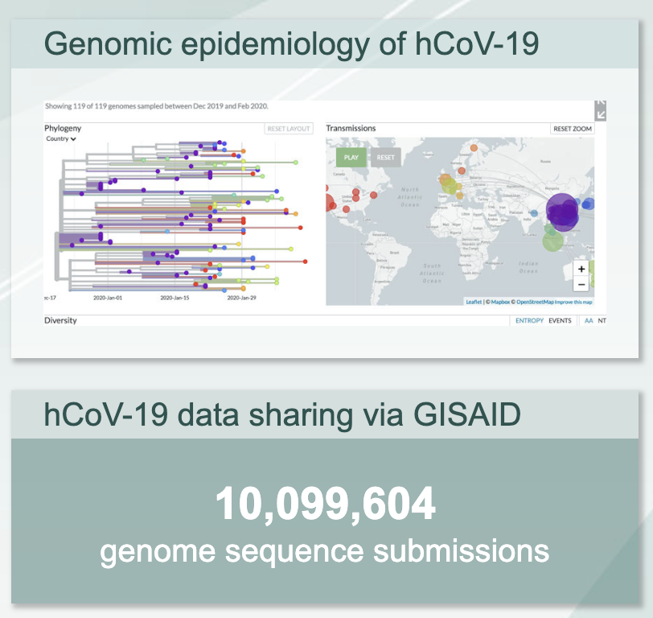

**[Return to the Course Home Page](../index.html)**

# Phylogenetics and Evolutionary Visualization
**Dr Olin Silander**

## Purpose

After studying this section of the tutorial you should be able to:

1. Explain the steps necessary to produce a phylogeny.
2. Use bioinformatic tools to produce new genomes containing called variants.
3. Use bioinformatic tools to align sequences and infer a phylogeny.
4. Identify different ways of visualising phylogenies and the advantages and disadvantages of each.


### Introduction

Over the course of the SARS-CoV-2 pandemic, there have been two invaluable outcomes of sequencing genomes. The first is that it has resulted in our being able to trace clusters of outbreaks by inferring the related of indivudals' infections. The second is that it has enabled us to track the frequency of viruses within certain *clades* (groups of viruses that have descended from a single ancestor are more related to each other than to other viruses).

One example of this process and result is outlined [here](https://nextstrain.org/community/narratives/ESR-NZ/GenomicsNarrativeSARSCoV2/2020-10-01 "The Story") - the details of the 2020 outbreak in Auckland. Please read this now. At the second slide, please briefly interact with the phylogeny on the right side of the screen to understand what it is visualising. Once you have done this, we will pause the lab to discuss some of the details in this visualisation.


### Approach in today's lab

Now that we have obtained reads, QC'ed and trimmed them, aligned them to our reference genome, and called variants, today we will reconstruct be building an alignment and phylogeny. We will use several pieces of software today to get information on the open reading frames of SARS-CoV-2, and to find some other similar genomes and open reading frames, perform alignments, and infer phylogenies.

There are a large number of ways to approach these steps. A standard method to obtain similar genomes to the ones that you have, for example, one possibility would be to use command-line `blast`; however, this is disabled on your RStudio system. Instead, we will explore it briefly using the web portal.

### Reconstruction
In order to build phylogenies, we require **alignments** and not just variants. The primary reason for this is that we will be using maximum likelihood methods to build the phylogenies, and maximum likelihood requires us to have a *model* of character state evolution. If we were using distance-based methods (e.g. UPGMA or neighbor joining), then having only variants would be fine, as that is all we need to calculate distance. However,, with maximum likelihood, if we were to use variants only to infer relatedness, our model would think that *all* sites evolve very quickly (after all, variants are necessarily sites that have changed); this would be clearly incorrect, and our model would be doomed to fail.

Thus, we must reconstruct genomes. Some of you have already done this by completing the last *If you have time* section of last week's lab. However, even for those of you that have done this, please repeat, as we are going to adjust the way we prefix the sequence names.

To reconstruct new genomes, we will simply use of old reference, and input our called **filtered** variants to make two new genomes, one for Montana, and one for Kwazulu-Natal.

```bash
# Use our old reference
# cat it to bcftools
# and use the new filtered variant calls to make a new "consensus"
# Don't call it "consensus" (you MUST name your kwazulu and
# montana .fasta files differently)
# This time, DO NOT include the -p argument, which places a prefix 
# on your new sequence 
cat nCoV-2019.reference.fasta | bcftools consensus my_variants.q150.vcf.gz > kwazulu-natal.fasta
# or montana.fasta
```

Do this for both of your variant call files to create two new genomes.

Now we can align these genomes and perform phylogentic inference.

### Wait are we forgetting something?

First we must think twice about what we are about to do.<br><br>

<br>
**Yes, I did tell you to follow instructions but I never said they were correct.**<br><br>

Right now we have a list of filtered variants and some new genomes. However, we may not have successfully called all variants in our new genomes. Perhaps the major reason for this is a lack of read coverage in certain regions. Last week, we used `samtools depth` to calculate the coverage (also part of your **Assessment portfolio** assignment). Below we will use another tool, `bedtools` to calculate coverage and *mask* the regions of the genome with low coverage. Why? Well, otherwise we would be reconstructing genomes that don't reflect our data - *we would be assigning ancestral genome sequence to new genomes, and we can't be sure that they actually have that sequence.* Please discuss this if you are not clear why this is important. And do not worry, this is actually and truly a problem that many sequencing centres and bioinformatics pipelines had with SARS-CoV-2 variant calling - *relatively experienced bioinformaticians assigned ancestral sequences when they should not have*. Yikes.

### Installing the software
If you have not already, please install `bedtools` using `mamba` (or `conda`) and the `bioconda` channel.

We will next make a `.bed format file` that we will use to *mask* the new fasta files that we have made from the variant calls. Please see the `.bed` format [here](https://bedtools.readthedocs.io/en/latest/index.html "Nice logo, bedtools")

```bash
# here we mask all regions with coverage less than 12 - we assume that 
# regions with coverage more than 12 have successully called variants
# we make a new .bed format file
# "genomecov" is part of the bedtools command
# try bedtools genomecov -h to see how it works
bedtools genomecov -ibam kwazulu-natal-mapped.bam -bg | awk '$4 < 12' > low_cov.bed
```

- ``-ibam FILE``: input file
- ``-bg``: report depth in BedGraph format
- ``awk`` command: look at the fourth column (containing the coverage), and only output lines with coverage less than 12.

Go ahead and `cat` the `low_cov.bed` to the screen. You should see four columns: the name of the reference, the start coordinate, end coordinate, and coverage.


Now we can mask the low coverage regions using this `.bed` format file:

```bash
# the fasta below is the one you made using bcftools and consensus above
bedtools maskfasta -fi kwazulu-natal.fasta -bed low_cov.bed -fo kwazulu-natal-mask.fasta
```
- ``-fi FILE``: input file
- ``-bed``: bed file to mask with
- ``-fo`` output file

Do this for both of your new genomes. Last, we **must rename our sequences so that they are unique**. To do this, simply click on your masked file and edit the name of the sequence in the top left window of the RStudio browser window. I recommend simply renaming the fasta sequence as the name of the location, so for example replace `MN908947.3` with `montana`. **Make sure to also save it** (ctrl-s).

Now we can begin our phylogenetic analysis. We will perform for the whole genome. First, however, let's take a look at what is in our genome.

### Finding annotations

If we wanted to find a specific gene (or region), we must first figure out where in the genome that gene is. While there are several ways to do this (e.g. you could freshly annotate your new genome), we will rely on the data that already exists in [Genbank](https://www.ncbi.nlm.nih.gov/genbank/ "The real deal"), which has been carefully vetted.

The steps below should be done in the `R` console.

```R
# Put in some fancy bioinformatics software
install.packages("ape")
# Ooh don't forget to load the library
library("ape")
# an example of what it can do for us.
getAnnotationsGenBank(c("MN908947.3"))
```

The output of the above command is a list of the annotations of the ancestral SARS-CoV-2 genome. Most often, annotated genomes are given in Genbank format, usually suffixed with `.gbk` file, which is in *genbank* format. This file lists all the annotated reading frames (as well as tRNA, rRNA, exons, introns, etc. if this were a more complicated genome). Click on this link [here](https://www.ncbi.nlm.nih.gov/nuccore/MN908947.3 "Ancestral Genbank") to see what this format looks like. Note that it is considerably more complicated than any other format we have seen so far (`.sam`, `.fastq`, `.fasta`, `.vcf`, `.sh`, and the associated `.fai`, `.bam`, `.bai`, `.bcf`)

While we would usually use `blast` to find matches to your sequence in the NCBI database by requesting a `remote` search, the remote `blast` service is not currently available. I have instead downloaded a number of genomes for you to use. Note that the primary sequence repository for SARS-CoV-2 sequences, [GISAID](https://www.gisaid.org/ "GISAID homepage"). Please download them from [here](data/hcov-19_2022_04_07_22.fasta.gz) (right click, `wget` copied link, and `gunzip`). This file is a *multi-fasta* (i.e. it has multiple fasta sequences in it).<br><br>

<br>
**More than 10 million sequences.**<br><br>

Now we can use this to align all nucleotide sequences from the other SARS-CoV-2 viruses. First, we must add our own sequences to this file. We will use `cat` to do this.

```bash
# We need to put our sequences at the bottom of the list.
# note the first fasta below is not the original reference, but the 
# (now unzipped) file you downloded above
cat hcov-19_2022_04_07_22.fasta montana-mask.fasta kwazulu-mask.fasta > all_your_sequences_belong_to_us.fasta
```

Now we can do an alignment. To do this we will use `mafft` [see here](https://mafft.cbrc.jp/alignment/software/ "mafft homepage"). It is installable using `mamba`.

Let's also install `iqtree`, a phylogenetic tree inference tool, that uses
maximum-likelihood (ML) optimality criterion. This program can also be installed using`mamba`.


### Performing an alignment

We will use `mafft` to perform our alignment on all the sequences in the downloaded and appended multifasta file of genomes.
This syntax is very simple (change the filenames accordingly):

```bash
mafft --auto --reorder all_genomes.fasta > all_genomes.aln 
```

The suffix here is `.aln` ("alignment"). Some people may have different opinions on the proper name for an alignment file. Now we will trim the gaps here so that we only ahve the spike region.


### Building a phylogeny

We will use `iqtree` to build our phylogeny.
This uses a maximum likelihood method to infer parameters of evolution and the topology of the tree.
Again, the syntax of the command is fairly simple.

The arguments are (for now):

- ``-s``: an alignment file

  
```bash
# note that there is no need to pipe this into a file.
iqtree -s my_genomes.aln -m MF 
```
- `-m MF` use modelfinder to find the "best model" of evolution

`iqtree` has *automatically* selected the best model. How, you ask? It has found the tree with the highest likelihood that has the *simplest model*. Let's see what that is. use `grep` to locate the following phrase in the `.log` file:

*Best-fit model*

You should see a single line stating the best model. What is it? Go [here](http://www.iqtree.org/doc/Substitution-Models "yikes so many models") to see what model this is. Make sure you investigate *all* the parameter specifications (the +I, etc.)

Let's first see what the tree looks like. `cat` your `.treefile` onto the screen. You will see a lot of brackets (specifying the relationships), number (specifying branch lengths, or relatedness), and names (the taxa). This format is *Newick*, which was invented [in a restaurant on a napkin](https://en.wikipedia.org/wiki/Newick_format "Yummy").

It looks (simplified) something like this (here we do not use distances for simplicity): `(A,B,(C,D)E)F`, where C and D are most closely related, followed by E, etc. You can copy this text and load it into `R` below.

### Visualizing the phylogeny

We will use `R` to visualise our tree. Return to the `R` console and make sure you have the `ape` library loaded. Next, paste in your simplified Newick from above:

```R
# simple tree time
my.tree <- read.tree(text='(A,B,(C,D)E)F;')
```

Extra taxa can be added simply by using more commas or parentheses, for example:

`my.tree <- read.tree(text='(A,((X,B),Y),(C,D)E)F;')`

Or perhaps you've recently sequenced a tiny dragon that you found in your back garden. Let's add that:

```R
# new tree
my.tree <- read.tree(text='(tiny.dragon,A,((X,B),Y),(C,D)E)F;')
# plot differently
plot.phlyo(my.tree, type="radial")
```

Next, load your tree using the `read.tree` command. Again, the tree is in the `treefile`.

```R
library(ape)
# get the tree
my.tree <- read.tree(file="tree.i.made.with.iqtree.treefile")
# do we have it?
summary(my.tree)
# let's take a look
plot.phylo(my.tree)
```

Finally, take a look at the `ape` `plot.phylo` function. How can you change the appearance of the tree? Can you make a prettier tree?

### Portfolio Assessment

Above, you have inferred a phylogeny, but have not calculated any level of *certainty* in your tree. For this portion of your assessment, I will make a new multifasta file available with a larger number of sequences. You will need to align these sequences, infer a phylogeny, **perform bootstraps on that phylogeny** (whaatever number you think is reasonable), and plot the phylogeny **with the bootstrapped values appearing on it**. Otherwise you can plot the phylogeny in any way you see fit.[^1]

[^1]: In order to find bootstrap values and to change to plotting appearance, you will need to look carefully at the `iqtree` program options and `plot.phylo` function in `R`.


