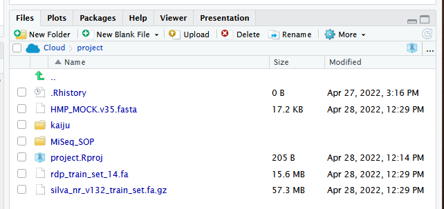

**[Return to the Course Home Page](../index.html)**

# 28-Apr 2022 - PLEASE DO NOT MAKE A PHYSICAL COPY OF THIS FILE UNTIL THIS LABEL IS REMOVED

# Barcodes and diversity - Fastq read analysis for 16S rRNA metabarcoding using the R package DADA2

**Professor Patrick Biggs**

[Purpose](#purpose)<br>
[Introduction](#introduction)<br>
[Lecture Overview](#lecture-overview)<br>
[Conventions used for this RStudio practical](#conventions-used-for-this-rstudio-practical)<br>
[Accessing the resources needed](#accessing-the-resources-needed)<br>
[Theoretical overview](#theoretical-overview)<br>
[Exercise 1: Getting everything ready](#exercise-1-getting-everything-ready)<br>
[Exercise 2: Collecting our data](#exercise-2-collecting-our-data)<br>
[Exercise 3: Examining the quality profiles of forward and reverse reads](#exercise-3-examining-the-quality-profiles-of-forward-and-reverse-reads)<br>
[Exercise 4: Performing filtering and trimming](#exercise-4-performing-filtering-and-trimming)<br>
[Exercise 5: Dereplication](#exercise-5-dereplication)<br>
[Exercise 6: Investigation of the error rates](#exercise-6-investigation-of-the-error-rates)<br>
[Exercise 7: Sample inference](#exercise-7-sample-inference)<br>
[Exercise 8: Merging the paired reads](#exercise-8-merging-the-paired-reads)<br>
[Exercise 9: Constructing the sequence table and removing chimaeras](#exercise-9-constructing-the-sequence-table-and-removing-chimaeras)<br>
[Exercise 10: Checking our progress](#exercise-10-checking-our-progress)<br>
[Exercise 11: Assigning taxonomy](#exercise-11-assigning-taxonomy)<br>
[Exercise 12: Evaluating the accuracy](#exercise-12-evaluating-the-accuracy)<br>
[Exercise 13: Working with fasta files to generate a sequence logo](#exercise-13-working-with-fasta-files-to-generate-a-sequence-logo)<br>
[Portfolio analysis](#portfolio-analysis)<br>
[Assessment](#assessment)<br>
[Contact](#contact)<br>


## Purpose

To learn how to perform an analysis of 16S rRNA sequencing data from raw sequencing data to preliminary visualisation and taxonomic classification.


## Introduction

Microbial diversity has been revolutionised by the rapid advances in sequencing technology, given us new insights into the role of the microbial world in all environments on Earth. Sequencing of metagenomes (all the DNA in a given sample etc) or of specific markers (metabarcodes e.g. 16S rRNA amplicons) have been crucial in this regard. Knowing what is there, and what it is potentially doing are two of the main research areas of interest.  How we then analyse the data, visualise and interpret the results is thus of importance.

Week 7 focusses on introducing ideas around the analysis of microbial diversity - for bacteria - within the 16S rRNA amplicon, and performing a typical workflow analysis on such sequences in `R` using a piece of software called DADA2. These ideas will be developed further in the next two weeks (weeks 8 and 9) of this module. 


## Lecture Overview

The lecture introduced the motivation for doing these kinds of studies, and described the **very important conceptual difference between metabarcoding and metagenomics**.  Next an overview of metabarcoding was discussed as was the 16S rRNA amplicon, and some initial ideas about how we work with sequence diversity to make OTUs (operational taxonomic units).

We then swtiched tack to looking at software - from a historical point of view - with QIIME, mothur and Usearch being mentioned before turning or focus to DADA2 within the `R` environment.  Finally some challenges were mentioned, which is a theme further developed in the tutorial.

So, now on to the practical...

First thing, you have an electronic copy of this practical -- which you will see via the Stream and this site -- **please don't copy and paste in the practical today!** Why? Typing these commands is part of the hard wiring required to make them stick! By typing commands it gives you another opportunity to think about the command before you execute it and typing is more likely to trigger a big red flag in dangerous situations! So, think twice, type once, we will discuss this more next week.


## Conventions used for this RStudio practical

As a reminder, in what follows, we shall use the following typographical conventions for working with `R`:
* Characters written in `this programming style` are commands to be typed into the computer as they stand.
* Characters written in _`this programming style`_ are objects and file names.
* Characters written after something like `###` indicate comments within the code that will help you.  They do not run code.
* Characters written in without `>` at the start of the line **(e.g. lines starting with "\[1\]")** indicate responses back from the R console inside RStudio that will help you too.
* Words inserted within square brackets **\[Enter\]** indicate keys to be pressed.

So, for example,

```R
 > x <- c(1, 5, 7, 14) [Enter]
```
means \"at the `R` console prompt `>`, type the code as written to make a vector `x` made up of the values 1, 5, 7 and 14, then press the key marked Enter\".

Don\'t forget to press the **\[Enter\]** key: commands are not sent to the `R` console until this is done. There will not be **\[Enter\]** at the end of any of the lines of code in this practical, it is taken that this is to be typed at the end of the line _unless otherwise stated_. It is also assumed that the first `>` is the `R` console prompt.


## Accessing the resources needed

### Computing

#### General

We will be working within web browsers, and Firefox and Chrome are installed on the machines, or Safari if you are an Apple user. We will then login to RStudio Cloud using your personalised account.

#### Manawatu (iMacs)

The machines we are using for the course -- Apple iMacs -- have been updated for 2022, and there is a new login method for them. Usernames and passwords will be supplied to you in the lab, but please remember to ignore (i.e. cancel) the dialogue box about the network when you log in.

#### Albany (PCs)

The machines are Windows PC's so logging into them should be the same as any other Massey Windows PC.

#### outside Massey 

Most likely this is your own machine, so this should not be an issue.


### Our work today

Just as we did for the Bootcamp module, you have been provided with a link to create a new RStudio workspace in your account.  Please go ahead and do this if you have not already done so.  We are using different packages in `R` for this Module - some of which have large numbers of dependencies (I have loaded them for you already) - so I strongly suggest starting this new Module with this new workspace.  Also, the resources for this Module will only be available via this project (I will be posting the files on Stream as well as a backup).


## Theoretical overview

The DADA2 paper[^1] by Callahan et al. has an associated GitHub page[^2]  and a great tutorial page.  We are going to use a set of 20 samples that are used in the tutorial, and are provided for you within the _`MiSeq_SOP`_ folder.  There are other files in there, but more on those later.  So, most of the below comes from the tutorial and the DADA2 vignette inside `R` and is acknowledged as such.

The investigation of environmental microbial communities and microbiomes has been driven in significant part by the recent widespread adoption of amplicon sequencing. In amplicon sequencing a particular genetic locus is amplified from DNA extracted from the community of interest, and then sequenced on a next-generation sequencing platform. This technique removes the need to culture microbes in order to detect their presence, and cost-effectively provides a deep census of a microbial community.

However, the process of amplicon sequencing introduces errors into the DNA sequences being analysed, and these errors severely complicate the interpretation of the results.  DADA2 implements a novel algorithm that models the errors introduced during amplicon sequencing and uses that error model to infer the true sample composition.  DADA2 takes the place of the ubiquitous “OTU-picking” step in amplicon sequencing workflows.  As demonstrated in the paper and in further benchmarking, the DADA2 method provides both better sensitivity and specificity than OTU methods: DADA2 detects real biological variation missed by OTU methods while outputting fewer spurious sequences.

The starting point for the DADA2 pipeline is a set of demultiplexed Fastq files corresponding to the samples an amplicon sequencing study. That is, DADA2 expects there to be an individual Fastq file for each sample (or two Fastq files, one forward and one reverse, for each sample).   Once demultiplexed Fastq files are in hand, the DADA2 pipeline proceeds as follows:

- Filter and Trim: `filterAndTrim()` 
- Dereplicate: `derepFastq()`
- Learn error rates: `learnErrors()`
- Infer sample composition: `dada()`
- Merge paired reads: `mergePairs()`
- Make sequence table: `makeSequenceTable()`
- Remove chimeras: `isBimeraDenovo()` or `removeBimeraDenovo()`
- Assign taxonomy: `assignTaxonomy()`

The output of the DADA2 pipeline is a sample-by-sequence matrix – a so-called **sequence table** – with each entry corresponding to the number of times that inferred sample sequence was observed in that sample.  This table is analogous to a common OTU table, except at higher resolution (exact sample sequences rather than 97% OTUs).  We also assign taxonomies to the output sequences using a small reference database.  In this practical we are working with a small set of Fastq reads from the 16S rRNA gene – one of the main taxonomic identifiers in prokaryotes.


### What we are going to do today?

- We start out with a set of Illumina-sequenced paired-end Fastq files that have been split (or “demultiplexed”) by sample and from which the barcodes/adapters have already been removed.
- We will end up with an amplicon sequence variant (ASV) table, a higher-resolution analogue of the ubiquitous “OTU table”, which records the number of times each 16S rRNA sequence variant (SV) was observed in each sample.


## Exercise 1: Getting everything ready

We will check we have all we need to do the analysis first.  The commands below have been checked and should work fine.  The below screenshot shows the folder structure within `/cloud/project/` for the new Module.

1. Go to the _`MiSeq_SOP`_ folder in the `/cloud/project/` project within the "weeks7to9" project within the "MicrobialDiversity_2022" workspace and check that there are files there.



2. Check we have all our packages we need for the work, so typing into the console as you have done before:

```R
### check on packages being there and their versions ###
> library(dada2)
> packageVersion("dada2")
[1] ‘1.22.0’

> library(ShortRead)
> packageVersion("ShortRead")
[1] ‘1.52.0’

> library(ggplot2)
> packageVersion("ggplot2")
[1] ‘3.3.5’
```

The next thing we want to do is to set a working path and then define a path variable to check it is all OK for the work we are going to do today. 

```R
### is our path OK?
> path <- ("/cloud/project/MiSeq_SOP/")
> path
[1] "/cloud/project/MiSeq_SOP/"

> fns <- list.files(path)
> fns
 [1] "F3D0_S188_L001_R1_001.fastq"   "F3D0_S188_L001_R2_001.fastq"   "F3D1_S189_L001_R1_001.fastq"  
 [4] "F3D1_S189_L001_R2_001.fastq"   "F3D141_S207_L001_R1_001.fastq" "F3D141_S207_L001_R2_001.fastq"
```

**If you do not see this structure and output, please let a demonstrator know as soon as possible, as you will not be able to proceed any further in the practical without it.**

>**Question 1:**
> How many non-Fastq files are there in the directory?
> <table><tr><td>
> ____________________
> </td></tr></table>


## Exercise 2: Collecting our data

First we read in the names of the Fastq files, and perform some string manipulation to get lists of the forward and reverse Fastq files in matched order.  This is relatively straightforward, so we shall just go ahead and do this.

```R
### extract out our fastq sequences
> fastqs <- fns[grepl(".fastq$", fns)]
> fastqs
[1] "F3D0_S188_L001_R1_001.fastq"   "F3D0_S188_L001_R2_001.fastq"   "F3D1_S189_L001_R1_001.fastq"  
[4] "F3D1_S189_L001_R2_001.fastq"   "F3D141_S207_L001_R1_001.fastq" "F3D141_S207_L001_R2_001.fastq"
[7] "F3D142_S208_L001_R1_001.fastq" "F3D142_S208_L001_R2_001.fastq" "F3D143_S209_L001_R1_001.fastq"

### sort them to ensure reads are in the same order
> fastqs <- sort(fastqs)

### make sub-lists for the forward and reverse reads
> fnFs <- fastqs[grepl("_R1", fastqs)] # Just the forward read files
> fnRs <- fastqs[grepl("_R2", fastqs)] # Just the reverse read files

### get the sample.names
> sample.names <- sapply(strsplit(fnFs, "_"), `[`, 1)

### Specify the full path to the fnFs and fnRs
> fnFs <- file.path(path, fnFs)
> fnRs <- file.path(path, fnRs)
> fnFs
 [1] "/cloud/project/MiSeq_SOP//F3D0_S188_L001_R1_001.fastq"  
 [2] "/cloud/project/MiSeq_SOP//F3D1_S189_L001_R1_001.fastq"  
 [3] "/cloud/project/MiSeq_SOP//F3D141_S207_L001_R1_001.fastq"
> fnRs
 [1] "/cloud/project/MiSeq_SOP//F3D0_S188_L001_R2_001.fastq"  
 [2] "/cloud/project/MiSeq_SOP//F3D1_S189_L001_R2_001.fastq"  
 [3] "/cloud/project/MiSeq_SOP//F3D141_S207_L001_R2_001.fastq"
```

>**Question 2:**
> How many Fastq files are there in the directory?
> <table><tr><td>
> ____________________
> </td></tr></table>


## Exercise 3: Examining the quality profiles of forward and reverse reads

It is important to look at your data. We start by visualizing the quality profiles along the sequencing reads.

```R
### Visualize the quality profile of the forward reads
> plotQualityProfile(fnFs[[1]])
> plotQualityProfile(fnFs[[12]])
> plotQualityProfile(fnRs[[1]])
> plotQualityProfile(fnRs[[12]])
```

Here we have randomly picked sample 1 and sample 12.  We are plotting the Phred quality scores for the Fastq reads for this sample (y-axis) against the sequencing cycle (x-axis).  Clearly, we want our data to be as high quality as possible.  The green line shows the median quality score at each position, and the orange lines shows the quartiles of the quality score distribution. The red line shows the scaled proportion of reads that extend to at least that position (this is more useful for other sequencing technologies, as Illumina reads are typically all the same length, hence the flat red line).  Typical example plots look like the overleaf for the forward and reverse reads respectively for one of the samples:


>**Question 3:**
> What do you think about the quality of read 1 (R1; forward) compared to read 2 (R2; reverse)?
> <table><tr><td>
> ____________________
> </td></tr></table>

The forward reads are of good quality. It would generally be advised that trimming the last few nucleotides is a good idea to avoid less well-controlled errors that can arise there. There is no suggestion from these quality profiles that any additional trimming is needed, so we will truncate the forward reads at position 240 (trimming the last 10 nucleotides).  As is mostly the case, the reverse reads are of significantly worse quality, especially at the end, which is common in Illumina paired-end sequencing. This isn’t too worrisome, DADA2 incorporates quality information into its error model which makes the algorithm is robust to lower quality sequence, but trimming as the average qualities crash is still a good idea. We will truncate at position 160 where the quality distribution crashes.


## Exercise 4: Performing filtering and trimming

Now that we know what our quality is like, we need to perform some filtering and trimming on the data.  For this kind of work, having more – but poorer quality data – can have major deleterious consequences on data analysis.

As in the DADA2 tutorial, we will use standard filtering parameters: _`maxN=0`_ (DADA2 requires no Ns), _`truncQ=2`_ and _`maxEE=2`_. The _`maxEE`_ parameter sets the maximum number of “expected errors” allowed in a read, which is a better filter than simply averaging quality scores. We use `filterAndTrim()` to jointly filter the forward and reverse reads.

```R
### Make directory and filenames for the filtered fastqs
> filt_path <- file.path(path, "filtered")
> if(!file_test("-d", filt_path)) dir.create(filt_path)
> filt_path
[1] "/cloud/project/MiSeq_SOP//filtered"

### make list of filtered names for later
> filtFs <- file.path(filt_path, paste0(sample.names, "_F_filt.fastq.gz"))
> filtRs <- file.path(filt_path, paste0(sample.names, "_R_filt.fastq.gz"))
```

>**Question 4:**
> The second line in the above `R` code is a complicated one – `if(!file_test("-d", filt_path)) dir.create(filt_path)` – can you work out what it might be doing (if you cannot, do not worry, this is a tricky one)?
> <table><tr><td>
> ____________________
> </td></tr></table>

Now to perform the actual filtering and trimming on our samples and place the results in an object called **`trim_data`**.  Due to our RStudio Cloud setup this year, we have to run the code in a slightly different way.  This is due to resources we are allowed in the cloud environment.  These lines of code might take a couple of minutes or so to run.

```R
### Perform the trimming and filtering
### Adapted for 2022
### You will not be tested on the adapted code in this code box to make the process work

### collect the names
> names(filtFs) <- sample.names
> names(filtRs) <- sample.names

### make a list of the arguments
> trim_arguments <- list(truncLen=c(240,160), 
                    maxN=0, maxEE=c(2,2), truncQ=2, rm.phix=TRUE,
                    compress=TRUE)

### run the filterAndTrim function on each set of files, returning a list
> out <- mapply(filterAndTrim, fnFs, filtFs, fnRs, filtRs, 
         MoreArgs = trim_arguments, SIMPLIFY = FALSE)

### work on our object out to tidy it up for later analyses
> trim_data <- do.call(rbind.data.frame, out)
> rownames(trim_data) <- sample.names
> head(trim_data)
       reads.in reads.out
F3D0       7793      7113
F3D1       5869      5299
F3D141     5958      5463
F3D142     3183      2914
F3D143     3178      2941
F3D144     4827      4312

### You would then see the 6 lines like those in red, indicating 
### what is happening to each sample under this process as it is running
```

Ideally the code to run this same command would be the following, but please **do not run this as it will not work**.  In fact, it will crash your RStudio Cloud session.  I have included it as it is important that you see the code as it should be run.

```R
### Perform the trimming and filtering
out <- filterAndTrim(fnFs, filtFs, fnRs, filtRs, truncLen=c(240,160), 
       maxN=0, maxEE=c(2,2), truncQ=2, rm.phix=TRUE,
       compress=TRUE, multithread=TRUE)
head(out) 

### Please do not run this code, it is for completeness and so you can see the code as it should be run
### You could be tested on the code in this box
```

> If you are interested (**which I very strongly suggest you are by the way for the future**), have a look at the arguments for the `filterAndTrim()` function as it is doing a huge amount of work for you, including compressing the resulting reads, i.e. please do not ignore the contents of the code box directly above.


## Exercise 5: Dereplication

Dereplication is a key step in any metabarcoding pipeline, as it combines all identical sequencing reads into “unique sequences” with a corresponding “abundance”: the number of reads with that same sequence.  Dereplication substantially reduces computation time by eliminating redundant comparisons.

As implemented in the DADA2 pipeline dereplication has one crucial addition from other pipelines: DADA2 retains a summary of the quality information associated with each unique sequence. The consensus quality profile of a unique sequence is the average of the positional qualities from the dereplicated reads. These quality profiles inform the error model of the subsequent denoising step, significantly increasing DADA2’s accuracy.  We now go on and dereplicate the forward and reverse reads separately and rename our files with the correct names.  Again, this is relatively straightforward, so we shall just go ahead and do that.

```R
### dereplicate the forward and reverse reads separately
> derepFs <- derepFastq(filtFs, verbose=TRUE)
Dereplicating sequence entries in fastq file: /cloud/project/MiSeq_SOP//filtered/F3D0_F_filt.fastq.gz
Encountered 1979 unique sequences from 7113 total sequences read.
Dereplicating sequence entries in fastq file: /cloud/project/MiSeq_SOP//filtered/F3D1_F_filt.fastq.gz
......

> derepRs <- derepFastq(filtRs, verbose=TRUE)
Dereplicating sequence entries in fastq file: /cloud/project/MiSeq_SOP//filtered/F3D0_R_filt.fastq.gz
Encountered 1660 unique sequences from 7113 total sequences read.
Dereplicating sequence entries in fastq file: /cloud/project/MiSeq_SOP//filtered/F3D1_R_filt.fastq.gz
......

### rename the derep-class objects by the sample names
> names(derepFs) <- sample.names
> names(derepRs) <- sample.names
```

You will see on your screen output for the 20 reads for the forward and reverse output.  Let’s just check that we have proper names for our samples:

```R
> names(derepFs)
 [1] "F3D0"   "F3D1"   "F3D141" "F3D142" "F3D143" "F3D144" "F3D145" "F3D146" "F3D147" "F3D148" "F3D149" "F3D150" "F3D2"   "F3D3"   "F3D5"  
[16] "F3D6"   "F3D7"   "F3D8"   "F3D9"   "Mock"
```

All should be looking good so far….


## Exercise 6: Investigation of the error rates

As already stated, Illumina sequencing is prone to error, and when we are using differences in an amplicon to assign sequences to taxa, we need to have a feel for our error rate.  DADA2 can do this for us, but how it does this is way beyond the scope of the current course.  

The DADA2 algorithm depends on a parametric error model (err) and amplicon dataset having different error rates. DADA2 learns its error model from the data itself by alternating estimation of the error rates and the composition of the sample until they converge on a jointly consistent solution (this is similar to a method called the EM algorithm).

As in many optimization problems, the algorithm must begin with an initial guess, for which we provide the maximum possible error rates in this data (the error rates if only the most abundant sequence is correct, and all the rest are errors) by setting _`err=NULL`_.  Again, we run these for both the forward and reverse reads, and then we plot the result errors to get a visualisation of what is going on.  The `learnErrors()` function might take 3 or 4 minutes or so to run for each of the forward and reverse errors to be calculated, so please be patient whilst this is occurring.

```R
### forward reads first and then look at the output
> errF <- learnErrors(derepFs, multithread=FALSE)
33514080 total bases in 139642 reads from 20 samples will be used for learning the error rates.
> dadaFs.lrn <- dada(derepFs, err=errR, multithread=TRUE)
Sample 1 - 7113 reads in 1979 unique sequences.
Sample 2 - 5299 reads in 1639 unique sequences.
Sample 3 - 5463 reads in 1477 unique sequences.
......
```

And then the reverse reads…

```R
### reverse reads second and then look at the output
> errR <- learnErrors(derepRs, multithread=FALSE)
22342720 total bases in 139642 reads from 20 samples will be used for learning the error rates.
> dadaRs.lrn <- dada(derepRs, err=errR, multithread=TRUE)
Sample 1 - 7113 reads in 1660 unique sequences.
Sample 2 - 5299 reads in 1349 unique sequences.
Sample 3 - 5463 reads in 1335 unique sequences.
......
```

>**Question 5:**
> What are the number of unique sequences for both the forward and reverse reads for Sample 12?  Why do you think they are different?
> <table><tr><td>
> ____________________
> </td></tr></table>

Now we use the power of `R` to simply plot a very complicated data structure and figure for the error profiles on our forward reads. 

```R
### plot the errors as a trellis plot
> plotErrors(errF, nominalQ=TRUE)
```

Hopefully you will see the image overleaf.  So, what does this show?  The error rates for each possible transition (e.g. A->C, A->G, …) are shown as “A2C”, “A2G” etc.. The points are the observed error rates (y-axis) for each consensus quality score (x-axis). The black line shows the estimated error rates after convergence. The red line is the error rates expected under the nominal definition of the Q-value. Here the black line (the estimated rates) fits the observed rates well, and the error rates drop with increased quality as expected. The tutorial states that everything looks reasonable and we proceed.


>**Question 6:**
> How would you modify the previous code to draw a plot of the error estimations for the reverse reads?
> <table><tr><td>
> ____________________
> </td></tr></table>


 ## Exercise 7: Sample inference

We are now ready to apply the core sequence-variant inference algorithm to the dereplicated data.  What does that mean?  Well, looking at the help for `dada()` - `?dada` - indicates that “The dada function takes as input dereplicated amplicon sequencing reads and returns the inferred composition of the sample (or samples).  Put another way, `dada()` removes all sequencing errors to reveal the members of the sequenced community.”

Let’s run this on the dereplicated forward and reverse reads (_`derepFs`_ and _`derepRs`_) separately again, and then look at an example output for one sample:

```R
### Infer the sequence variants in each sample
> dadaFs <- dada(derepFs, err=errF, multithread=TRUE)
Sample 1 - 7113 reads in 1979 unique sequences.
Sample 2 - 5299 reads in 1639 unique sequences.
Sample 3 - 5463 reads in 1477 unique sequences.
......

> dadaRs <- dada(derepRs, err=errR, multithread=TRUE)
Sample 1 - 7113 reads in 1660 unique sequences.
Sample 2 - 5299 reads in 1349 unique sequences.
Sample 3 - 5463 reads in 1335 unique sequences.
......

### inspect the results in more detail
> dadaFs[[1]]
dada-class: object describing DADA2 denoising results
128 sample sequences were inferred from 1979 input unique sequences.
Key parameters: OMEGA_A = 1e-40, OMEGA_C = 1e-40, BAND_SIZE = 16
```

>**Question 7:**
> Using the last line of code above, adapt it to find out how many sample sequences were inferred for sample 15?
> <table><tr><td>
> ____________________
> </td></tr></table>


## Exercise 8: Merging the paired reads

Now we can actually go ahead and merge our forward and reverse reads into a single read that overlaps.  By doing this, we can also further reduce spurious sequence variants by merging these overlapping reads. The core function here is `mergePairs()`, which depends on the forward and reverse reads being in matching order at the time they were dereplicated.

```R
### Merge the denoised forward and reverse reads
> mergers <- mergePairs(dadaFs, derepFs, dadaRs, derepRs, verbose=TRUE)
6540 paired-reads (in 107 unique pairings) successfully merged out of 6891 (in 197 pairings) input.
5028 paired-reads (in 101 unique pairings) successfully merged out of 5190 (in 157 pairings) input.
4986 paired-reads (in 81 unique pairings) successfully merged out of 5267 (in 166 pairings) input.
......
```

The resulting dataframe – called _`mergers`_ – is large, so we will just look at the start of sample 1:

```R
### Inspect the merger data.frame from the first sample
> head(mergers[[1]])
sequence
1 TACGGAGGATGCGAGCGTTATCCGGATTTATTGGGTTTAAAGGGTGCGCAGGCGGAAGATCAAGTCAGCGGTAAAATTGAGAGGCTCAACCTCTTCGAGCCGTTGAAACTGGTTTTCTTGAGTGAGCGAGAAGTATGCGGAATGCGTGGTGTAGCGGTGAAATGCATAGATATCACGCAGAACTCCGATTGCGAAGGCAGCATACCGGCGCTCAACTGACGCTCATGCACGAAAGTGTGGGTATCGAACAGG
2 TACGGAGGATGCGAGCGTTATCCGGATTTATTGGGTTTAAAGGGTGCGTAGGCGGCCTGCCAAGTCAGCGGTAAAATTGCGGGGCTCAACCCCGTACAGCCGTTGAAACTGCCGGGCTCGAGTGGGCGAGAAGTATGCGGAATGCGTGGTGTAGCGGTGAAATGCATAGATATCACGCAGAACCCCGATTGCGAAGGCAGCATACCGGCGCCCTACTGACGCTGAGGCACGAAAGTGCGGGGATCAAACAGG
.......
  abundance forward reverse nmatch nmismatch nindel prefer accept
1       579       1       1    148         0      0      1   TRUE
2       470       2       2    148         0      0      2   TRUE
3       449       3       4    148         0      0      1   TRUE
4       430       4       3    148         0      0      2   TRUE
5       345       5       6    148         0      0      1   TRUE
6       282       6       5    148         0      0      2   TRUE
```


## Exercise 9: Constructing the sequence table and removing chimaeras

We can now construct a sequence table of our samples that is analogous to the “OTU table” produced by classical methods.  We do not want to run this on the mock community samples as we are using those at the end of the practical, if there is time.

```R
### Construct sequence table of the non-Mock data
> seqtab <- makeSequenceTable(mergers)
```

The sequence table – _`seqtab`_ – is a matrix with rows corresponding to (and named by) the samples, and columns corresponding to (and named by) the sequence variants. 

>**Question 8**
> Use the dim() function to find out the size of _`seqtab`_.
> <table><tr><td>
> ____________________
> </td></tr></table>

We can now look at the distribution of the sequence lengths:

```R
### Inspect the distribution of sequence lengths
> table(nchar(getSequences(seqtab)))
```

>**Question 9**
> What is the most frequent size for _`seqtab`_?
> <table><tr><td>
> ____________________
> </td></tr></table>

Our merged sequences all fall in the expected range for the V4 amplicon as described by the Illumina protocol, so this is reassuring.

The core `dada()` method removes substitution and indel errors, but chimaeras remain. Fortunately, the accuracy of the sequences after this denoising process makes identifying chimaeras easier than it is when dealing with fuzzy OTUs: all sequences which can be exactly reconstructed as a bimera (two-parent chimera) from more abundant sequences.  Let’s see what happens when we remove chimaeras:

```R
### Remove chimeric sequences 
> seqtab.nochim <- removeBimeraDenovo(seqtab, verbose=TRUE)
Identified 61 bimeras out of 293 input sequences.
```

>**Question 10**
> Use the dim() function to find out the size of _`seqtab.nochim`_?
> <table><tr><td>
> ____________________
> </td></tr></table>

This is not the same as _`sebtab`_.  Let’s calculate our sequences remaining after checking for chimaeras:

```R
> sum(seqtab.nochim)/sum(seqtab)
[1] 0.964064
```

The fraction of chimeras varies based on factors including experimental procedures and sample complexity but can be substantial. Here chimeras make up about 21% of the inferred sequence variants (61 out of 293), but those variants account for only about 4% of the total sequence reads.


## Exercise 10: Checking our progress

We can do a quick check of how our samples have performed over the process to get to this stage.  This is important as it can be regarded as a “sanity check” before we went on and did more analyses if we so wished.  If we saw an over-large drop associated with one step, we might want to have a look at our parameters throughout our sequence processing.

```R
### Remove chimeric sequences with some complicated code 
> getN <- function(x) sum(getUniques(x)) # our first function
> track <- cbind(trim_data, sapply(dadaFs, getN), sapply(dadaRs, getN),
           sapply(mergers, getN), rowSums(seqtab.nochim))

> colnames(track) <- c("input", "filtered", "denoisedF", "denoisedR", "merged",
                       "nonchim")
> rownames(track) <- sample.names

> head(track)
       input filtered denoisedF denoisedR merged nonchim
F3D0    7793     7113      6976      6979   6540    6528
F3D1    5869     5299      5227      5239   5028    5017
F3D141  5958     5463      5331      5357   4986    4863
F3D142  3183     2914      2799      2830   2595    2521
F3D143  3178     2941      2822      2867   2552    2518
F3D144  4827     4312      4151      4228   3627    3488
```


## Exercise 11: Assigning taxonomy

So, here we are at last, at the point, after having done all this quality control work, of actually looking at what all these sequences mean, as far as a taxonomic classification is concerned.  It is common at this point in 16S/18S/ITS amplicon sequencing, to classify sequence variants taxonomically. 

The DADA2 package provides a native implementation of the RDP’s naive Bayesian classifier for this purpose. The `assignTaxonomy()` function takes a set of sequences and a training set of taxonomically classified sequences, and outputs the taxonomic assignments with at least minBoot bootstrap confidence.  Again, this step might take three minutes or so, so please be patient.  We will use a small reference dataset to classify the _`seqtab.nochim`_ sequences to, and then use the `taxa.print()` function to remove the names and print them out:

```R
### use a reference data set to assign taxonomy to the reads
> training <- ("/cloud/project/silva_nr_v132_train_set.fa.gz")
> training
[1] "/cloud/project/silva_nr_v132_train_set.fa.gz”

> taxa <- assignTaxonomy(seqtab.nochim, training, multithread=TRUE)

### Removing sequence rownames for display only
> taxa.print <- taxa 
> rownames(taxa.print) <- NULL
> head(taxa.print)
     Kingdom    Phylum          Class         Order           Family           Genus        
[1,] "Bacteria" "Bacteroidetes" "Bacteroidia" "Bacteroidales" "Muribaculaceae" NA           
[2,] "Bacteria" "Bacteroidetes" "Bacteroidia" "Bacteroidales" "Muribaculaceae" NA           
[3,] "Bacteria" "Bacteroidetes" "Bacteroidia" "Bacteroidales" "Muribaculaceae" NA           
[4,] "Bacteria" "Bacteroidetes" "Bacteroidia" "Bacteroidales" "Muribaculaceae" NA           
[5,] "Bacteria" "Bacteroidetes" "Bacteroidia" "Bacteroidales" "Bacteroidaceae" "Bacteroides"
[6,] "Bacteria" "Bacteroidetes" "Bacteroidia" "Bacteroidales" "Muribaculaceae" NA   
```

So, at this point we could stop, as we have a taxonomy, ready for phyloseq in Practical 9 in two week's time for further analysis and visualisation.  However, we can do one more thing today.


## Exercise 12: Evaluating the accuracy 

Our last thing to do with this dataset from a DADA2 point of view is to evaluate the accuracy in terms of how well the process has gone with these sequence data, and we can use a “mock community” for this purpose.  This is a mixture of 20 known strains (this mock community is supposed to be 21 strains, but the bacterium P. acnes was absent). Reference sequences corresponding to these strains were provided in the downloaded zip archive. Previously, the Mock sample was removed when we made the sequence table, but we return to that sample now and compare the sequence variants inferred by DADA2 to the expected composition of the community.

```R
### Evaluating DADA2’s accuracy on the mock community
> unqs.mock <- getUniques(removeBimeraDenovo(mergers[["Mock"]], verbose=TRUE))
Identified 0 bimeras out of 20 input sequences.

### how did we do? – we are printing information out to the screen now in a different way
> cat("DADA2 inferred", length(unqs.mock), "sample sequences present in the Mock community.\n")
DADA2 inferred 20 sample sequences present in the Mock community.

### find our reference file – don’t worry about this complex code
> mockRef <- readFasta(file.path(path, "HMP_MOCK.v35.fasta"))
> match.ref <- sum(sapply(names(unqs.mock), function(x) any(grepl(x, as.character(sread(mockRef))))))

### print out our results
> cat("Of those,", sum(match.ref), "were exact matches to the expected reference sequences.\n")
Of those, 20 were exact matches to the expected reference sequences.
```

This mock community dataset contained 20 bacterial strains. DADA2 found 20 unique sequences all of which exactly match the reference genomes of the expected community members. The residual error rate after the DADA2 pipeline for this sample is 0%.  In comparison, the tutorial records that the mothur pipeline finds 34 OTUs in this Mock community sample. DADA2 infers sequence variants exactly instead of fuzzy 97% OTUs, and outputs fewer false positives than the OTU methods!

> **We are now at the end of the DADA2 tutorial, but we are going to do something else with our sequencing data.  This will be picked up again in Week 9.**


## Exercise 13: Working with fasta files to generate a sequence logo

We have created a dataframe of 232 16S rRNA sequences called _`seqtab.nochim`_ that represent the sequences in our experiment.  We now consider these sequences as *unique* sequences, even though we know that they are present at vastly different proportions in the 20 samples we have.  However, we are going to ignore that fact for now and make a fasta file of these sequences for illustrating the principles required for the Portfolio Analysis.  To do this, we need to load some pre-installed packages in order to create a fasta file that we can do further analysis on. 

```R
> library(FastaUtils)
> library(msa)
> library(seqLogo)
 
> ### make a fasta file from the nochim dataframe
> uniquesToFasta(seqtab.nochim, "nochimSeqs232.fa")

> ### make a random subsample of say 100 sequences
> fasta.sample(infile = "nochimSeqs232.fa", nseq = 100, file.out = "sub100_nochimSeqs.fa")
```

As we are randomly pulling sequences in this seection, the output will look slightly different fro mone attempt to the other.

To illustrate the path from fasta sequence file to aligned sequence to a sequence logo, we will use the fasta file _`sub100_nochimSeqs.fa`_ as an example of the workflow.

```R 
> ### run the sequence alignment and view in the console
> my16SAlignment <- msa(seqs16S) 
use default substitution matrix

> my16SAlignment
CLUSTAL 2.1  

Call:
   msa(seqs16S)

MsaDNAMultipleAlignment with 100 rows and 258 columns
      aln                                                                                          names
  [1] GACAGAGGATGCAAGCGTTATCCGGAATGATTGGGCGTAAAGCGT...CGAC-ACTGACACTGAG-AGACGAAAGCTAGGGGAGCGAATGGG sq222;size=5;
  [2] GACAGAGGATGCAAGCGTTATCCGGAATGATTGGGCGTAAAGCGT...CGAC-ACTGACACTGAG-AGACGAAAGCTAGGGGAGCGAATGGG sq189;size=18;
....

[100] GACGGGGGGGGCAAGTGTTCTTCGGAATGACTGGGCGTAAAGGGC...CCCT-ACCGACGCTGGG-GTGCGAAAGCATGGGGAGCGAACAGG sq107;size=117;
  Con TACGTAGGGGGCAAGCGTTATCCGGATTTACTGGGTGTAAAGGGA...?GTA-ACTGACGCTGAG-GCTCGAAAGCGTGGGGAGCAAACAGG Consensus
  
> print(my16SAlignment, show="complete") # view the results

MsaDNAMultipleAlignment with 100 rows and 258 columns
      aln (1..92)                                                                                  names
  [1] GACAGAGGATGCAAGCGTTATCCGGAATGATTGGGCGTAAAGCGT-CTGTAGGTGGCTTTTTAAGTCCGCCGTCAAAT-CCCAGGGCTCAAC sq222;size=5;
  [2] GACAGAGGATGCAAGCGTTATCCGGAATGATTGGGCGTAAAGCGT-CTGTAGGTGGCTTTTTAAGTTCGCCGTCAAAT-CCCAGGGCTCAAC sq189;size=18;

.....

 [99] AACACCGGTGGCGAAGGCGGGTCTCTGGGCCGTT-ACTGACGCTGAG-GAGCGAAAGCGTGGGGAGCGAACAGG sq58;size=325;
[100] AACGCCAAAAGCGAAGGCAGCTCTCTGGGTCCCT-ACCGACGCTGGG-GTGCGAAAGCATGGGGAGCGAACAGG sq107;size=117;
  Con AACACCAGTGGCGAAGGCGGCTT?CTGGAC?GTA-ACTGACGCTGAG-GCTCGAAAGCGTGGGGAGCAAACAGG Consensus 

> ## print out the alignment
> msaPrettyPrint(my16SAlignment, output="pdf", showNames="left", file = "ourSet.pdf",
+                showLogo="top", askForOverwrite=FALSE, verbose=FALSE)
```

The `msaPrettyPrint()` command has lots of options including showing the sequence names and printing out certain regions only.  I would **strongly suggest giving `?msaPrettyPrint` a look and to understand what is going on**.

We can also use the `seqLogo` package to generate a sequence logo only.  This package has limited functionality and printing ability and is probably designed for shorter sequence stretches, as discussed in the tutorial.  The code is a little complex, so it has comments for each code section.  *Please do not worry too much about what the code is doing here.* 

```R
### generate a sequence logo only using the seqLogo package

## read in only the first 150 positions in the alignment
> smallAlign <- DNAStringSet(my16SAlignment, start=1, end=150)

## use seqLogo to make a consensus matrix
> posWeightMat <- consensusMatrix(smallAlign, baseOnly=TRUE)

## remove the 'other' row to give only A, C, G and T counts
> rowname_to_remove <- ("other")
> posWeightMat2 <- posWeightMat[!(row.names(posWeightMat) %in% rowname_to_remove),]

## proportionate per alignment position
> posWeightMat2 <- prop.table(posWeightMat2, 2)
> p <- makePWM(posWeightMat2)

## print out the logo with a smaller font size than usual
> seqLogo(p, xfontsize = 10)
```

You could then export this image to save it through the Export command in the Plots view in the bottom right window.


## Portfolio analysis

There are two parts to the week 7 Portfolio analysis.  This will result in a figure with a part A and a part B.

### Part A

From Exercise 10, you generated a dataframe called _`track`_.  Your task is to plot this dataframe in a way that shows whether the multiple steps in the processing are adversely affecting (or not) one or more samples.  Consider the dataframe from left to right, as there is a general reduction in the number of sequences from left to right.  The columns 'denoisedF' and 'denoisedR' are a little different, but leave them as they are.  Remember to get inspirarion and ideas from https://r-graph-gallery.com/.  Would you plot the data as is, would you proportionate, and if so, by rows or columns?  If this was a way to go, as a hint, the function `prop.table()` could be of use, as was used for a different purpose in Exercise 13 above.

### Part B

From Exercise 13, you worked with a method to generate a sequence logo from the sequences from the DADA2 tutorial.  Unfortunately, due to its scale, this is not a dataset with a lot of sequence variation within it. To get to looking at a truer represenation of the 9 hypervariable regions within 16S rRNA, we need to use a reference fasta file such as _`rdp_train_set_14.fa`_.  Your task is to generate a new fasta file of 50 sequences chosen at random, and search with the `msa` and `seqLogo` packages to find a region of ~100 - 150 bp in length that shows a high degree of sequence similarity and then variability.  You should then also plot the same region with the `msa` package showing the alignment and the sequence logo, describing what you observe in the figure legend.  
 


## Assessment

To reiterate, there is no direct assessment today.  What is required however, is an understanding of the principles we have learnt today, as these will be required for the mastery test which accounts for 15% of the course.  This will take place between Thursday 19-May-2022 and Friday 20-May-2022 online.

The mastery test will test the contents of weeks 7 to 9, more information will follow soon.


## Contact

I have two offices on the Manawatu campus (as I work for both SNS and SoVS), so I am not always in my Science Tower office D5-30. If you want to discuss anything, it's best to email me beforehand.

Prof Patrick Biggs,

Molecular Biosciences Group,

School of Natural Sciences

```
-. .-.   .-. .-.   .-. .-.   .
||\|||\ /|||\|||\ /|||\|||\ /|
|/ \|||\|||/ \|||\|||/ \|||\||
~   `-~ `-`   `-~ `-`   `-~ `-
```

<p.biggs@massey.ac.nz>


[^1]: <https://www.nature.com/nmeth/journal/v13/n7/pdf/nmeth.3869.pdf >
[^2]: Concepts for this part of the practical came from a tutorial found at: <https://benjjneb.github.io/dada2/tutorial.html>
