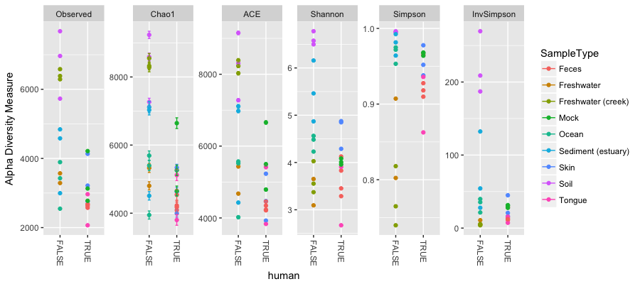
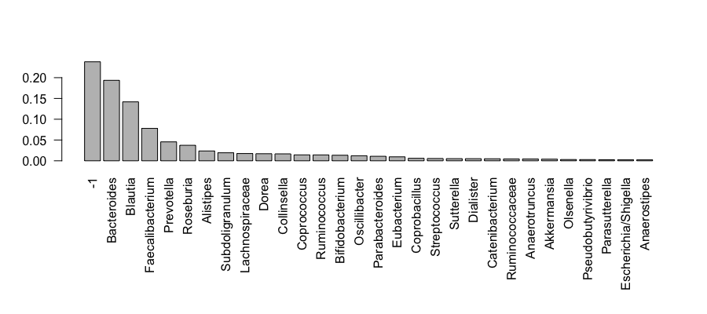
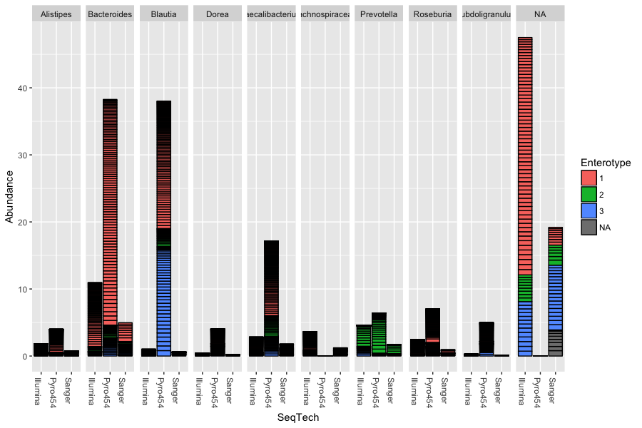
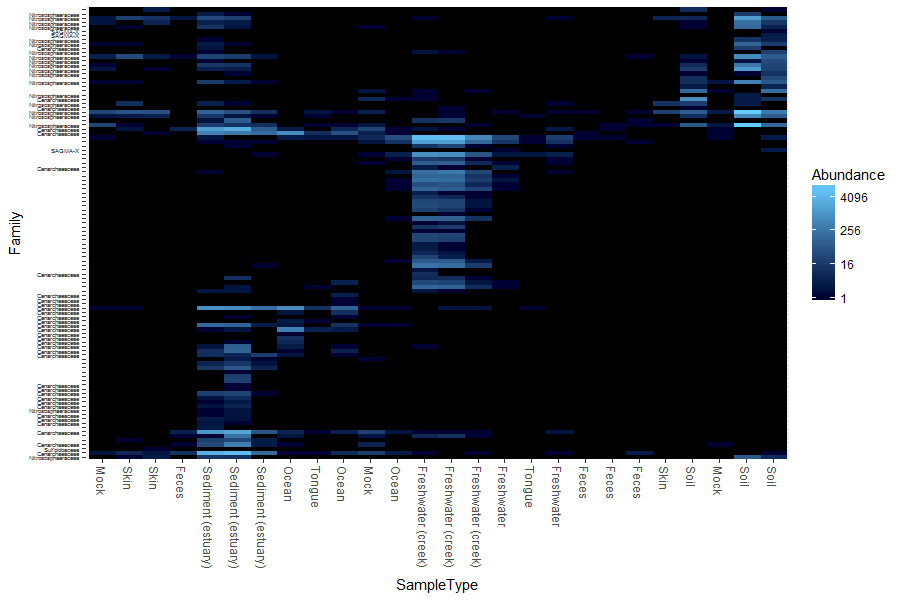
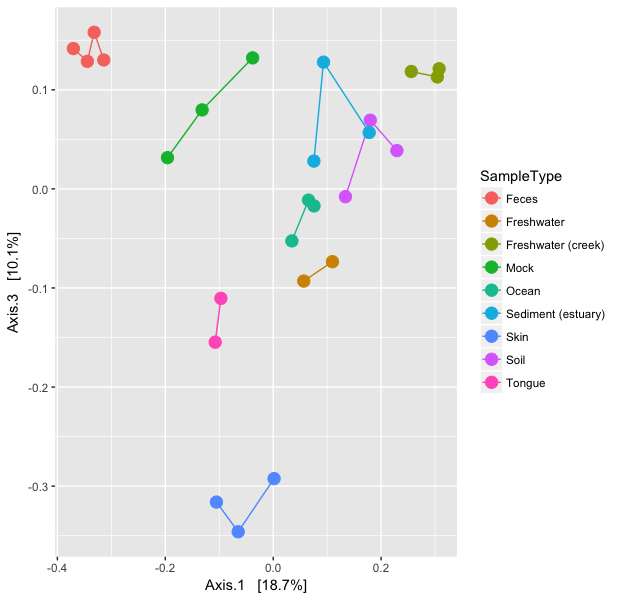
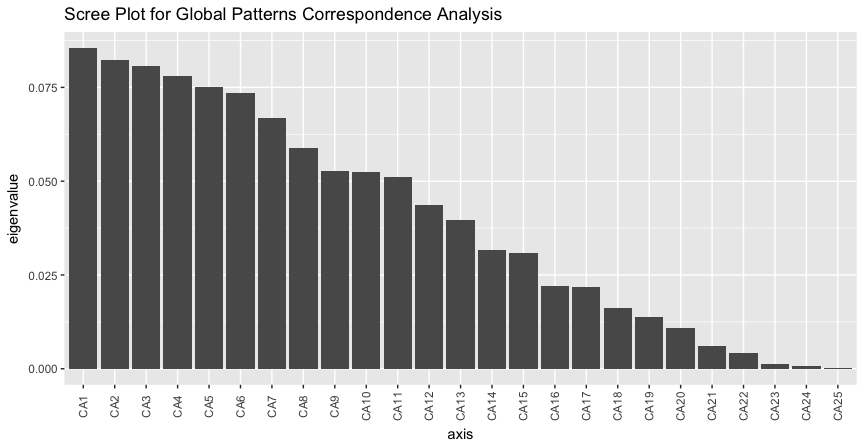
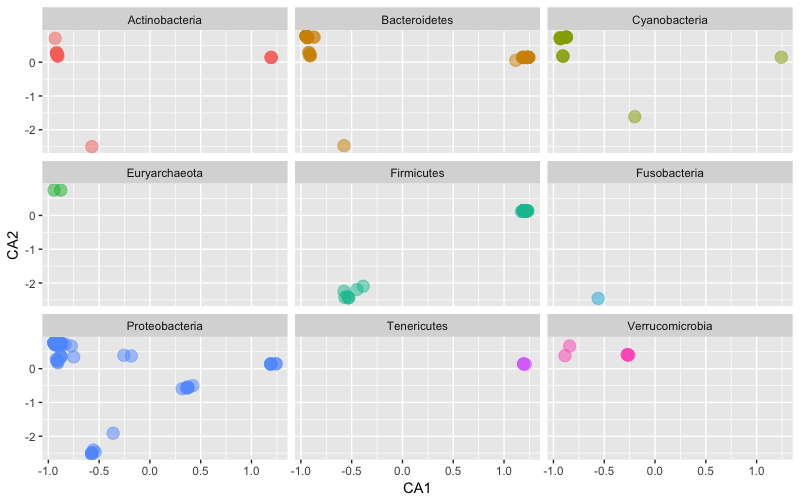
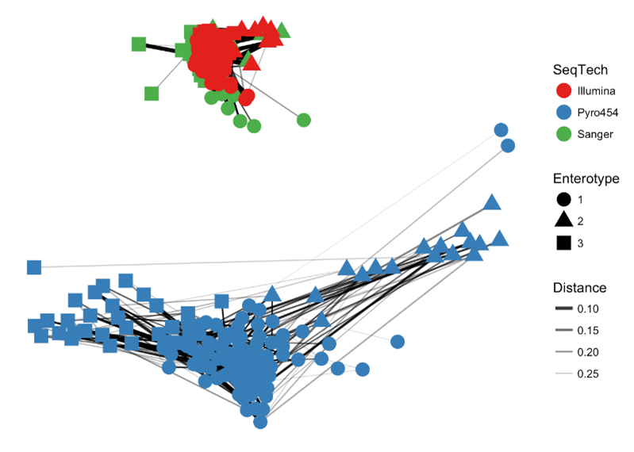
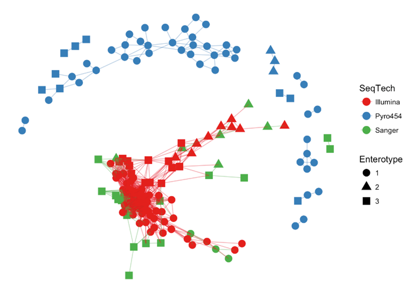

**[Return to the Course Home Page](../index.html)**

### **10-May-2022 - PLEASE DO NOT MAKE A COPY OF THIS FILE UNTIL THIS LABEL IS REMOVED**

# Metagenomic and metabarcoding visualisation

**Professor Patrick Biggs**

[Purpose](#purpose)<br>
[Introduction](#introduction)<br>
[Lecture Overview](#lecture-overview)<br>
[Conventions used for this RStudio practical](#conventions-used-for-this-rstudio-practical)<br>
[Accessing the resources needed](#accessing-the-resources-needed)<br>
[Exercise 1: Completion of the DADA2 tutorial](#exercise-1-completion-of-the-DADA2-tutorial)<br>
[Exercise 2: Going back to the beginning with phyloseq](#exercise-2-going-back-to-the-beginning-with-phyloseq)<br>
[Exercise 3: Exploratory data plotting](#exercise-3-exploratory-data-plotting)<br>
[Exercise 4: Data ordination](#exercise-4-data-ordination)<br>
[Exercise 5: Networks](#exercise-5-networks)<br>
[Exercise 6: Retrieval of new data](#exercise-6-retrieval-of-new-data)<br>
[Portfolio analysis](#portfolio-analysis)<br>
[Assessment](#assessment)<br>
[Contact](#contact)<br>


## Purpose

To return to a more in-depth analysis of metabarcoding data primarily using the phyloseq package within `R`.


## Introduction

Microbial diversity has been revolutionised by the rapid advances in sequencing technology, given us new insights into the role of the microbial world in all environments on Earth. Sequencing of metagenomes (all the DNA in a given sample etc) or of specific markers (metabarcodes e.g. 16S rRNA amplicons) have been crucial in this regard. Knowing what is there, and what it is potentially doing are two of the main research areas of interest.  How we then analyse the data, visualise and interpret the results is thus of importance.

Week 9 focusses on building from the lecture material (see below) to gain familiarity with the phyloseq package within `R`.


## Lecture Overview

The lecture covered two areas: a custom amplicon generated by my collegues and I for a specific use in _E. coli_ community analysis.  This is for a 284bp region of the _gnd_ (6-phophogluconate dehydrogenase) gene that acts as hitchhiker of recombination due to its proximity to the very recombinogenic O-antigen biosynthesis gene cluster (O-AGC).  The rest of the lecture focussed on exploring ideas and concepts around the `R` package phyloseq, and provided a theoretical introduction to the phyloseq object, and how we can do some basic data plotting and pre-processing of a phyloseq object.  We now turn that practical knowledge into some coding.

So, now on to the practical...

First thing, you have an electronic copy of this practical -- which you will see via the Stream and this site -- **please don't copy and paste in the practical today!** Why? Typing these commands is part of the hard wiring required to make them stick! By typing commands it gives you another opportunity to think about the command before you execute it and typing is more likely to trigger a big red flag in dangerous situations! So, think twice, type once.


---

## Conventions used for this RStudio practical

As a reminder, in what follows, we shall use the following typographical conventions for working with `R`:

-   Characters written in `this programming style` are commands to be typed into the computer as they stand.
-   Characters written in _`this programming style`_ are objects and file names.
-   Characters written after something like `###` indicate comments within the code that will help you.  They do not run code. 
-   Characters written in without `>` at the start of the line **(e.g. lines starting with "\[1\]")** indicate responses back from the R console inside RStudio that will help you too. 
-   Words inserted within square brackets **\[Enter\]** indicate keys to be pressed.

So, for example,

```R
 > x <- c(1, 5, 7, 14) [Enter]
```
means \"at the `R` console prompt `>`, type the code as written to make a vector `x` made up of the values 1, 5, 7 and 14, then press the key marked Enter\".

Don\'t forget to press the **\[Enter\]** key: commands are not sent to the `R` console until this is done. There will not be **\[Enter\]** at the end of any of the lines of code in this practical, it is taken that this is to be typed at the end of the line _unless otherwise stated_. It is also assumed that the first `>` is the `R` console prompt.

---

## Accessing the resources needed

### Computing

#### General

We will be working within web browsers, and Firefox and Chrome are installed on the machines, or Safari if you are an Apple user. We will then login to RStudio Cloud using your personalised account.

#### Manawatu (iMacs)

The machines we are using for the course -- Apple iMacs -- have been updated for 2022, and there is a new login method for them. Usernames and passwords will be supplied to you in the lab, but please remember to ignore (i.e. cancel) the dialogue box about the network when you log in.

#### Albany (PCs)

The machines are Windows PC's so logging into them should be the same as any other Massey Windows PC.

#### Outside Massey 

Most likely this is your own machine, so this should not be an issue.


### Our work today

We will return to our RStudio cloud environment to analyse the data we started working on in Week 7, and then further that analysis by following some tutorial examples on the pre-loaded `phyloseq` datasets.


### What we are going to do today?

We have 5 exercises -- with questions along the way --  to work through before getting to the Portfolio analysis (more on that below):
- We will follow on with the DADA2 tutorial, and take that data into phyloseq to see what we can glean from further analysis.
- We will start working through the phyloseq tutorial to get an idea of what is possible.
- We will perform some initial data plotting.
- We will perform some initial data ordination.
- Finally, we will have a quick look at some network visualisations.

The commands below have been checked and should work fine.

---

## Exercise 1: Completion of the DADA2 tutorial

We wil use information described on the phyloseq pages (https://joey711.github.io/phyloseq/) by its author -- Paul J. McMurdie -- for this practical, and this work is acknowledged.

The DADA2 pipeline produced a sequence table and a taxonomy table which is appropriate for further analysis in phyloseq. We'll also include the small amount of metadata we have – the samples are named by the gender (G), mouse subject number (X) and the day post-weaning (Y) it was sampled (e.g. GXDY is the format of the sample names).  So, now we shall build up this metadata file, but we shall do it inside of `R` using source files available to us:

```R
### load our required packages
> library(phyloseq)
> packageVersion("phyloseq")
[1] ‘1.30.0’

### modifying our seqtab.nochim object to remove the mock community
> seqtab <- makeSequenceTable(mergers[names(mergers) != "Mock"])
> seqtab.nochim <- removeBimeraDenovo(seqtab, verbose=TRUE)

### starting to make a dataframe for the samples by getting their names
> samples.out <- rownames(seqtab.nochim)
> samples.out
 [1] "F3D0"   "F3D1"   "F3D141" "F3D142" "F3D143" "F3D144" "F3D145" "F3D146" "F3D147" "F3D148" "F3D149"
[12] "F3D150" "F3D2"   "F3D3"   "F3D5"   "F3D6"   "F3D7"   "F3D8"   "F3D9" 
```

We will now make our other columns of data to add to the metadata:

```R
### set up the subject and gender
> subject <- sapply(strsplit(samples.out, "D"), `[`, 1)
> subject
 [1] "F3" "F3" "F3" "F3" "F3" "F3" "F3" "F3" "F3" "F3" "F3" "F3" "F3" "F3" "F3" "F3" "F3" "F3" "F3"
> gender <- substr(subject,1,1)
> gender
 [1] "F" "F" "F" "F" "F" "F" "F" "F" "F" "F" "F" "F" "F" "F" "F" "F" "F" "F" "F"
> subject <- substr(subject,2,999)
> subject
 [1] "3" "3" "3" "3" "3" "3" "3" "3" "3" "3" "3" "3" "3" "3" "3" "3" "3" "3" "3"
```

Now to define the data post weaning:

```R
### days post weaning
> day <- as.integer(sapply(strsplit(samples.out, "D"), `[`, 2))
> day
 [1]   0   1 141 142 143 144 145 146 147 148 149 150   2   3   5   6   7   8   9

### setting up
> samdf <- data.frame(Subject=subject, Gender=gender, Day=day)
> head(samdf)
  Subject Gender Day
1       3      F   0
2       3      F   1
3       3      F 141
4       3      F 142
5       3      F 143
6       3      F 144

### define early and late categories dependent on days post weaning to add to our data
> samdf$When <- "Early"
> samdf$When[samdf$Day>100] <- "Late"
> rownames(samdf) <- samples.out
> head(samdf)
       Subject Gender Day  When
F3D0         3      F   0 Early
F3D1         3      F   1 Early
F3D141       3      F 141  Late
F3D142       3      F 142  Late
F3D143       3      F 143  Late
F3D144       3      F 144  Late
```

Now we construct our initial phyloseq object as a combination to bring all these things together:

```R
### this is all one line of code
> ps <- phyloseq(otu_table(seqtab.nochim, taxa_are_rows=FALSE), 
+                sample_data(samdf), 
+                tax_table(taxa))
> ps
phyloseq-class experiment-level object
otu_table()   OTU Table:         [ 218 taxa and 19 samples ]
sample_data() Sample Data:       [ 19 samples by 4 sample variables ]
tax_table()   Taxonomy Table:    [ 218 taxa by 6 taxonomic ranks ]
```

**If you do not see this structure and output, please let a demonstrator know as soon as possible.**

We can start to do many analyses at this point.  Again as a starting point, we will have a look at the counts, alpha diversity, and an initial ordination to see if there are any differences in our metadata, and whether it has an effect on the results.

We shall start off by looking at the alpha diversity:

```R
### plotting diversity by day using the Shannon and Simpson measures
> plot_richness(ps, x="Day", measures=c("Shannon", "Simpson"), color="When")
```

You should see something like the following:


>**Question 1:**
>
>What can we see in the differences between the Early and Late samples?
>
> <table><tr><td>
> ____________________
> </td></tr></table>

Now let’s have a quick look at the composition via an ordination of the data using relatively standard methods:

```R
### a quick look at the data via an ordination method
ord.nmds.bray <- ordinate(ps, method="NMDS", distance="bray")
plot_ordination(ps, ord.nmds.bray, color="When", title="Bray NMDS")
```

You should see something like the following:


>**Question 2:**
>
>What can we see in the differences between the Early and Late samples?
>
> <table><tr><td>
> ____________________
> </td></tr></table>

Now, let’s have a look at the number of counts for the top 20 sequences by frequency.  We will then plot the counts at the taxonomic level of family:

```R
### what about the top 20 taxa?
top20 <- names(sort(taxa_sums(ps), decreasing=TRUE))[1:20]
head(top20)
ps.top20 <- transform_sample_counts(ps, function(OTU) OTU/sum(OTU))
ps.top20 <- prune_taxa(top20, ps.top20)
plot_bar(ps.top20, x="Day", fill="Family") + facet_wrap(~When, scales="free_x")
```

You should see something like the following:


We will look at the `plot.bar()` function shortly.  However, for now, to end this section – and I am not going to list the code to do this – please rerun the above code, only for the top 50.  Call your new object _`top50`_ and change the ending of the first line in the above box of code to be `[1:50]`.

>**Question 3:**
>
>If you compare the data from _`top20`_ to _`top50`_, can you see any more obvious changes in the taxonomy that could explain the ordination plot (hint: you really want to be able to do this)?
>
> <table><tr><td>
> ____________________
> </td></tr></table>

We do not have very rich metadata for this set (that was not its purpose).  However, we have now done this, we will take a step back to explore phyloseq with a different dataset.

---

## Exercise 2: Going back to the beginning with phyloseq 

Before we start, a lot of the information in this section comes from the various phyloseq tutorials and vignettes that are available, and are acknowledged as such.  From the introduction to the vignette:

> *“The phyloseq package is a tool to import, store, analyze, and graphically display complex phylogenetic sequencing data that has already been clustered into Operational Taxonomic Units (OTUs), especially when there is associated sample data, phylogenetic tree, and/or taxonomic assignment of the OTUs. This package leverages many of the tools available in R for ecology and phylogenetic analysis (vegan, ade4, ape, picante), while also using advanced/flexible graphic systems (ggplot2) to easily produce publication-quality graphics of complex phylogenetic data. phyloseq uses a specialized system of S4 classes to store all related phylogenetic sequencing data as single experiment-level object, making it easier to share data and reproduce analyses. In general, phyloseq seeks to facilitate the use of R for efficient interactive and reproducible analysis of OTU-clustered high-throughput phylogenetic sequencing data.”*

We have already seen three of the four main phyloseq classes with our quick look from the DADA2 data, but for completeness, they are:
1.	**the OTU abundance table (otu_table)** - the central data type, as it directly represents the number and type of sequences observed in each sample
2.	**a table of sample data (sample_data)** - stores both categorical and numerical data about each sample, and the orientation of a data.frame in this context requires that samples/trials are rows, and variables are columns
3.	**a table of taxonomic descriptors (taxonomyTable)** - oriented such that rows are taxa/OTUs and columns are taxonomic levels (e.g. phylum).
4.	**a phylogenetic tree** (optional)

There are a variety of methods for importing data from other tools, and a whole set of so-called accessor functions for looking at, and analysing the data.  We will not look at those in much detail today, as there is not a huge amount of time.  As we have been through the process of data quality control – via DADA2 – and now importing into phyloseq, we will use already available data for this purpose, rather than use phyloseq for this purpose.  There is therefore some degree of overlap in the functionalities of these packages.

The data to use is part of the Global Patterns (GP) dataset from a 2011 PNAS paper[^1], and also the enterotype 2011 Nature paper[^2].  The GP data compares the microbial communities of 25 environmental samples and three known “mock communities” — a total of 9 sample types — at a depth averaging 3.1 million reads per sample.  The human enterotype dataset compares the faecal microbial communities from 22 subjects using complete shotgun DNA sequencing. The authors further compare these microbial communities with the faecal communities of subjects from other studies, for a total of 280 faecal samples/subjects, and 553 genera.

OK, on to the data analysis, so, let’s check that everything is there.

```R
### set up packages ###
> library(phyloseq)
> packageVersion("phyloseq")
[1] ‘1.30.0’
> library(ggplot2)
> packageVersion("ggplot2")
[1] ‘3.3.2’

### load the base data
> data(GlobalPatterns)
```

Now we can load our data, but to make life easy (and for further exploration), we have to do a couple of other things to our dataset first. We are going to remove any taxa that are not present in our data, and define a new variable in our data as to whether the source data comes from humans or not:

```R
### prune OTUs that are not present in at least one sample
> GP <- prune_taxa(taxa_sums(GlobalPatterns) > 0, GlobalPatterns)
### Define a human-associated versus non-human categorical variable:
> human <- get_variable(GP, "SampleType") %in% c("Feces", "Mock", "Skin", "Tongue")
> human
 [1] FALSE FALSE FALSE  TRUE  TRUE  TRUE  TRUE  TRUE  TRUE  TRUE FALSE FALSE FALSE FALSE FALSE FALSE FALSE
[18] FALSE FALSE FALSE FALSE  TRUE  TRUE  TRUE  TRUE  TRUE

### Add new human variable to the sample data:
> sample_data(GP)$human <- factor(human)
```

---

## Exercise 3: Exploratory data plotting

We are going to now perform a couple of exploratory data analyses, using richness estimates, and a tree plot with extra metadata superimposed on it.  To start, we shall make a vector of names of the various types of richness estimates there are within phyloseq.  These are therefore defined names, and will feed into the plotting one by one.  Because we are using the R environment – that is in turn doing lots of work behind the scenes - we can use complex functions to do analyses very quickly and easily.  An example is in the below code.  

```R
### plot diversity measures from a vector
> alpha_meas = c("Observed", "Chao1", "ACE", "Shannon", "Simpson", "InvSimpson")
> p <- plot_richness(GP, "human", "SampleType", measures=alpha_meas)
> p 
Warning message:
Removed 104 rows containing missing values (geom_errorbar)

### use ggplot2 to add in boxplots in one line of code
> p + geom_boxplot(data=p$data, aes(x=human, y=value, color=NULL), alpha=0.1)
Warning message:
Removed 104 rows containing missing values (geom_errorbar).
```

I am not sure why the error messages are there (things still appear to work), but you should see something like the following:



Here we have alpha diversity estimators for samples in the Global Patterns dataset. Each panel shows a different type of diversity estimator.  Individual colour-shaded points and brackets represent the richness estimate and the theoretical standard error range associated with that estimate, respectively.  Again because of the power of `R` and our environment, the next plot shows the addition of boxplots on top of the data with very little extra work:


>**Question 4:**
>
>What does these plots tell us about the diversity found on humans compared to that not found on humans?
>
> <table><tr><td>
> ____________________
> </td></tr></table>

Phyloseq also contains a method for easily plotting an annotated phylogenetic tree with information regarding the sample in which a particular taxa was observed, and optionally the number of individuals that were observed.  For the sake of creating a readable tree, let’s subset the data to just the Chlamydiae phylum, which consists of obligate intracellular pathogens and is present in only a subset of environments in this dataset.  

```R
### Exploratory tree plots
> GP.chl <- subset_taxa(GP, Phylum=="Chlamydiae")
```

Once we have made our new dataset, we will create the tree graphic from this subset of Global Patterns, shading by the _`SampleType`_ variable (we shall do this a lot this afternoon), which indicates the environment category from which the microbiome samples originated. The following command also takes the option of labelling the number of individuals observed in each sample (if at all) of each taxa. The symbols are slightly enlarged as the number of individuals increases.

```R
> plot_tree(GP.chl, color="SampleType", shape="Family", label.tips="Genus", size="Abundance")
```

You should see something like the following:


An unbelievably complex figure plotted “relatively” easily.  Next, we shall look at the barplot.  These are key functions and are seen often in research papers about metabarcoding.  We shall also use the enterotype dataset for these plots.  We shall start with a simple rank-abundance barplot, using the cumulative fractional abundance of each OTU in the dataset. In the enterotype dataset, the available published data are simplified as sample-wise fractional occurrences, rather than counts of individuals, and we will further normalize them by the total number of samples (280).  In doing this from the code, we get the figure below:

```R
### on to the enterotype data 
> data(enterotype)

### Exploratory bar plots
> par(mar = c(10, 4, 4, 2) + 0.1) # make more room on the bottom margin
> N <- 30
> barplot(sort(taxa_sums(enterotype), TRUE)[1:N]/nsamples(enterotype), las=2)
```



>**Question 5:**
>
>How would you simply change some of the code in the above box to plot the rank-abundances for the first 50 taxa?
>
> <table><tr><td>
> ____________________
> </td></tr></table>

So what does this plot tell us?  We have clipped this first barplot at the 30th OTU by abundance.  This was chosen because `ntaxa(enterotype)` = 553 OTUs would not be legible on the plot. As you can see, the relative abundances have decreased dramatically by the 10th-ranked OTU.  What are these OTUs? In the enterotype dataset, only a single taxonomic rank type is present.  

```R
> rank_names(enterotype)
[1] "Genus"
```

This means the OTUs in this dataset have been grouped at the level of genera, and no other taxonomic grouping/transformation is possible without additional information (like might be present in a phylogenetic tree, or with further taxonomic classification analysis).  We need to know which taxonomic rank classifiers, if any, we have available to specify in the second barplot function in this example, plot_bar(). We have already observed how quickly the abundance decreases with rank, so wo we will subset the enterotype dataset to the most abundant N taxa in order to make the barplot legible on this page.

```R
### trim our data to the top 10 OTUs
> TopNOTUs <- names(sort(taxa_sums(enterotype), TRUE)[1:10]) 
> ent10   <- prune_taxa(TopNOTUs, enterotype)
> print(ent10)
phyloseq-class experiment-level object
otu_table()   OTU Table:         [ 10 taxa and 280 samples ]
sample_data() Sample Data:       [ 280 samples by 9 sample variables ]
tax_table()   Taxonomy Table:    [ 10 taxa by 1 taxonomic ranks ]
```

Again the power of R allows us to plot a variety of information very quickly, and relatively easily.  We can make a plot like the below to see how the results from each genus fall into different enterotypes and also what impact sequencing technology had on the results:

```R
> sample_variables(ent10)
[1] "Enterotype"     "Sample_ID"      "SeqTech"        "SampleID"       "Project"        "Nationality"   
[7] "Gender"         "Age"            "ClinicalStatus"
> plot_bar(ent10, "SeqTech", fill="Enterotype", facet_grid=~Genus)
```

In this example we have also elected to organize data by “facets” (separate, adjacent sub-plots) according to the genus of each OTU. Within each genus facet, the data is further separated by sequencing technology, and the enterotype label for the sample from which each OTU originated is indicated by the fill colour. Abundance values from different samples and OTUs but having the same variables mapped to the horizontal (x) axis are sorted and stacked, with thin horizontal lines designating the boundaries. With this display it is very clear that the choice of sequencing technology had a large effect on which genera were detected, as well as the fraction of OTUs that were assigned to a genus.



For our final data output for this section, we shall look at the heatmap with an example from the GlobalPatterns dataset.  As the number of taxa in a dataset gets very large, the ability to effectively display all of the elements of the data becomes compromised, and a heatmap representation is no exception. It can also be time-consuming to render.  To address both these issues, we will look at an example in which the GlobalPatterns dataset has been subsetted to a manageable portion, in this case, the Crenarchaeota phylum.  If the following code is run, we can see how a heatmap highlights patterns in the data easily:

```R
### draw a heatmap on a subset of the data for the samples, and their family where known
> data("GlobalPatterns")
> gpac <- subset_taxa(GlobalPatterns, Phylum=="Crenarchaeota")
> pH <- plot_heatmap(gpac, method = "NMDS", distance = "bray", sample.label="SampleType", taxa.label = "Family")
> pH
Warning message:
Transformation introduced infinite values in discrete y-axis
```



>**Question 6:**
>
>Where do you find most of the Crenarchaeota?  Use the Internet to quickly find out about the habitat of this phylum.  Do the results make sense?
>
> <table><tr><td>
> ____________________
> </td></tr></table>

---

## Exercise 4: Data ordination

Our next exercise for this module is to look at some ways we can ordinate the data.  Ordination methods can be a useful tool for exploring complex phylogenetic sequencing data, particularly when the hypothesized structure of the data is poorly defined (or there isn’t a hypothesis). The phyloseq package provides some useful tools for performing ordinations and plotting their results, via the `ordinate()` and `plot_ordination()` functions, respectively.  We could spend some time on this aspect, but we are going to look at two data ordination methods as our last exploration of metabarcoding:
- Principal Coordinates Analysis (PCoA)
- Correspondence Analysis (CA)

We take as our first example, a reproduction of Figure 5 from the “Global Patterns” article (Caporaso 2011). The authors show a 3-dimensional representation of the first three axes of a Principal Coordinates Analysis (PCoA; This is also sometimes referred to as “Multi-Dimensional Scaling”, or “MDS”) performed on the unweighted-UniFrac distance using all of the available sequences (their approach included both 5’ and 3’ sequences). 

> From: https://en.wikipedia.org/wiki/UniFrac: “UniFrac is a distance metric used for comparing biological communities. It differs from dissimilarity measures such as Bray-Curtis dissimilarity in that it incorporates information on the relative relatedness of community members by incorporating phylogenetic distances between observed organisms in the computation. Both weighted (quantitative) and unweighted (qualitative) variants of UniFrac are widely used in microbial ecology, where the former accounts for abundance of observed organisms, while the latter only considers their presence or absence.”

According to the authors, “the first axis [appears to be associated with a] host associated/free living [classification],” and similarly the third axis with “saline/nonsaline environment[s].”  The following reproduces the unweighted UniFrac distance calculation on the full dataset.

```R
### load the data
> data(GlobalPatterns)
> GPUF <- UniFrac(GlobalPatterns)

### load the pre-computed distance matrix, GPUF
> load(system.file("doc", "Unweighted_UniFrac.RData", package="phyloseq"))

### calculate the PCoA on this distance matrix, GPUF.
> GloPa.pcoa = ordinate(GlobalPatterns, method="PCoA", distance=GPUF)
```

Remember we are looking to reduce high dimensional data down to a level we can plot and interpret hopefully more meaningfully.  So, before we look at the results, let’s first investigate how much of the total distance structure we will capture in the first few axes. We can do this graphically with a “scree plot”, an ordered barplot of the relative fraction of the total eigenvalues associated with each axis.  The code to do this is below:

```R
### plot a scree plot
> plot_scree(GloPa.pcoa, "Scree plot for Global Patterns, UniFrac/PCoA")
```


We can see that ~43% of the variation in the data comes from the first 3 axes.  So, if we wanted to compare say the 1st and 2nd, and then the 1st and 3rd axes of data, we could use the following code to make the following plots:

```R
### plot axes 1 and 2 (left hand side):
> p12 <- plot_ordination(GlobalPatterns, GloPa.pcoa, "samples", 
+                color="SampleType") + geom_point(size=4) + 
+                geom_path() + scale_colour_hue(guide = FALSE)
> p12

### plot axes 1 and 3, but with a legend (right hand side):
> p13 <- plot_ordination(GlobalPatterns, GloPa.pcoa, "samples", 
+                color="SampleType", axes=c(1, 3)) + 
+                geom_point(size=4) + geom_line()
> p13
```

The horizontal axis represents the first axis in the PCoA ordination, while the top and bottom vertical axes represent the second and third axes, respectively. Different points represent different samples within the dataset, and are shaded according to the environment category to which they belong. The colour scheme is the default used by ggplot2.




Our last example is for a Correspondence Analysis.  This is an ordination method that provides information on the taxa that explain differences between samples (or groups of samples).  Let’s start by investigating the scree plot.  To make the data workable however, we shall reduce the number of species under analysis.

```R
### load our data
> data(GlobalPatterns)

### take the top 200 species by abundance and reduce our data
> topsp <- names(sort(taxa_sums(GlobalPatterns), TRUE)[1:200])
> GP <- prune_taxa(topsp, GlobalPatterns)

### out of these species, take the top 9 phyla
> top9ph <- sort(tapply(taxa_sums(GP), tax_table(GP)[, "Phylum"], sum), decreasing=TRUE)[1:9]
> GP <- subset_taxa(GP, Phylum %in% names(top9ph))

### add the 'human' factor back in to our sample data
> sample_data(GP)$human <- factor(human)
```

Now we can draw the scree plot:

```R
### perform an unconstrained correspondence analysis
> gpca <- ordinate(GP, "CCA")
> plot_scree(gpca, "Scree Plot for Global Patterns Correspondence Analysis")
```



Both interestingly and challengingly, the scree plot suggests that the Global Patterns abundance data is quite high-dimensional, with the first two CA axes accounting for not quite 17% of the total (chi-square) variability.  Note the absence of a steep decline in eigenvalue fraction as axis number increases.  Each additional axis represents only marginally less variability than the previous.  It is often more convenient for further analyses if the first two (or three) axes account for most of the variability.

>**Question 7:**
>
>Use the help function to investigate what the differences are between the `prune_taxa()` and `subset_taxa()` functions within phyloseq.
>
> <table><tr><td>
> ____________________
> </td></tr></table>

We can now choose axes to investigate the data.  We can plot data for axes 1 and 2 (left hand side), and axes 3 and 4 (right hand side) with the following code:

```R
### CA plot for axes 1 and 2
> p12 <- plot_ordination(GP, gpca, "samples", color="SampleType") + 
+     geom_line() + geom_point(size=4)
> p12

### CA plot for axes 3 and 4
> p34 <- plot_ordination(GP, gpca, "samples", color="SampleType", 
+     axes=c(3, 4)) + geom_line() + geom_point(size=4)
> p34
```

I am not plotting these images, but you should, and be able to see that they are different due to the axes being used.  Whilst reading this section, you can look at the plots as a comparison.  A clear feature of these plots is that the faeces and mock communities cluster tightly together, far away from all other samples on the first axis (CA1). The skin and tongue samples separate similarly, but on the second axis. Taken together, it appears that the first two axes are best explained by the separation of human-associated “environments” from the other non-human environments in the dataset, with a secondary separation of tongue and skin samples from faeces.

For our final analysis, we will investigate further this top-level structure of the data, using an additional feature of correspondence analysis that allows us to compare the relative contributions of individual taxa on the same graphical space: the “biplot”. However, because we just displayed the position of samples in the ordination and there are often many thousands of OTUs, we will focus on creating an interpretable plot of the OTUs.  We shall look at our data by phylum.

```R
### plotting by species at the phylum level
> p1 <- plot_ordination(GP, gpca, "species", color="Phylum")
> p1
```

This gives us the image below:


However, again because of the power of our analysis system we can easily plot in a facet way the ordination of the top 9 phyla for this dataset.

```R
### facet plot of the top 9 phyla
> p1 <- ggplot(p1$data, p1$mapping) + geom_point(size=4, alpha=0.5) + 
+     facet_wrap(~Phylum) + scale_colour_hue(guide = FALSE)
> p1
```

Only the most abundant 9 phyla among the most abundant 200 taxa (cumulative, all samples) are included. This is just an example to illustrate the functionality.  



>**Question 8:**
>
>How would we adjust this plot to make the points more translucent (harder question – don’t worry if you cannot answer this one)?
>
> <table><tr><td>
> ____________________
> </td></tr></table>

---

## Exercise 5: Networks

Our last exercise for this module is to look at some ways we can visualise our data as a network where we can look at the relationships between samples in our experiment.  Our nodes (or points) are our samples, and the edges (or lines between them) represent a relationship between the samples that has been filtered in some way.  If not, all we would see is a useless spider’s web of every sample connected to every other sample.  We will explore these ideas a little with the enterotype dataset, and first off we want to exclude samples that have no enterotype designation:

```R
### load our data
> data(enterotype)
> enterotype = subset_samples(enterotype, !is.na(Enterotype))
```
If we do a basic plot of the data we something not all that interesting (i.e. there is no plot shown here), but if we start to visualise the data by using some of the metadata in our enterotype object we can start to see interesting results.

```R
### a basic network plot
> plot_net(enterotype, maxdist = 0.4, point_label = "Sample_ID")
> plot_net(enterotype, maxdist = 0.3, color = "SeqTech", shape="Enterotype")
```



Our “distance” here is a measure of dissimilarity between samples, and in this case, a value of 0.3 was used to create an edge.  It is possible your plot will look different due to the way the underlying computation is performed (not relevant for this course), but hopefully the overarching structure is still there.  Such a plot can be modified to change the metadata so the data can be visualised to highlight different patterns in the data.  What is the immediate observation here in terms of viewing the data by sequencing technology?

>**Question 8:**
>
>How would we adjust this plot to lower the _`maxdist`_ parameter?  What has been the effect on the network?
>
> <table><tr><td>
> ____________________
> </td></tr></table>

The last thing we will look at is a different way to the plot the same data to see how it compares.  This is using a different function, but applying the same max.dist value at 0.3.  We will make an object to then plot with default setting. 

NB: _`maxdist`_ in `plot_net()` is called _`max.dist`_ in `make_network()`, so try not to get these two mixed up!

```R
### make a basic plot
> ig <- make_network(enterotype, max.dist=0.3)
> plot_network(ig, enterotype)
```

The names here indicate there maybe a structure here.  Let’s colour this the same way as above to see what it looks like.

```R
### colour in the same way as above
> plot_network(ig, enterotype, color="SeqTech", shape="Enterotype", line_weight=0.4, label=NULL)
```



---

## Exercise 6: Retrieval of new data 

### Introduction

In order to look at a completely novel dataset, I have found a dataset in a paper from 2021 that is of interest.  

### Locating data

The first thing we will need to do is to download our three files that form the core of a phyloseq object.  These are the file names, but with hyperlinks:  

- [Portfolio_OTUtable.txt](https://raw.githubusercontent.com/mpcox/203.311/main/Week9/files/Portfolio_OTUtable.txt "Portfolio_OTUtable.txt")
- [Portfolio_sampleData60.txt](https://raw.githubusercontent.com/mpcox/203.311/main/Week9/files/Portfolio_sampleData60.txt "Portfolio_sampleData60.txt")
- [Portfolio_taxa.txt](https://raw.githubusercontent.com/mpcox/203.311/main/Week9/files/Portfolio_taxa.txt "Portfolio_taxa.txt")

We will then repeat the process Olin introduced in Week 4.  To download the data, first make sure you are in your _`/cloud/project/`_ directory, and that you are using the Terminal tab in RStudio. Second, make a new directory called _`week9data`_, and change into that directory. Third, copy the link address (right click on the link and scroll to Copy Link Address). Finally, download the files using `wget`:

```bash
wget link_address_you_just_copied
```

### Building a phyloseq object to work with

So now we can import our tables to make a new phyloseq object.  **Please be aware that _`Portfolio_OTUtable.txt`_ might take quite a few minutes to load.**

```R
### set the working directory
> setwd("/cloud/project/week9data/")

### sample table
> portfolio_samp <- read.table(file = "Portfolio_sampleData60.txt", sep = "\t", header = TRUE)
> rownames(portfolio_samp) <- portfolio_samp$Sample
> samp_tab <- sample_data(portfolio_samp)

### OTU table
> portfolio_OTU <- read.delim(file = "Portfolio_OTUtable.txt", sep = "\t")
> OTU_tab <- otu_table(portfolio_OTU, taxa_are_rows = FALSE)

### taxa table
> portfolio_taxa <- read.delim(file = "Portfolio_taxa.txt", sep = "\t")
> portfolio_taxa <- as.matrix(portfolio_taxa)
> taxa_tab <- tax_table(portfolio_taxa)

### build the object
> portfolioPhy <- phyloseq(OTU_tab, taxa_tab, samp_tab)
```

We have now built the object called _`portfolioPhy`_ that we need for the portfolio analysis.

---

## Portfolio analysis

Once again, this is a two part analysis for the week 9 Portfolio analysis. 

#### Part A


#### Part B


---


## Assessment

To reiterate this week's lab is only assessed via the Portfolio analysis as described above.  **Any code shown here that has not been at least briefly described in the Week 9 lecture will not the subject of assessment in the Mastery test for this Module that is taking place between Thursday 19-May-2022 and Friday 20-May-2022 online.**


## Contact

I have two offices on the Manawatu campus (as I work for both SNS and SoVS), so I am not always in my Science Tower office D5-30. If you want to discuss anything, it's best to email me beforehand.

Prof Patrick Biggs,

Molecular Biosciences Group,

School of Natural Sciences

```
-. .-.   .-. .-.   .-. .-.   .
||\|||\ /|||\|||\ /|||\|||\ /|
|/ \|||\|||/ \|||\|||/ \|||\||
~   `-~ `-`   `-~ `-`   `-~ `-
```

<p.biggs@massey.ac.nz>

[^1]: <http://www.pnas.org/content/108/Supplement_1/4516.full.pdf?with-ds=yes>
[^2]: <http://www.nature.com/nature/journal/v473/n7346/full/nature09944.html>


<!-- <br><br><br>

[GitHub Markdown cheat sheet](https://github.com/adam-p/markdown-here/wiki/Markdown-Cheatsheet)


This is how you put in an image file:
```

```
 -->


