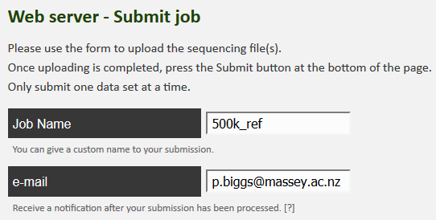

**[Return to the Course Home Page](../index.html)**

### **06-May-2022 - Hard copy available on 'Wiki | Week 8' Stream page**

# Introduction to Metagenomic analysis

**Professor Patrick Biggs**

[Purpose](#purpose)<br>
[Introduction](#introduction)<br>
[Lecture Overview](#lecture-overview)<br>
[Conventions used for this RStudio practical](#conventions-used-for-this-rstudio-practical)<br>
[Accessing the resources needed](#accessing-the-resources-needed)<br>
[Taxonomic classification with the Kaiju webserver](#taxonomic-classification-with-the-kaiju-webserver)<br>
[Data visualisation with Krona](#data-visualisation-with-krona)<br>
[Further analysis of Kaiju output in R](#further-analysis-of-kaiju-output-in-r)<br>
[Portfolio analysis](#portfolio-analysis)<br>
[Assessment](#assessment)<br>
[Contact](#contact)<br>


## Purpose

To use a mixture of tools (online) to explore a small set of metagenomic reads from uploading reads to a server through interactive visualisation and then work in R to look at the data in other ways.


## Introduction

Microbial diversity has been revolutionised by the rapid advances in sequencing technology, given us new insights into the role of the microbial world in all environments on Earth. Sequencing of metagenomes (all the DNA in a given sample etc.) or of specific markers (metabarcodes e.g. 16S rRNA amplicons) have been crucial in this regard. Knowing what is there, and what it is potentially doing are two of the main research areas of interest.  How we then analyse the data, visualise and interpret the results is thus of importance.

Week 9 focusses on using tools outside of `R` for most of today's practical to use online classfiers and visualisation methodologies to explore the complexitites of metagenomic data.


## Lecture Overview

As a brief summary of the lectures from this week, we discussed the motivation for doing metagenomics analysis given how ubiquitous and important bacteria are to us, the environment and the planet as a whole.  We looked at the history of metagenomics, and then had a quick tour of 4 notable projects – focussing in a little more detail on the Human Microbiome Project – which illustrated how technology has driven the scale of potential projects.  We also touched on the potential controversial issue of personal genomics by looking at the now bankrupt uBiome company, and their products.  There was a quick mention of metabarcoding – a subfield of metagenomics – and how that is different to metagenomics, but yet at the same time, how these areas are also related to each other.

The next focus was on a metagenomics workflow, to show how complex this is, and also where there are potential biases to consider in experimental design, and sample generation.  We then started looking at some of the issues there are in terms of the measures of say taxonomic diversity in analysing results.  We also considered data quality control, and that there are many software packages out there to analyse metagenomics data.  Finally, we considered the concept of comparative metagenomics, and ways to analyse and visualise the data using a tool like MEGAN.  Our last software tool was the one we start off with today, the online taxonomic classifier Kaiju.

So, now on to the practical...

First thing, you have an electronic copy of this practical -- which you will see via the Stream and this site -- **please don't copy and paste in the practical today!** Why? Typing these commands is part of the hard wiring required to make them stick! By typing commands it gives you another opportunity to think about the command before you execute it and typing is more likely to trigger a big red flag in dangerous situations! So, think twice, type once.


---

## Conventions used for this RStudio practical

As a reminder, in what follows, we shall use the following typographical conventions for working with `R`:

-   Characters written in `this programming style` are commands to be typed into the computer as they stand.
-   Characters written in _`this programming style`_ are objects and file names.
-   Characters written after something like `###` indicate comments within the code that will help you.  They do not run code. 
-   Characters written in without `>` at the start of the line **(e.g. lines starting with "\[1\]")** indicate responses back from the R console inside RStudio that will help you too. 
-   Words inserted within square brackets **\[Enter\]** indicate keys to be pressed.

So, for example,

```R
 > x <- c(1, 5, 7, 14) [Enter]
```
means \"at the `R` console prompt `>`, type the code as written to make a vector `x` made up of the values 1, 5, 7 and 14, then press the key marked Enter\".

Don\'t forget to press the **\[Enter\]** key: commands are not sent to the `R` console until this is done. There will not be **\[Enter\]** at the end of any of the lines of code in this practical, it is taken that this is to be typed at the end of the line _unless otherwise stated_. It is also assumed that the first `>` is the `R` console prompt.

---

## Accessing the resources needed

### Computing

#### General

We will be working within web browsers, and Firefox and Chrome are installed on the machines, or Safari if you are an Apple user. We will then login to RStudio Cloud using your personalised account. If you would like to use your own laptop in the labs on either campus, please feel free to do so.

#### Manawatu (iMacs)

The machines we are using for the course are Apple iMacs. Please use your normal Massey username and password to login to these machines. Please remember to ignore (i.e. cancel) the dialogue box about the network when you log in.

#### Albany (PCs)

The machines are Windows PC's so logging into them should be the same as any other Massey Windows PC.

#### Outside Massey 

Most likely this is your own machine, so this should not be an issue.


### Our work today

We will continue to use our RStudio cloud environment as a source and location for the data we are working with, but we will also be using webtools, and the Microsoft product Excel, as well as `R`.


### What we are going to do today?

We are primarily going to be using webtools, and the Microsoft product Excel to explore some reads from an experiment, but under different analysis conditions, varying both the analysis methods and the database we are comparing our reads to. 
- We will upload a pair of reads to the Kaiju website for analysis against a variety of databases.
- We will download these data, and open them in Excel to explore them in a comparative way.  
- We will then look at the results in a completely different way using Krona
- Finally, we will be returning to `R` for the work that will lead to the Portfolio analysis of today's work.

The commands below have been checked and should work fine.


---

## Taxonomic classification with the Kaiju webserver

In this, the second practical session of this Microbial Diversity Module, we will be working with the Kaiju webserver to classify a small set of reads (500,000) under a couple of different algorithm conditions, and against three different reference databases supplied by the website to get an understanding of the fact that the way you perform these analyses has an impact on the results you get out.  In other words, writing down the results, and information about what you have done precisely to get them is important.  We are going to upload the reads to the server, download the results, and analyse them.  We are also going to use the Krona interactive viewer to explore our data in a little more depth.


### Exercise 1: Data uploading and generation

The below screenshot shows the folder structure within `/cloud/project/` for the new Module.


The first thing we are going to do is upload a set of 500,000 paired Fastq sequences in two files – called _`sampleA_500k_R1.fq.gz`_ and _`sampleA_500k_R2.fq.gz`_ – to the Kaiju webserver and perform a taxonomic analysis on the reads. 


These are environmental samples taken as part of a Massey University research project I was involved with a few years ago.  So, to do that, we need to use the reads from the _`kaiju`_ folder in the `/cloud/project/` project within the "weeks8to10" project within the "MicrobialDiversity_2023" workspace.  There are other files in there too, but more on those later. 

We have 3 set of analyses to perform so, your job name for each analysis will vary according to what we are going to run.  Replace `XXX` with your initials.  The combinations of names for the jobs is shown in the table below:

<table>
<thead>
  <tr>
    <th>Database to use:</th>
    <th>Run mode (no need to change):</th>
    <th>Job name:</th>
    <th>Performed by:</th>
  </tr>
</thead>
<tbody>
  <tr>
    <td>RefSeq Genomes</td>
    <td rowspan="3">Default (greedy)</td>
    <td>XXX_Gr500k_ref</td>
    <td rowspan="3">student</td>
  </tr>
  <tr>
    <td>NCBI BLAST nr</td>
    <td>XXX_Gr500k_nr</td>
  </tr>
  <tr>
    <td>NCBI BLAST nr + euk</td>
    <td>XXX_Gr500k_nreuk</td>
  </tr>
  <tr>
    <td>RefSeq Genomes</td>
    <td rowspan="3">MEM</td>
    <td>XXX_MEM500k_ref</td>
    <td rowspan="3">P. Biggs (for you to work with)</td>
  </tr>
  <tr>
    <td>NCBI BLAST nr</td>
    <td>XXX_MEM500k_nr</td>
  </tr>
  <tr>
    <td>NCBI BLAST nr + euk</td>
    <td>XXX_MEM500k_nreuk</td>
  </tr>
</tbody>
</table>


Now let’s go to the website, and start the uploading process:

1.  Go to <https://kaiju.binf.ku.dk/>

2.  Click on the webserver icon at the top of the page.

3.  Enter your name for the job, and then your email address, so you will know when the job is complete by getting an email.



4.  Now we can upload the reads, one at a time. Select the “Select file” box, and it will open up a window for the first read.  Select _`sampleA_500k_R1.fq.gz`_ from the dialogue box and click on “Start upload”.  As soon as you have done this, click on “Upload a second file for paired end sequencing”.


5.  In the same way, you can upload _`sampleA_500k_R2.fq.gz`_ as well.   Click on “Start upload” again.


6.  When both reads are completely uploaded, you see the following.


_NB: This is a little weird in its behaviour, but you need to keep an eye on the upload, as I have had experience where the upload times out, and then you have to do it again.  Given that for me it took me up to 7 minutes to upload, and there are 3 to do, you have to keep an eye on things, and also I appreciate it will take a little while.  This also depends a little on the Massey network._

7.  Now you can choose the database for the job name, as in the table above, and you are ready to click on “Submit” at the bottom of the page.

NB2: There is a bit of waiting for this first part of the process, so I suggest whilst you are waiting, you read the “Behind the Paper” feature on the Nature Microbiology website for the Kaiju publication.  The link is below:

<https://naturemicrobiologycommunity.nature.com/users/10226-peter-menzel/posts/6200-from-metagenomics-of-hot-springs-to-bioinformatics-software-development> 

This is not super-long but gives you a chance to see the motivation for the paper from the authors.  It is also important to note that we are relying on the Internet here, so this is a little risky.  If the worst happens, and things do not go to plan, please let a demonstrator know, and magically a set of results can be made to appear for you.

>**Question 0:**
>
> On looking at Kaiju webserver, on the left are listed the reference databases.  Have a look at the quick database descriptions and write down in the box below what you think might happen in terms of the potential results we might get back when our results are notified to us.
>
> <table><tr><th> </th></tr><tbody><tr><td> </td></tr><tr><td> </td></tr><tr><td> </td></tr></tbody></table>


### Exercise 2: Data downloading

After a little while, you should have been emailed three times from the Kaiju webserver with your results.  We now have to download these to analyse them.  Using your email link, click on the link to open up the results page.  It lists 4 things:
1.  A summary of the results, and the parameters used for the run
2.  A metagenomics overview with an interactive bubble plot.
3.  Two output files to potentially download
4.  Krona output

>**Question 1:**
>
>Fill in the following table for your results to record the parameter values for the 3 results you have generated (any order of results is fine):
>
> <table><thead><tr><th>Job</th><th>1</th><th>2</th><th>3</th></tr></thead><tbody><tr><td>Job name</td><td></td><td></td><td></td></tr><tr><td>Reference database</td><td></td><td></td><td></td></tr><tr><td>Database date</td><td></td><td></td><td></td></tr><tr><td>Run mode</td><td></td><td></td><td></td></tr><tr><td>Number of classified reads</td><td></td><td></td><td></td></tr><tr><td>% classified</td><td></td><td></td><td></td></tr></tbody></table>

The next thing we are going to do is download the results from the 3 runs.  We are going to download the compressed output file for the RefSeq Genomes run (your ID for this will be different, but we are all using the same data) as well.  


1.  Right click on the “download taxon path counts” and save the file with a new name – your jobname would be a good choice – including the database you ran the reads against.  
2.  Repeat this procedure for the other two files.  
3.  In addition, for one of the jobs, in a similar manner, download the compressed output file for the run against the RefSeq Genomes.  
4.  The file is always called _`kaiju.out.gz`_.  
5.  Go to your downloads folder and uncompress this file (double click on it) to make a file called _`kaiju.out`_.

> **Please remember that uncompressing a _`.gz`_ file will be a different process depending on your machine and whatever compression software you use, e.g. 7Zip on Windows PCs.**
>
> **If there is an issue with downloading from the web you can run the following code to retrieve the file, as per the below from the terminal in RStudio.**

```bash
wget https://raw.githubusercontent.com/osilander/203.311/main/Week9/files/kaiju.out.gz
gunzip kaiju.out.gz
```

> **If you have downloaded via the `wget` method above, you will have to download the  _`kaiju.out`_ file from RStudio to your local machine.**


We are going to have a look at the now uncompressed  _`kaiju.out`_ file quickly just to get a hint of what the data looks like.  Open this file up in a spreadsheet program such as Excel.  Double click on the application to start it.  You will see the 7 columns as listed in the screenshot above.  

>**Question 2:**
>
>What is the name of the accession number for the sequence in column B called `M00933:6:000000000-A1D0H:1:1101:12995:9348`?
>
> <table><tr><td>
> ____________________
> </td></tr></table>


### Exercise 3: Data analysis

We are interested in the file for the taxon path counts.  In a similar way, let’s open up this file in a spreadsheet program like Excel to have a look at the contents.  This has far fewer rows of data as the hits to the same taxon have been merged.  

>**Question 3:**
>
>Using your spreadsheet for the file of the results against the RefSeq Genomes, how many taxa are present at over 1000 counts?  
>What is the number of counts we would use as a cutoff for 0.1%?  
>How many taxa are there above this threshold?  
>Finally, what is the species of bacteria with a count of 916?
>
> <table><tbody><tr><td>Over 1000 counts:</td><td></td></tr><tr><td>Counts for 0.1% cutoff:</td><td></td></tr><tr><td>Taxa present at more than 0.1%:</td><td></td></tr><tr><td>Taxon at count of 916:</td><td></td></tr></tbody></table>

Part of the practical today is to look at similarities and differences between the databases, and what effect that can have on the results.  To do that, we need to have a file where all this data is listed together.  We will look at a file I have made to do this.  

I have performed the same 3 analyses (against the same 3 databases), but with the “MEM” algorithm specified rather than the default “Greedy” that you have used.  I have then used a scripting language – Perl – and a database – MySQL – to process this data into a format where everything is all together based on the taxonomic classification.  You will find this file – _`500k_cutoffs.xlsx`_ – in the _`kaiju`_ folder for today’s practical.

Open this file in Excel.  Immediately you will notice that there are actually 5 tabs here, where the data has been trimmed to remove any taxa that are present at fewer than 1, 10, 100, 1000 or 10000 counts.  These are unsurprisingly called _`Cutoff1`_, _`Cutoff10`_, _`Cutoff100`_, _`Cutoff1000`_ and _`Cutoff10000`_ respectively.

>**Question 4:** 
>
>Given how many counts there are in the original input test file, what percentages do these cutoffs represent?
>
> <table><thead><tr><th>cutoff</th><th>percentage</th><th>cutoff</th><th>percentage</th></tr></thead><tbody><tr><td>1</td><td></td><td>1000</td><td></td></tr><tr><td>10</td><td></td><td>10000</td><td></td></tr><tr><td>100</td><td></td><td></td><td></td></tr></tbody></table>

>**Question 5:**
>
>How many taxa are represented for each of the 5 cutoff levels?
>
> <table><thead><tr><th>cutoff</th><th>percentage</th><th>cutoff</th><th>percentage</th></tr></thead><tbody><tr><td>1</td><td></td><td>1000</td><td></td></tr><tr><td>10</td><td></td><td>10000</td><td></td></tr><tr><td>100</td><td></td><td></td><td></td></tr></tbody></table>

Let’s investigate the data a little further.  Looking at the first tab - _`Cutoff10000`_ – does not show much, so we move on to the next one - _`Cutoff1000`_ – where we can start to see some differences in the counts.  Remember, this is the same underlying sequence dataset analysed in 6 different ways.  

>**Question 6:**
>
>How many taxa in the _`Cutoff1000`_ are eukaryotes (Hint: sort the data, or use find)?
>
> <table><tr><td>
> ____________________
> </td></tr></table>

We have to go to the next two tabs - _`Cutoff100`_ and _`Cutoff10`_ – to really explore the data.  We will leave the last tab - _`Cutoff1`_ – for today, as there are too many taxa to deal with.  We shall look at _`Cutoff100`_ first.  Go to that tab now if you are not there.  

**NB: Any sorting you are going to do shortly on the sheets needs to be across the columns A to I, otherwise things will go badly awry, and you will make incorrect inferences.  If that happens, download the file again, and start sorting again.**

The data are sorted by the descending average value (column G).  If we sort on the coefficient of variation (COV; column H), we are looking at the most equal counts.
 
>**Question 7:**
>
>What do you notice about the location of the “Unclassfied” taxa?
>
> <table><tr><td>
> ____________________
> </td></tr></table>

Now sort _`Cutoff100`_ on column A.  Remember what databases you have been working with, and their constituents (from the Kaiju webpage).

>**Question 8:**
>
>When you compare columns A and D with columns B, C, E and F, what do you notice in the first 300 or so rows?  Why do you think this is?
>
> <table><tr><th> </th></tr><tbody><tr><td> </td></tr><tr><td> </td></tr><tr><td> </td></tr></tbody></table>

For our final look at the data, we will move to the _`Cutoff10`_ tab.  Sort this sheet on Taxonomy (column I) in the Z to A direction, i.e., making sure that "Unclassified" is at the top of the sheet.  Scroll down until you get to the Eukaryotes section of the taxonomy.  There are \~500 entries for the eukaryotes.

>**Question 9:**
>
>In column C, what is the eukaryote with the highest count? 
> Why do you think there is a difference between columns C and F in terms of counts for a given taxon?
>
> <table><tbody><tr><td>Highest count:</td><td></td></tr><tr><td>Reason for differences in columns C and F:</td><td></td></tr></tbody></table>

Ok, so now we can look at visualising these data with Krona.


## Data visualisation with Krona

For this last part of this metagenomics portion, we will head back to our Kaiju results page, and look at the Krona chart. Krona - <https://github.com/marbl/Krona/wiki> - is a way to explore hierarchical data with multi-layered pie charts in an interactive manner.  


To do this, click on the “view classification as Krona chart” towards the bottom of the results page.  This should open up a new webpage showing our results.  You should see something like the following:


We are going to explore the data as this is a fully interactive plot.  Let’s get rid of our unclassified data, as that is of no interest to us right now.  To do that, click on the area that says “root” so the segment goes grey, and then click again to get arrows, like in the picture below.


If you now double click, the ‘unclassified’s disappear, and we now see our classified data.  The plot should have dramatically changed, and look something like the below:


We shall explore the viral world first.  Viruses make up 0.7% of this dataset.  Click on the blue section at the bottom to expand this section out.  When your arrow looks like the below, double click on it to generate the new view, as per the images below.


>**Question 10:**
>
>How many viral sequences are there in this dataset (Hint: top right of the page)?  
>Given this value, approximately how many reads were assigned to Gokushovirinae GAIR4?
>
> <table><tbody><tr><td>Number of viral reads:</td><td></td></tr><tr><td>Number of reads assigned to Gokushovirinae GAIR4:</td><td></td></tr></tbody></table>

Have a click and explore the data for a couple of minutes.  Use the back arrow (top left of webpage) next to the word ‘Krona’ to go back out.  


Right, on to the microbial world.  

We can also search for taxonomic classifications across the bacterial tree of life.  Searching on a name shows where they are located in the plot.  For example, let’s find where “_Paracoccus_” is on the plot.  We can then double click to zoom in to the _Paracoccus_ genus.  This is probably too close in, so if you click on say Rhodobacteraceae we can see what proportion of the Rhodobacteraceae are members of the _Paracoccus_ genus.


>**Question 11:**
>
>What approximate proportion of the Rhodobacteraceae family are members of the _Paracoccus_ genus (Hint: adding up the percentages is fine for today)?
>
> <table><tr><td>
> ____________________
> </td></tr></table>

A group of bacteria of interest – to me anyway! – are the Proteobacteria, so as we did before, let’s click on that ring (found at about 9:30pm on the clock face) to show all the members of this taxonomic class.  Within the Proteobacteria is the genus _Klebsiella_ (a human pathogen).

>**Question 12:**
>
>Use the search function to find members of the _Klebsiella_ genus.  Can you use the rings of the plot to work out the full taxonomic path for the _Klebsiella_ genus?  Use a format like “Bacteria – Proteobacteria - XXXXX”.  The full taxonomic path is quite long.
>
> <table><tr><th> </th></tr><tbody><tr><td> </td></tr><tr><td> </td></tr><tr><td> </td></tr></tbody></table>

Within the Gammaproteobacteria is the order Legionellales (one member of which is responsible for Legionnaire’s disease).  This order is made up of two families – Legionellaceae and Coxillaceae – at different proportions.

>**Question 13:**
>
>Using the chart, and by clicking in various parts of the Krona image, what are the proportions of each of the two families? 
>
> <table><tbody><tr><td>Legionellaceae:</td><td></td></tr><tr><td>Coxillaceae:</td><td></td></tr></tbody></table>

---

## Further analysis of Kaiju output in R

### Locating data

We will now return to using `R` to look at our data, and head back to our RStudio Cloud environment.  The first thing we will need to do is to download our _`CutoffXXXX`_ files, i.e., our 5 different levels of counts from an external source this time.  These are now the file names, but with hyperlinks:  

- [500k_Cutoff1.txt](https://raw.githubusercontent.com/osilander/203.311/main/Week9/files/500k_Cutoff1.txt "500k_Cutoff1.txt")
- [500k_Cutoff10.txt](https://raw.githubusercontent.com/osilander/203.311/main/Week9/files/500k_Cutoff10.txt "500k_Cutoff10.txt")
- [500k_Cutoff100.txt](https://raw.githubusercontent.com/osilander/203.311/main/Week9/files/500k_Cutoff100.txt "500k_Cutoff100.txt")
- [500k_Cutoff1000.txt](https://raw.githubusercontent.com/osilander/203.311/main/Week9/files/500k_Cutoff1000.txt "500k_Cutoff1000.txt")
- [500k_Cutoff10000.txt](https://raw.githubusercontent.com/osilander/203.311/main/Week9/files/500k_Cutoff10000.txt "500k_Cutoff10000.txt")

We will then repeat the process Olin introduced in Week 4.  To download the data, first make sure you are in your _`/cloud/project/`_ directory, and that you are using the Terminal tab in RStudio. Second, make a new directory called _`week9data`_, and change (`cd`) into that directory. Third, copy the link address (right click on the link and scroll to Copy Link Address). Finally, download the files using `wget`:

```bash
wget the_link_address_you_just_copied
```

>**Question 14:**
>
> What command line would you use to check the number of lines in your downloaded files using a wildcard character?
> how many lines are there in each of the 5 files?
>
> <table><thead><tr><th>code to run the command</th><th></th></tr></thead><tbody><tr><td>Cutoff1</td><td></td></tr><tr><td>Cutoff10</td><td></td></tr><tr><td>Cutoff100</td><td></td></tr><tr><td>Cutoff1000</td><td></td></tr><tr><td>Cutoff10000</td><td></td></tr></tbody></table>


### Basic dataset interaction

We have seen that the both the search algorithm (`MEM` or `Greedy`), as well as the database we are searching against (`Nr`, `NrEuk` or `RefOnly`) has implications for the composition of our single sample we are working with.  How can we visualise this?

#### Installing some new packages

**NB: these packages have to be installed by you to complete the Portfolio analysis.**

Please install the following packages, and then load them - and another one - for use.

```R
### install packages
> install.packages("UpSetR")
> install.packages("pheatmap")

### load packages
> library(UpSetR)
> library(pheatmap)
> library(data.table)
```

#### Loading data and subsetting on taxonomy

Let's load in some data now.  This presumes that you are at _`/cloud/project/`_ and that you have made the  _`week9data`_ directory as stated above.  We will load in the _`500k_Cutoff1000.txt`_ file as an example, and perform some manipulation on it to allow us to work with the file in the rest of this section.

```R
### load in data
> cutDataFile <- read.table("week9data/500k_Cutoff1000.txt", header = TRUE, sep = "\t")

### remove unwanted columns
> cutDataFileRemovedCols <- subset(cutDataFile, select=-c(averVal, COV))

### remove the first row of unclassified data
> cutDataFileRemovedCols_noUC <- cutDataFileRemovedCols[-c(1), ]
```

The next thing is to make a subset based on a certain taxonomic classification.  Let's take "Proteobacteria" as a group.  You need to know the point in the taxonomy to get to "Proteobacteria", as this is therefore common also all taxonomic hits, and we can remove it to make the very long taxonomic names shorter.  So for "Proteobacteria", it is "root__cellular__organisms__Bacteria__Proteobacteria__", and this is want we want to remove, which we shall do thus:

```R
### make a new object on a certain taxonomic classification and below

## perform some column manipuluation to fix the taxonomy as our rowname
> rownames(cutDataFileRemovedCols_noUC) <- cutDataFileRemovedCols_noUC[,7]
> cutDataFileRemovedCols_noUC2 <- cutDataFileRemovedCols_noUC[,-7]

## extract out the rows of interest
> onlyTaxaOfInterest <- subset(cutDataFileRemovedCols_noUC2, rownames(cutDataFileRemovedCols_noUC2) 
      %like% "Proteobacteria")

## tidy up the names
> rownames(onlyTaxaOfInterest) 
      <- gsub("root__cellular__organisms__Bacteria__Proteobacteria__", "", rownames(onlyTaxaOfInterest))
```

This is why we are making a copy of the object here, so that you can look at _`cutDataFileRemovedCols_noUC2`_ to get the part of the name to remove.

>**Question 15:**
>
> How many rows does _`onlyTaxaOfInterest`_ have compared to  _`cutDataFileRemovedCols_noUC2`_? (Use one of the many methods you now are aware of, e.g. `grep` in the terminal, or by a manual inspection to find the numbers.)
>
> <table><tr><td>
> ____________________
> </td></tr></table>


### Visualising data in different ways

We are going to look at our data as heatmaps, and something called an UpSet plot.

#### Heatmaps

I talked about abundance of reads in the Week 9 lectures.  A convenient way to view the abundance of the different taxa is with a heatmap (such as at <https://r-graph-gallery.com/heatmap>).  Hopefully you are slightly familiar with these from the other Portfolio analyses.

To draw a very basic heatmap, we use the `pheatmap()` command from the `pheatmap` package.  

```R
### draw a basic heatmap
> pheatmap(onlyTaxaOfInterest)
```
This command can be modified very extensively - have a look at `?pheatmap()` in the `R` console to get the help pages.  Try out a few things out if you like. 

In window #4, this will look at little weird due to the long taxa names (which is why we have shortened them).  Click in the "Zoom" for the image to go to a new window.  This window is stretchable, so you can make it look how you want, right click it and save it as an image.


#### UpSet plots

Now we are going to look at the data in a very different way.  This method is all to do with Venn diagrams, and thinking about the taxa results as members of sets.  In other words, overall if we get a taxon returned from a specific database, what other databases can we find that taxon in as well?  As we have 6 sets of data, we want to look at the insection of those 6.  How do we do that?  Here is an example of a Venn diagram with 6 intersecting sets:


What is going on here?  How intuitive is this?  The answer is **not very intuitive at all**.   Above 7 sets it is almost impossible to work out what is going on (it might be at 6 too!) with all the combination of relationships, and ever smaller parts of the figure where the intersections are found.  Therefore we are going to look at our data in a different way, using an UpSet plot.  You might have seen these on the R graph gallery (<https://r-graph-gallery.com/>) at <https://r-graph-gallery.com/upset-plot.html>.  Have a read of <https://upset.app/> for a brief introduction, an example plot and an explanation of what is going on here.  We are going to create a similar plot with our data.

To make the plot, we have to apply a transformation to our data to make it an absence/presence dataset and therefore lose our quantitative data.  So, in this case, any non-zero value in our dataset becomes 1, and 0 stays as 0.  Hence, if a taxon has 3 or 2048 counts associated with it, it gets transformed to 1.  This shows us the detected taxa, rather than the abundance.  This is still a useful way to look at the data to understand the relationship between the 6 datasets we have from our sample.  

```R
### remove unwanted columns
> cutDataFileUpSet <- subset(cutDataFile, select=-c(averVal, COV, taxonomy))

### convert all non-zero values to 1
> cutDataFileUpSet[cutDataFileUpSet != 0] <- 1

### add taxonomy back in 
> cutDataFileUpSetTaxa <- cbind(cutDataFileUpSet, cutDataFile$taxonomy)
> colnames(cutDataFileUpSetTaxa)[7] <- "taxonomy"

### draw an upSet plot to show interactions
> setOrder = c("Greedy_Nr", "Greedy_NrEuk", "Greedy_RefOnly", "MEM_Nr", "MEM_NrEuk", "MEM_RefOnly")

> upset(cutDataFileUpSetTaxa, order.by = "freq", decreasing = TRUE,
+       sets = setOrder, keep.order = TRUE)
```

We have fixed the order of the sets here with the _`setOrder`_ object, have a go at changing the order of _`setOrder`_ if you want to change how the ouptut looks.

---


## Portfolio analysis

Once again, this is a two part analysis for the week 9 Portfolio analysis. This will result in a figure with a part A and a part B.  In the section above, the code and principles described are what you need for this Portfolio analysis.  You will have to apply them to the conditions and files listed in the sections below.  The code requirement, images and figure legends from this Week's analysis are as previously described. 


In the "Visualising data in different ways" section above, for the "Heatmaps", we worked with an example file - _`500k_Cutoff1000.txt`_ - to understand and build the code to generate a heatmap that is readable in terms of numbers involved to easily visualise.  In this part, I would like you to choose one -- and only one -- of the following combinations to visualise how the taxonomic classification varies based on searching algorithm and database:

- combination 1: file _`500k_Cutoff10.txt`_ and taxonomic classification _`__Chitinophagia__`_
- combination 2: file _`500k_Cutoff1.txt`_ and taxonomic classification _`__Rhodobacter__`_
- combination 3: file _`500k_Cutoff1.txt`_ and taxonomic classification _`__Methanomicrobiales__`_

As with the code above, you are required to trim out the constant part of the taxonomic name to reduce the length of classification name.  Please use the exact search term above, otherwise you will get far more data and your plot will look very complex.

#### Part B

In the "Visualising data in different ways" section above, for the "UpSet plots", we worked with an example file - _`500k_Cutoff1000.txt`_ - to understand the relationship between the databases, and how these overlap.  In this part, I would like you to choose one  -- and only one -- of the following files to visualise how the number of times a taxonomic result varies based on searching algorithm and database:

- file 1: file _`500k_Cutoff10.txt`_
- file 2: file _`500k_Cutoff1.txt`_ 


---


## Assessment

To reiterate, there is no direct assessment today. What is required however, is an understanding of the principles we have learnt today, as these will be required for the mastery test which accounts for 15% of the course. This will take place between Thursday 25-May-2023 and Friday 26-May-2023 online.

The mastery test will test the contents of weeks 8 to 10, more information will follow next week.


## Contact

I have two offices on the Manawatu campus (as I work for both SNS and SoVS), so I am not always in my Science Tower office D5-30. If you want to discuss anything, it's best to email me beforehand.

Prof Patrick Biggs,

Molecular Biosciences Group,

School of Natural Sciences

```
-. .-.   .-. .-.   .-. .-.   .
||\|||\ /|||\|||\ /|||\|||\ /|
|/ \|||\|||/ \|||\|||/ \|||\||
~   `-~ `-`   `-~ `-`   `-~ `-
```

<p.biggs@massey.ac.nz>


<!-- <br><br><br>

[GitHub Markdown cheat sheet](https://github.com/adam-p/markdown-here/wiki/Markdown-Cheatsheet)


This is how you put in an image file:
```

```
 -->


